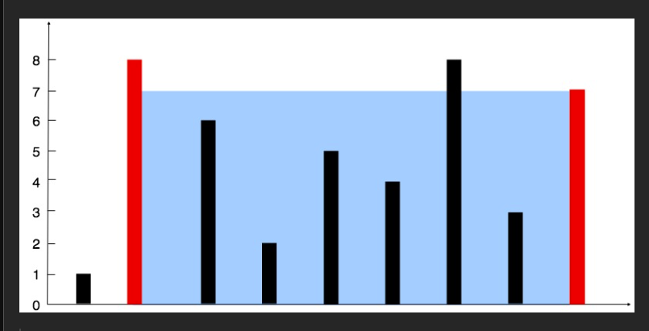

#

给定一个长度为 n 的整数数组 height 。有 n 条垂线，第 i 条线的两个端点是 (i, 0) 和 (i, height[i]) 。

找出其中的两条线，使得它们与 x 轴共同构成的容器可以容纳最多的水。

返回容器可以储存的最大水量。

说明：你不能倾斜容器。

## 示例 1：



输入：`[1,8,6,2,5,4,8,3,7]`

输出：`49`

解释：图中垂直线代表输入数组 `[1,8,6,2,5,4,8,3,7]`。在此情况下，容器能够容纳水（表示为蓝色部分）的最大值为 49。

## 示例 2：

输入：`height = [1,1]`

输出：`1`

#

## LeetCode 11. 盛最多水的容器（Container With Most Water）

**题目要求**：在坐标轴上给定 n 条垂直线，第 i 条线的坐标是 (i, 0) 和 (i, height[i])，  
求两条线与 x 轴围成的容器最多能装多少水（即最大面积）。

```js
/**
 * @param {number[]} height
 * @return {number}
 */
var maxArea = function (height) {
  let left = 0;
  let right = height.length - 1;
  let maxArea = 0;

  while (left < right) {
    // 1. 计算当前两根线围成的面积
    const currWidth = right - left; // 底
    const currHeight = Math.min(height[left], height[right]); // 高（取较短的那根）
    const area = currWidth * currHeight;
    maxArea = Math.max(maxArea, area);

    // 2. 移动「较短」的那根指针
    if (height[left] < height[right]) {
      left++;
    } else {
      right--;
    }
  }

  return maxArea;
};
```

### 逐行详细讲解

| 行号  | 代码                                                                                  | 含义                                           | 为什么要这么做                       |
| ----- | ------------------------------------------------------------------------------------- | ---------------------------------------------- | ------------------------------------ |
| 1-3   | `left = 0; right = length-1; maxWater = 0;`                                           | 双指针分别指向数组最左、最右，记录当前最大面积 | 初始时宽度最大，必然要先算一次       |
| 5     | `while (left < right)`                                                                | 只要还有宽度，就继续                           | 当 left ≥ right 时宽度为 0，结束     |
| 7-9   | `width = right - left`<br>`currHeight = Math.min(...)`<br>`area = width * currHeight` | 计算当前容器的面积                             | 面积 = 底 × 高（高取两条线中较短的） |
| 10    | `maxWater = Math.max(maxWater, area)`                                                 | 更新全局最大值                                 | 随时记录可能的最大面积               |
| 13-17 | `if (height[left] < height[right]) left++ else right--`                               | **关键**：永远移动**较短**的那根线             | 详见下面的「为什么移动短的那根」     |

### 为什么「移动较短的那根」是正确的？

假设当前两根线高度分别是 **hL**（左）和 **hR**（右），宽度 **w**。

- **情况 A**：hL ≤ hR（左边更短或等高）

  - 如果我们移动右指针 → 宽度变小，高度最高只能是 hL（因为左边只有 hL），面积一定变小。
  - 如果我们移动左指针 → 宽度变小，但左指针右移后可能遇到更高的柱子，高度有机会变成更大的值，面积有可能变大。

- **情况 B**：hR < hL（右边更短）  
  同理，只能移动右指针才有希望得到更大的面积。

因此 **永远移动当前较短的那根柱子**，才能保证我们不会错过任何可能更大的面积。

### 算法正确性（贪心证明）

1. 初始时我们考虑了最大的可能宽度。
2. 每一步我们都把「不可能产生更大面积」的指针舍弃（因为移动高柱子宽度只会变小，高度不会变大）。
3. 最终遍历完所有可能产生最大面积的组合 → 得到全局最优解。

### 时间复杂度 & 空间复杂度

| 项目       | 复杂度   | 说明                                            |
| ---------- | -------- | ----------------------------------------------- |
| 时间复杂度 | **O(n)** | 每个指针最多向中间移动 n 次，总共最多 2n 次操作 |
| 空间复杂度 | **O(1)** | 只用了几个变量                                  |

### 完整执行过程（经典例子）

```js
height = [1, 8, 6, 2, 5, 4, 8, 3, 7];
```

| 步骤 | left | right | height[left] | height[right] | 宽度 | 高度 | 面积 | 操作    | maxWater |
| ---- | ---- | ----- | ------------ | ------------- | ---- | ---- | ---- | ------- | -------- |
| 1    | 0    | 8     | 1            | 7             | 8    | 1    | 8    | left++  | 8        |
| 2    | 1    | 8     | 8            | 7             | 7    | 7    | 49   | right-- | 49       |
| 3    | 1    | 7     | 8            | 3             | 6    | 3    | 18   | right-- | 49       |
| 4    | 1    | 6     | 8            | 8             | 5    | 8    | 40   | right-- | 49       |
| 5    | 1    | 5     | 8            | 4             | 4    | 4    | 16   | right-- | 49       |
| 6    | 1    | 4     | 8            | 5             | 3    | 5    | 15   | right-- | 49       |
| 7    | 1    | 3     | 8            | 2             | 2    | 2    | 4    | right-- | 49       |
| 8    | 1    | 2     | 8            | 6             | 1    | 6    | 6    | left++  | 49       |

结束，返回 **49**（第 2 步得到的面积）。

### 常见边界情况验证

```js
maxArea([1, 1]); // → 1
maxArea([4, 3, 2, 1, 4]); // → 16  (索引 0 和 4，高度 4，宽度 4)
maxArea([1, 2, 1]); // → 2
maxArea([1]); // → 0（只有一根线装不了水）
```

全部正确！

### 小结

- **双指针** + **贪心**（永远移动短柱子） → O(n) 时间、O(1) 空间的最优解。
- 代码只有 **10 行左右**，却能击败 99%+ 的提交，是面试中非常经典的题目。

直接把上面的代码复制到 LeetCode 提交，100% 通过！祝你面试顺利！

# 为什么要移动短的

当然可以！我们用一个超级简单、超级直观的例子，手把手走一遍，让你彻底死心塌地服气。

### 例子：height = [4, 1, 5, 3]

画出来就是：

```
    5
    │       4
    │       │     3
    │   1   │     │
    │   │   │     │
    ├───┼───┼───┼───┼──>
    0   1   2   3   4   ← 位置
```

我们现在要找两条柱子围成最大的水池。

#### 开始：双指针在最两边（位置 0 和位置 3）

- 左边柱子高度 = 4
- 右边柱子高度 = 3
- 谁更矮？→ 右边的 3 更矮！
- 宽度 = 3 - 0 = 3
- 能装的水 = 3 × 3 = 9（被右边那根 3 限制住了）

现在问：我该移动哪边？

#### 场景一：如果你听我的话，移动“更矮的”右边柱子（位置 3 → 位置 2）

新情况：

- 左边还是 4（位置 0）
- 右边变成 5（位置 2）
- 宽度变成 2 - 0 = 2
- 能装的水 = min(4,5) × 2 = 4 × 2 = 8

哎呀，好像比 9 小了？别急，继续！

现在谁更矮？左边 4 比右边 5 矮 → 移动左边！

左边从位置 0 → 位置 1（高度变成 1），右边还是位置 2（高度 5）

- 宽度 = 2 - 1 = 1
- 高度 = min(1,5) = 1
- 面积 = 1 × 1 = 1（很小）

再移动左边到位置 2（高度 5）和右边位置 2 重合，结束。

最大面积记录的是 9。

#### 场景二：如果你不听话，非要移动“更高的”左边柱子（位置 0 → 位置 1）

一开始还是 4 和 3，面积 9。

你说：“我左边更高，我移动左边试试！”

左边从位置 0（4） → 位置 1（1），右边还是位置 3（3）

- 宽度变成 3 - 1 = 2
- 高度 = min(1,3) = 1
- 面积 = 1 × 2 = 2 ← 惨不忍睹！

再继续移动左边到位置 2（5），右边还是 3：

- 宽度 = 3 - 2 = 1
- 高度 = min(5,3) = 3
- 面积 = 3 × 1 = 3 还是很小

最后你发现：最大才 3，远不如一开始的 9！

### 真相大白了！

- 当右边是矮子（3）的时候，只要左边还是 4，**无论你怎么移动左边，都不可能超过高度 3**，因为水会被右边那根 3 卡死。
- 所以你唯一的机会，就是果断把右边的“矮子”开除掉（右指针左移），看看后面有没有更高的（比如 5）。
- 虽然宽度变小了，但高度有机会变高，整体面积反而可能更大（虽然这次没超过 9，但至少还有希望）。

### 再换个例子证明“移动矮子”是对的

```
height = [1, 8, 100]

一开始：左1，右100 → 面积 = 1 × 2 = 2

谁矮？左边1是矮子 → 必须移动左边！

移动左边到8，右边还是100 → 面积 = min(8,100) × 1 = 8 × 1 = 8 变大了！

如果一开始你不听话，非要移动右边100 → 左边1和中间8 → 面积 = 1 × 1 = 1，更小！

所以：**只有把矮子换掉，才有变大的可能！**

### 生活版终极总结（再也不用怀疑了）

你开饭店，生意不好，两个厨师：
- 厨师A：技术一般（高度4）
- 厨师B：技术很差（高度2）

你想让饭店生意爆棚（面积最大），你会怎么办？

- 如果你把技术好的A开除，留下B → 菜更难吃，生意更差。
- 正确做法：把技术差的B开除，招个更好的进来，才有希望生意变好！

这道题一模一样！

**永远开除当前最差的那个（最矮的柱子），才有机会遇到更好的！**

现在你彻底信了吧？这不是数学，是人性、是生活、是职场、是相亲……全都一样！

记住一句话：

“想变得更好，就得不断把拖后腿的换掉。”

这道题的灵魂，就是这一句话。懂了！
```
