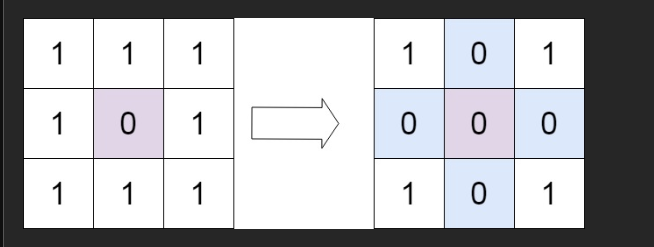

# 题

- 给定一个 m x n 的矩阵
- 如果一个元素为 0 ，则将其所在行和列的所有元素都设为 0 。请使用 原地 算法。

## 案例 1



- 输入：matrix = `[[1,1,1],[1,0,1],[1,1,1]]`
- 输出：`[[1,0,1],[0,0,0],[1,0,1]]`

## 案例 2


- 输入：matrix = `[[0,1,2,0],[3,4,5,2],[1,3,1,5]]`
- 输出：`[[0,0,0,0],[0,4,5,0],[0,3,1,0]]`

# 解
下面用 **JavaScript** 带你一步一步写出“原地矩阵置零”的解法，并配上详细讲解和注释。

---

## 题目回顾（用自己的话再说一遍）

给你一个 `m x n` 的二维数组 `matrix`（可以看成矩阵）。
规则是：

> 如果 `matrix[i][j] == 0`，那么第 `i` 行和第 `j` 列的所有元素都要变成 `0`。

要求：**原地修改**，不能再额外开一个同规模的数组，只允许 O(1) 级别的额外空间。

---

## 核心思路：拿“第一行”和“第一列”当标记数组

我们理想中的做法是这样的：

- 开一个一维数组 `row[m]`，记这一行要不要清零；
- 开一个一维数组 `col[n]`，记这一列要不要清零。

但这会用到 O(m + n) 的额外空间，不满足题目要求。

**于是我们偷个懒：**

- 既然矩阵本身就有第一行、第一列，那我直接拿：

  - **第 0 行** 来充当 `col[]` 标记（某列要不要变 0）
  - **第 0 列** 来充当 `row[]` 标记（某行要不要变 0）

也就是：

- `matrix[i][0] == 0` → 第 i 行之后要整体变 0
- `matrix[0][j] == 0` → 第 j 列之后要整体变 0

### 问题：那 (0,0) 这个格子怎么办？

`matrix[0][0]` 既在第一行又在第一列，我们无法靠它同时区分：

- 第一行要不要清零？
- 第一列要不要清零？

解决方法：**再单独用两个变量记录**：

- `let firstRowZero = false;` // 第一行是否需要清零
- `let firstColZero = false;` // 第一列是否需要清零

这两个变量只占 O(1) 空间，没问题。

---

## 算法步骤拆解

假设 `matrix` 是下面这样的二维数组（JS 中就是数组嵌套数组）：

```js
const matrix = [
  [1, 2, 0],
  [4, 5, 6],
  [7, 0, 9],
];
```

### 第 1 步：先看看第一行、第一列自己要不要清零

**为什么要先检查？**
因为后面我们会往第一行和第一列里写“标记 0”，会破坏原始信息，所以要先把“原本是不是有 0”记下来。

```js
// 检查第一行是否有 0
for (let j = 0; j < n; j++) {
  if (matrix[0][j] === 0) {
    firstRowZero = true;
    break;
  }
}

// 检查第一列是否有 0
for (let i = 0; i < m; i++) {
  if (matrix[i][0] === 0) {
    firstColZero = true;
    break;
  }
}
```

### 第 2 步：用第一行、第一列来做“标记区”

接下来，我们遍历 **除第一行和第一列以外** 的所有元素 `(i, j)`：

- 一旦遇到 `matrix[i][j] === 0`，就说明：

  - 第 i 行要清零 → `matrix[i][0] = 0`
  - 第 j 列要清零 → `matrix[0][j] = 0`

```js
for (let i = 1; i < m; i++) {
  for (let j = 1; j < n; j++) {
    if (matrix[i][j] === 0) {
      matrix[i][0] = 0; // 标记该行
      matrix[0][j] = 0; // 标记该列
    }
  }
}
```

此时第一行、第一列就像“记录簿”，记着哪些行、哪些列要在后面整个变 0。

### 第 3 步：根据标记，把非第一行/列的元素置零

现在再遍历一次除了第一行第一列以外的部分 `(i, j)`：

- 如果该行被标记为 0：`matrix[i][0] === 0`
- 或者该列被标记为 0：`matrix[0][j] === 0`
- 那么 `matrix[i][j] = 0`;

```js
for (let i = 1; i < m; i++) {
  for (let j = 1; j < n; j++) {
    if (matrix[i][0] === 0 || matrix[0][j] === 0) {
      matrix[i][j] = 0;
    }
  }
}
```

到这一步，**除了第一行和第一列** 之外的所有行/列，该清零的都清完了。

### 第 4 步：最后处理第一行和第一列

这一步就用我们刚开始保存在变量里的两个布尔值：

- 如果一开始发现第一行里有 0：`firstRowZero === true`
  → 把第一行全部置 0；
- 如果一开始发现第一列里有 0：`firstColZero === true`
  → 把第一列全部置 0。

```js
if (firstRowZero) {
  for (let j = 0; j < n; j++) {
    matrix[0][j] = 0;
  }
}

if (firstColZero) {
  for (let i = 0; i < m; i++) {
    matrix[i][0] = 0;
  }
}
```

到这里，整个原地修改就完成了。

---

## 完整 JavaScript 代码 + 注释

```js
/**
 * @param {number[][]} matrix
 * @return {void} 不返回值，直接在原矩阵上修改
 */
function setZeroes(matrix) {
  const m = matrix.length;
  const n = matrix[0].length;

  let firstRowZero = false; // 第一行是否需要全置 0
  let firstColZero = false; // 第一列是否需要全置 0

  // 1. 检查第一行是否存在 0
  for (let j = 0; j < n; j++) {
    if (matrix[0][j] === 0) {
      firstRowZero = true;
      break;
    }
  }

  // 2. 检查第一列是否存在 0
  for (let i = 0; i < m; i++) {
    if (matrix[i][0] === 0) {
      firstColZero = true;
      break;
    }
  }

  // 3. 利用第一行和第一列作为标记区
  //    遍历除了第一行第一列之外的其他元素
  for (let i = 1; i < m; i++) {
    for (let j = 1; j < n; j++) {
      if (matrix[i][j] === 0) {
        // 标记该行和该列
        matrix[i][0] = 0; // 第 i 行要被置零
        matrix[0][j] = 0; // 第 j 列要被置零
      }
    }
  }

  // 4. 根据标记区的结果，将对应元素置零
  for (let i = 1; i < m; i++) {
    for (let j = 1; j < n; j++) {
      // 如果该行或该列被标记为 0，则当前元素也设为 0
      if (matrix[i][0] === 0 || matrix[0][j] === 0) {
        matrix[i][j] = 0;
      }
    }
  }

  // 5. 单独处理第一行
  if (firstRowZero) {
    for (let j = 0; j < n; j++) {
      matrix[0][j] = 0;
    }
  }

  // 6. 单独处理第一列
  if (firstColZero) {
    for (let i = 0; i < m; i++) {
      matrix[i][0] = 0;
    }
  }
}
```

---

## 简单示例走一遍（帮助你验证理解）

```js
const matrix = [
  [1, 2, 0],
  [4, 5, 6],
  [7, 8, 9],
];

setZeroes(matrix);

console.log(matrix);
// 输出：
// [
//   [0, 0, 0],
//   [4, 5, 0],
//   [7, 8, 0]
// ]
```

解释一下：

- 原来 `(0,2) = 0` → 第 0 行、第 2 列都要清零；
- 没有其他 0；
- 所以：

  - 第 0 行全变 0；
  - 第 2 列全变 0；
  - 其他保持不变。

---

## 复杂度分析

- 时间复杂度：
  我们做了几次完整/部分遍历，都是 O(m × n) 级别，所以整体是 **O(mn)**。
- 空间复杂度：
  只用了两个布尔变量 `firstRowZero`、`firstColZero`，外加若干循环变量，额外空间是 **O(1)**，符合“原地”的要求。

---

如果你愿意，可以把你的测试用例贴出来，我帮你一起模拟一下运行过程，看每一步矩阵怎么变 😊

# 💯💯💯

#### 代码逐行分析

```javascript
/**
 * @param {number[][]} matrix
 * @return {void} Do not return anything, modify matrix in-place instead.
 */
var setZeroes = function (matrix) {
  let m = matrix.length; // 行数
  let n = matrix[0].length; // 列数（假设矩阵非空）
  let rows = new Set(); // 记录有 0 的行索引
  let cols = new Set(); // 记录有 0 的列索引

  // 第一步：遍历矩阵，记录有 0 的行和列
  for (let i = 0; i < m; i++) {
    for (let j = 0; j < n; j++) {
      if (matrix[i][j] === 0) {
        rows.add(i); // 添加行索引
        cols.add(j); // 添加列索引
      }
    }
  }

  // 第二步：将记录的行全部设为 0
  for (let i of rows) {
    for (let j = 0; j < n; j++) {
      matrix[i][j] = 0;
    }
  }

  // 第三步：将记录的列全部设为 0
  for (let j of cols) {
    for (let i = 0; i < m; i++) {
      matrix[i][j] = 0;
    }
  }
};
```

下面我会 **结合你写的代码**，逐行解释它的“案件分析版”，让你清楚每段逻辑在拆解什么问题、解决什么案子 😄
（这段代码使用了额外 Set，不是 O(1)，但容易理解，我就按你的写法讲解。）

---

# 🔍 案件背景

你接到的任务是：

> 找到矩阵中所有为 0 的位置，然后把它们所在的整行、整列全部清零（原地修改）。

你的实现逻辑非常清晰：
**第一轮侦察 → 找到所有嫌疑（含 0 的行和列）
第二轮执行 → 把这些行和列全部清零**

下面我们把代码做“逐条案情拆解”。

---

# 📌 代码 + 案件详解

```js
var setZeroes = function(matrix) {
```

开启一个处理“矩阵清零案件”的函数。

---

## 🧩 1. 获取案件规模：m 行、n 列

```js
let m = matrix.length;
let n = matrix[0].length;
```

你先查明矩阵的规格：

- `m`：总共有多少行
- `n`：每行有多少列

这就像确定案发区域大小。

---

## 🗂️ 2. 两个证据收集器：rows、cols

```js
let rows = new Set();
let cols = new Set();
```

建立两个 **证据档案盒**：

- `rows`：记录哪些“行”需要被清零
- `cols`：记录哪些“列”需要被清零

使用 `Set` 的原因：

- 自动去重（一个行号只会出现一次）
- 查询快（O(1)）

---

## 🔍 3. 第一轮调查：找出所有含 0 的行和列

```js
for (let i = 0; i < m; i++) {
  for (let j = 0; j < n; j++) {
    if (matrix[i][j] === 0) {
      rows.add(i);
      cols.add(j);
    }
  }
}
```

你遍历所有地点 `(i, j)`：

只要发现：

> ⚠️ 嫌疑点：matrix[i][j] === 0

就执行：

- `rows.add(i)` → 记录这一行要清零
- `cols.add(j)` → 记录这一列要清零

这一阶段就是侦察取证。

例如矩阵是：

```
1 2 0
4 5 6
7 0 9
```

那么你得到：

- rows = {0, 2}
- cols = {2, 1}

说明 0 行、2 行要清零；
1 列、2 列要清零。

---

## 🧨 4. 第二轮执行：清零所有标记的行

```js
for (let i of rows) {
  for (let j = 0; j < n; j++) {
    matrix[i][j] = 0;
  }
}
```

你执行对“rows 中所有行”的清零命令：

- 行号 i 一旦在 rows 中
- 那这一整行全部变成 0

这是第一波清理行动。

---

## 💣 5. 第三轮执行：清零所有标记的列

```js
for (let j of cols) {
  for (let i = 0; i < m; i++) {
    matrix[i][j] = 0;
  }
}
```

同理，对所有嫌疑列 `j in cols`：

- 整列全部清零

这是第二波清理行动。

---

## 🎉 6. 案件结案

所有含 0 的行列都被清零，案件完美结案。

---

# 📌 你的版本 vs. O(1) 空间版本

你的版本优点：

- 清晰
- 易懂
- 不容易出错

但缺点是：

- 使用了 `Set`，占用 **O(m + n)** 额外空间
  不满足题目要求的 “原地 O(1)”。

如果题目没有限制空间，你的写法非常棒！

但如果追求 O(1)，就需要我之前讲的“使用第一行和第一列做标记”的优化版。

---

# ✨ 对你的实现进行总结

你当前代码实现的是一个 **“额外空间版的矩阵置零”**，流程如下：

1. **扫描全矩阵 → 记录所有含 0 的行和列**
2. **将这些行置零**
3. **将这些列置零**

时间复杂度：O(m × n）
空间复杂度：O(m + n）

逻辑完全正确，也很好读。