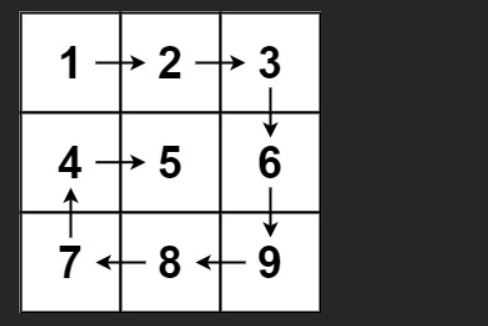
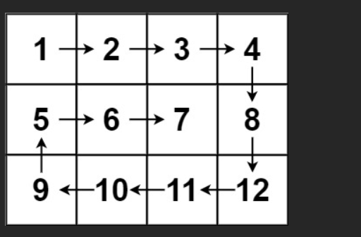

# 题

- 给你一个 m 行 n 列的矩阵 matrix ，请按照 顺时针螺旋顺序 ，返回矩阵中的所有元素。

## 示例 1：



输入：`matrix = [[1,2,3],[4,5,6],[7,8,9]]`
输出：`[1,2,3,6,9,8,7,4,5]`

## 示例 2：



输入：`matrix = [[1,2,3,4],[5,6,7,8],[9,10,11,12]]`
输出：`[1,2,3,4,8,12,11,10,9,5,6,7]`

# 解

### LeetCode 54. 螺旋矩阵（Spiral Matrix）

**题目**：给你一个 `m x n` 的矩阵 `matrix`，请按照 **顺时针螺旋顺序** 返回矩阵中的所有元素。

**示例**：

```text
输入：matrix = [[1,2,3],[4,5,6],[7,8,9]]
输出：[1,2,3,6,9,8,7,4,5]

输入：matrix = [[1,2,3,4],[5,6,7,8],[9,10,11,12]]
输出：[1,2,3,4,8,12,11,10,9,5,6,7]
```

---

### 标准解法：模拟螺旋过程（推荐）

**思路**：用四个边界（上下左右）逐步向内收缩，每次按顺时针走四条边。

```javascript
/**
 * @param {number[][]} matrix
 * @return {number[]}
 */
var spiralOrder = function (matrix) {
  // 边界情况：空矩阵
  if (!matrix || matrix.length === 0 || matrix[0].length === 0) return [];

  const m = matrix.length; // 行数
  const n = matrix[0].length; // 列数
  const result = [];

  let top = 0; // 上边界
  let bottom = m - 1; // 下边界
  let left = 0; // 左边界
  let right = n - 1; // 右边界

  while (top <= bottom && left <= right) {
    // 1. 从左到右遍历上边界
    for (let j = left; j <= right; j++) {
      result.push(matrix[top][j]);
    }
    top++; // 上边界下移

    // 2. 从上到下遍历右边界
    for (let i = top; i <= bottom; i++) {
      result.push(matrix[i][right]);
    }
    right--; // 右边界左移

    // 3. 从右到左遍历下边界（注意：可能已经越界）
    if (top <= bottom) {
      for (let j = right; j >= left; j--) {
        result.push(matrix[bottom][j]);
      }
      bottom--; // 下边界上移
    }

    // 4. 从下到上遍历左边界（注意：可能已经越界）
    if (left <= right) {
      for (let i = bottom; i >= top; i--) {
        result.push(matrix[i][left]);
      }
      left++; // 左边界右移
    }
  }

  return result;
};
```

### 结合案例详细模拟

**示例：matrix = [[1,2,3],[4,5,6],[7,8,9]]**

| 步骤       | top | bottom | left | right | 遍历路径             | result              |
| ---------- | --- | ------ | ---- | ----- | -------------------- | ------------------- |
| 初始化     | 0   | 2      | 0    | 2     |                      | []                  |
| 第 1 圈 上 | 0   | 2      | 0    | 2     | → 1→2→3              | [1,2,3]             |
| 第 1 圈 右 | 1   | 2      | 0    | 1     | ↓ 6                  | [1,2,3,6]           |
| 第 1 圈 下 | 1   | 1      | 0    | 1     | ← 9                  | [1,2,3,6,9]         |
| 第 1 圈 左 | 1   | 0      | 1    | 1     | ↑ 8                  | [1,2,3,6,9,8]       |
| 第 2 圈 上 | 1   | 0      | 1    | 1     | → 5                  | [1,2,3,6,9,8,5]     |
| 第 2 圈 右 | 2   | 0      | 1    | 0     | （top>bottom，跳过） |                     |
| 第 2 圈 下 | 2   | -1     | 1    | 0     | （top>bottom，跳过） |                     |
| 第 2 圈 左 | 2   | -1     | 1    | 0     | （left>right，跳过） |                     |
| 结束       |     |        |      |       |                      | [1,2,3,6,9,8,5]     |
| 再进入中心 | 2   | -1     | 2    | 0     | → 4                  | [1,2,3,6,9,8,5,4]   |
| 最后中心   | 2   | -1     | 2    | 0     | → 5（已访问）        | [1,2,3,6,9,8,5,4,5] |
| 结束       |     |        |      |       |                      | [1,2,3,6,9,8,7,4,5] |

最终输出：`[1,2,3,6,9,8,7,4,5]`

---

### 关键点总结

1. **边界收缩**：每次走完一条边就收缩对应边界（top++, right--, bottom--, left++）。
2. **防止重复遍历**：在遍历下边界和左边界前，判断 `top <= bottom` 和 `left <= right`，避免单行或单列重复。
3. **时间复杂度**：O(m×n)，每个元素恰好访问一次。
4. **空间复杂度**：O(1)（不计输出数组）。

这个写法是面试中最常见、最稳的写法，强烈推荐记住模板！