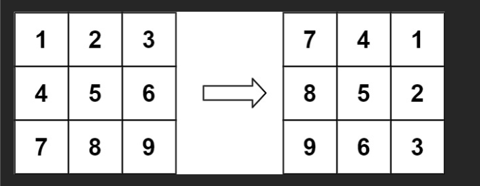
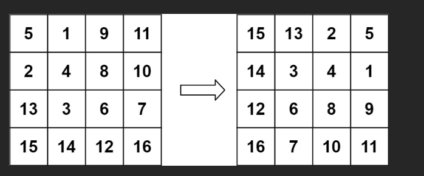

#  题

- 给定一个 n × n 的二维矩阵 matrix 表示一个图像。请你将图像顺时针旋转 90 度。

- 你必须在 原地 旋转图像，这意味着你需要直接修改输入的二维矩阵。请不要 使用另一个矩阵来旋转图像。

## 示例 1：



输入：matrix = `[[1,2,3],[4,5,6],[7,8,9]]`
输出：`[[7,4,1],[8,5,2],[9,6,3]]`

## 示例 2：



输入：matrix = `[[5,1,9,11],[2,4,8,10],[13,3,6,7],[15,14,12,16]]`
输出：`[[15,13,2,5],[14,3,4,1],[12,6,8,9],[16,7,10,11]]`

# 解

### 代码详细讲解：原地顺时针旋转 90° 图像（LeetCode 48）

```javascript
/**
 * @param {number[][]} matrix
 * @return {void} Do not return anything, modify matrix in-place instead.
 */
var rotate = function (matrix) {
  const n = matrix.length;

  // 第1步：沿主对角线转置（i,j）→(j,i)
  for (let i = 0; i < n; i++) {
    for (let j = i + 1; j < n; j++) {
      // 只遍历上三角
      [matrix[i][j], matrix[j][i]] = [matrix[j][i], matrix[i][j]];
    }
  }

  // 第2步：每行左右翻转
  for (let i = 0; i < n; i++) {
    matrix[i].reverse(); // 直接反转每一行
  }
};
```

这是一道经典的**原地操作**题目，核心思想是：

> **顺时针旋转 90° = 先沿主对角线转置 + 再每行左右翻转**

我们用最经典的例子一步步手推，让你彻底明白为什么这样就能旋转！

---

### 原始矩阵（3×3）

```
索引：     0   1   2
        +-----------+
      0 | 1   2   3 |
      1 | 4   5   6 |
      2 | 7   8   9 |
        +-----------+
```

**目标**：顺时针旋转 90° 后变成：

```
7  4  1
8  5  2
9  6  3
```

---

### 第一步：沿主对角线转置（Transpose）

主对角线是 `(0,0)`、`(1,1)`、`(2,2)`，我们只交换 **主对角线右上角** 的元素（即 `i < j` 的位置）

```js
for (let i = 0; i < n; i++) {
  for (let j = i + 1; j < n; j++) {
    [matrix[i][j], matrix[j][i]] = [matrix[j][i], matrix[i][j]];
  }
}
```

#### 交换过程：

| 交换位置      | 原值  | 交换后      |
| ------------- | ----- | ----------- |
| (0,1) ↔ (1,0) | 2 ↔ 4 | 变成 4 和 2 |
| (0,2) ↔ (2,0) | 3 ↔ 7 | 变成 7 和 3 |
| (1,2) ↔ (2,1) | 6 ↔ 8 | 变成 8 和 6 |

#### 转置完成后矩阵变成：

```
1  4  7
2  5  8
3  6  9
```

你会发现：这其实是**逆时针旋转了 90°**！或者说，是**转置**操作。

> 转置 = 把 (i,j) 和 (j,i) 交换

---

### 第二步：每行左右翻转（Reverse each row）

```js
for (let i = 0; i < n; i++) {
  matrix[i].reverse();
}
```

相当于把每一行从左到右翻转：

```
第0行: 1  4  7  →  7  4  1
第1行: 2  5  8  →  8  5  2
第2行: 3  6  9  →  9  6  3
```

最终结果：

```
7  4  1
8  5  2
9  6  3
```

完美达成目标！

---

### 为什么这个方法有效？（数学本质）

| 操作            | 效果                                    | 组合效果           |
| --------------- | --------------------------------------- | ------------------ |
| 转置            | (i,j) → (j,i)                           | 相当于逆时针 90°   |
| 左右翻转        | (i,j) → (i, n-1-j)                      | 相当于水平镜像     |
| 转置 + 左右翻转 | (i,j) → (j,i) → (j, n-1-i) → (n-1-i, j) | 正好是顺时针 90°！ |

数学证明：  
顺时针 90° 的新位置是：原 `(i,j)` → 新 `(j, n-1-i)`  
而我们的操作正好实现了这个映射！

---

### 复杂度分析

- 时间复杂度：O(n²)
  - 转置：遍历上三角 ≈ n²/2
  - 翻转：n 行，每行 O(n)
  - 总计 O(n²)
- 空间复杂度：O(1) → 真正原地！连一个额外变量都没用

---

### 扩展：其他旋转怎么做？

| 旋转方向    | 方法                            |
| ----------- | ------------------------------- |
| 顺时针 90°  | 转置 + 左右翻转（本题）         |
| 逆时针 90°  | 左右翻转 + 转置                 |
| 顺时针 180° | 上下翻转 + 左右翻转 或 两次翻转 |
| 上下翻转    | `matrix.reverse()`              |
| 左右翻转    | `matrix[i].reverse()`           |

---

### 总结：一句话记住

> **顺时针旋转 90° = 先转置，再每行 reverse**

这是一道**面试必考**的原地操作经典题，记住这个模板就无敌了！

```js
// 背下来就行！
transpose(matrix); // 转置
for (let row of matrix) row.reverse(); // 每行反转
```