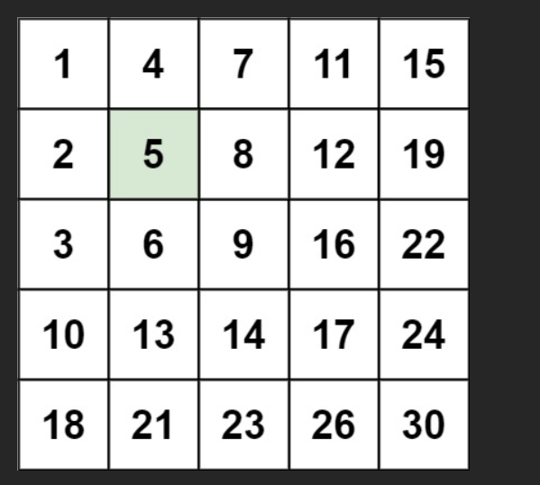
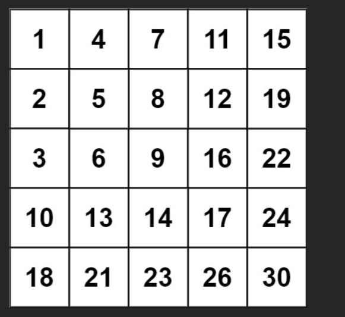

# 题

- 编写一个高效的算法来搜索 m x n 矩阵 matrix 中的一个**目标值** target 。该矩阵具有以下特性：

- 每行的元素从**左到右**升序排列。
- 每列的元素从**上到下**升序排列。

## 示例 1：



输入：

`matrix = [`
`[1,4,7,11,15],`
`[2,5,8,12,19],`
`[3,6,9,16,22],`
`[10,13,14,17,24],`
`[18,21,23,26,30]`
`]`

`target = 5`

输出：`true`

## 示例 2：



输入：

`matrix = [[1,4,7,11,15],[2,5,8,12,19],[3,6,9,16,22],[10,13,14,17,24],[18,21,23,26,30]]`

 `target = 20`

输出：`false`

# 解

这是 **LeetCode 240. 搜索二维矩阵 II**（中等偏难），经典中的经典！

矩阵特性：
- 每行从左到右递增
- 每列从上到下递增  
→ 整体呈现“**从左上到右下越来越大**”的规律

### 最优解法：从右上角开始“Z”字形搜索（时间 O(m + n)，空间 O(1)）

**核心思想**：  
从矩阵的 **右上角** `(0, n-1)` 开始搜索，像走“Z”字一样：

- 如果当前值 == target → 找到，返回 true
- 如果当前值 > target → 说明这一列下面都更大 → **左移**（col--）
- 如果当前值 < target → 说明这一行左边都更小 → **下移**（row++）

这样每次都能排除一行或一列，最多走 m + n 步！

```javascript
/**
 * @param {number[][]} matrix
 * @param {number} target
 * @return {boolean}
 */
var searchMatrix = function(matrix, target) {
    // 空矩阵处理
    if (matrix.length === 0 || matrix[0].length === 0) return false;
    
    let row = 0;                    // 从第0行开始
    let col = matrix[0].length - 1; // 从最右一列开始（右上角）
    
    while (row < matrix.length && col >= 0) {
        if (matrix[row][col] === target) {
            return true;            // 找到了！
        } else if (matrix[row][col] > target) {
            col--;                  // 当前值太大，这一列下面都更大 → 左移
        } else {
            row++;                  // 当前值太小，这一行左边都更小 → 下移
        }
    }
    
    return false; // 走出边界都没找到
};
```

### 结合具体例子手推一遍（超级清晰！）

```
matrix = [
  [1,   4,  7, 11, 15],
  [2,   5,  8, 12, 19],
  [3,   6,  9, 16, 22],
  [10, 13, 14, 17, 24],
  [18, 21, 23, 26, 30]
]
target = 5
```

从右上角 (0,4) = 15 开始：

| 步骤 | 位置     | 值     | 比较            | 操作             | 解释                              |
|------|----------|--------|------------------|-------------------|-----------------------------------|
| 1    | (0,4)    | 15     | 15 > 5           | col-- → (0,3)     | 太大，整列下面都 ≥15，排除第4列   |
| 2    | (0,3)    | 11     | 11 > 5           | col-- → (0,2)     | 太大，排除第3列                   |
| 3    | (0,2)    | 7      | 7 > 5            | col-- → (0,1)     | 太大，排除第2列                   |
| 4    | (0,1)    | 4      | 4 < 5            | row++ → (1,1)     | 太小，这一行左边都 ≤4，排除第0行  |
| 5    | (1,1)    | 5      | 5 === 5          | 找到！返回 true   | 就是它！                          |

成功找到！

### 再试一个找不到的：target = 20

从 (0,4)=15 开始：

| 步骤 | 位置     | 值   | 操作                   |
|------|----------|------|-------------------------|
| 1    | (0,4)    | 15   | 15 < 20 → row++ → (1,4)=19 |
| 2    | (1,4)    | 19   | 19 < 20 → row++ → (2,4)=22 |
| 3    | (2,4)    | 22   | 22 > 20 → col-- → (2,3)=17 |
| 4    | (2,3)    | 17   | 17 < 20 → row++ → (3,3)=17 |
| 5    | (3,3)    | 17   | 17 < 20 → row++ → (4,3)=26 |
| 6    | (4,3)    | 26   | 26 > 20 → col-- → (4,2)=23 |
| 7    | (4,2)    | 23   | 23 > 20 → col-- → (4,1)=21 |
| 8    | (4,1)    | 21   | 21 > 20 → col-- → (4,0)=18 |
| 9    | (4,0)    | 18   | 18 < 20 → row++ → row=5（越界）|

循环结束 → 返回 false

完美！

### 为什么不能从左上角或左下角开始？（常见误区）

- 从左上角 (0,0) 开始：小的无路可走，大的只能右或下，无法排除行列 → 退化为暴力
- 从左下角开始也可以，但逻辑相反（> target 就上移，< target 就右移），不如右上角直观

### 总结：这题的灵魂一句话

> “从右上角开始，像一条蛇一样往左下爬，每次只能排除一行或一列”

```js
// 最终推荐版本（简洁 + 鲁棒性强）
var searchMatrix = function(matrix, target) {
    if (!matrix.length || !matrix[0].length) return false;
    
    let row =  = 0;
    let col = matrix[0].length - 1;
    
    while (row < matrix.length && col >= 0) {
        if (matrix[row][col] === target) return true;
        if (matrix[row][col] > target)  col--;
        else                            row++;
    }
    
    return false;
};
```

时间 O(m + n)，空间 O(1)，面试中写出这个解法，基本稳了！  
这是算法题里少数几个“优雅到让人想鼓掌”的解法之一～