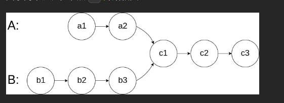
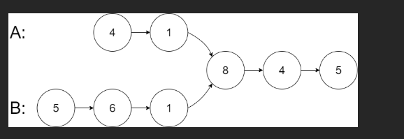
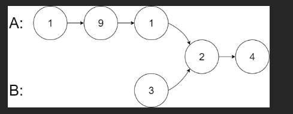
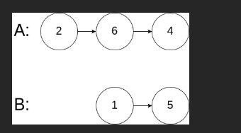

# 题

给你两个单链表的头节点 headA 和 headB ，请你找出并返回两个单链表相交的起始节点。如果两个链表不存在相交节点，返回 null 。

图示两个链表在节点 c1 开始相交：



题目数据 保证 整个链式结构中不存在环。

注意，函数返回结果后，链表必须 保持其原始结构 。

自定义评测：

评测系统 的输入如下（你设计的程序 不适用 此输入）：

intersectVal - 相交的起始节点的值。如果不存在相交节点，这一值为 0
listA - 第一个链表
listB - 第二个链表
skipA - 在 listA 中（从头节点开始）跳到交叉节点的节点数
skipB - 在 listB 中（从头节点开始）跳到交叉节点的节点数
评测系统将根据这些输入创建链式数据结构，并将两个头节点 headA 和 headB 传递给你的程序。如果程序能够正确返回相交节点，那么你的解决方案将被 视作正确答案 。

 

## 示例 1：




输入：`intersectVal = 8, listA = [4,1,8,4,5], listB = [5,6,1,8,4,5], skipA = 2, skipB = 3`
输出：`Intersected at '8'`
解释：相交节点的值为 8 （注意，如果两个链表相交则不能为 0）。
从各自的表头开始算起，链表 A 为 `[4,1,8,4,5]`，链表 B 为 `[5,6,1,8,4,5]`。
在 A 中，相交节点前有 2 个节点；在 B 中，相交节点前有 3 个节点。
— 请注意相交节点的值不为 1，因为在链表 A 和链表 B 之中值为 1 的节点 (A 中第二个节点和 B 中第三个节点) 是不同的节点。换句话说，它们在内存中指向两个不同的位置，而链表 A 和链表 B 中值为 8 的节点 (A 中第三个节点，B 中第四个节点) 在内存中指向相同的位置。
 

## 示例 2：



输入：`intersectVal = 2, listA = [1,9,1,2,4], listB = [3,2,4], skipA = 3, skipB = 1`
输出：`Intersected at '2'`
解释：相交节点的值为 2 （注意，如果两个链表相交则不能为 0）。
从各自的表头开始算起，链表 A 为 [1,9,1,2,4]，链表 B 为 [3,2,4]。
在 A 中，相交节点前有 3 个节点；在 B 中，相交节点前有 1 个节点。
## 示例 3：




输入：`intersectVal = 0, listA = [2,6,4], listB = [1,5], skipA = 3, skipB = 2`
输出：`No intersection`
解释：从各自的表头开始算起，链表 A 为` [2,6,4]`，链表 B 为 `[1,5]`。
由于这两个链表不相交，所以 intersectVal 必须为 0，而 skipA 和 skipB 可以是任意值。
这两个链表不相交，因此返回 null 。

# 💯💯💯

下面是用 **JavaScript** 实现的最优解法（浪漫双指针法），时间复杂度 O(n+m)，空间复杂度 O(1)：

```javascript
/**
 * @param {ListNode} headA
 * @param {ListNode} headB
 * @return {ListNode | null}
 */
var getIntersectionNode = function(headA, headB) {
    // 边界情况：有一个链表为空，直接不可能相交
    if (!headA || !headB) return null;

    let pA = headA;
    let pB = headB;

    // 最多循环两圈就会相遇或同时变为 null
    while (pA !== pB) {
        // pA 走完链表A后，立刻跳到链表B的头部
        pA = pA === null ? headB : pA.next;
        // pB 走完链表B后，立刻跳到链表A的头部
        pB = pB === null ? headA : pB.next;
    }

    // 相遇点就是交点（如果没有交点，pA 和 pB 会同时为 null）
    return null
    return pA;
};
```

太好了！我们来把这道题和这段代码**彻底讲透**，结合一个具体的例子，手把手一步步走完整个过程，保证你看完后彻底理解“浪漫双指针”为什么这么神奇！

---

### 示例场景（经典相交案例）

```
链表 A：  4 → 1 → 8 → 4 → 5
                ↑
链表 B：    5 → 0 → 1 → 8 → 4 → 5
                    ↑
              相交从节点 8 开始
```

- 节点值序列：
  - A = [4,1,8,4,5]
  - B = [5,0,1,8,4,5]
- 相交起始节点是值等于 `8` 的那个节点（注意：题目判断相交是**同一对象**，不是值相等）

```
headA ──→ 4 → 1 ──────┐
                      ↓
headB ──→ 5 → 0 → 1 ──┴──→ 8 → 4 → 5
                             (公共部分)
```

- A 独有部分长度 a = 2（4→1）
- B 独有部分长度 b = 3（5→0→1）
- 公共部分长度 c = 3（8→4→5）

---

### 现在运行代码，跟踪 pA 和 pB 的每一步！

| 步骤 | pA 当前位置（值） | pA 操作                        | pB 当前位置（值） | pB 操作             | pA === pB ? |
| ---- | ----------------- | ------------------------------ | ----------------- | ------------------- | ----------- |
| 0    | 4 (headA)         |                                | 5 (headB)         |                     | 否          |
| 1    | 1                 | pA = pA.next                   | 0                 | pB = pB.next        | 否          |
| 2    | 8                 | pA = pA.next                   | 1                 | pB = pB.next        | 否          |
| 3    | 4 (公共)          | pA = pA.next                   | 8                 | pB = pB.next        | 否          |
| 4    | 5 (公共)          | pA = pA.next                   | 4 (公共)          | pB = pB.next        | 否          |
| 5    | null（A 走完了）  | → pA = headB（跳到 B 开头）→ 5 | 5 (公共末尾)      | pB = pB.next → null | 否          |
| 6    | 5 (从 B 重新开始) | pA = pA.next → 0               | null（B 走完了）  | → pB = headA → 4    | 否          |
| 7    | 0                 | pA = pA.next → 1               | 4 (A 的头)        | pB = pB.next → 1    | 否          |
| 8    | 1                 | pA = pA.next → 8               | 1                 | pB = pB.next → 8    | 否          |
| 9    | 8 ← 相遇！        |                                | 8 ← 相遇！        |                     | 是！        |

第 9 步，pA 和 pB 同时到达值是 8 的节点 → 返回这个节点！

---

### 为什么一定能相遇？数学证明超浪漫

两个人走的总路程都是：  
**a + c + b + c = a + b + 2c**

- pA 走的路径：A 独有 + 公共 + B 独有 + 公共\*\*
- pB 走的路径：**B 独有 + 公共 + A 独有 + 公共**

顺序不同，但总长度完全一样！

所以：

- 如果有交点 → 他们一定在第二次进入公共部分时“同步”相遇
- 如果没有交点 → 最后都会走到 null，同时变成 null，相遇在 null 上（返回 null）

---

### 再来看一个**没有交点**的例子

```
A: 2 → 6 → 4
B: 1 → 5
```

执行过程：

| 步骤 | pA   | → 操作                  | pB   | → 操作               | 是否相等 |
| ---- | ---- | ----------------------- | ---- | -------------------- | -------- |
| 1    | 2    | →6                      | 1    | →5                   | 否       |
| 2    | 6    | →4                      | 5    | →null → 跳到 headA=2 | 否       |
| 3    | 4    | →null → 跳到 headB=1    | 2    | →6                   | 否       |
| 4    | 1    | →5                      | 6    | →4                   | 否       |
| 5    | 5    | →null                   | 4    | →null                | 否       |
| 6    | null | → 跳到 headB（仍 null） | null | → 跳到 headA（null） | 是！null |

→ 同时变成 null，返回 null，完美！

---

### 代码中有个小错误！快修一下！

你贴的代码最后两行写反了：

```js
return null）
return pA;
```

应该是：

```js
return pA; // 或者 return pB，都一样
```

# 💯💯💯

```javascript
var getIntersectionNode = function (headA, headB) {
  let a = headA,
    b = headB;

  while (a !== b) {
    if (a !== null) {
      a = a.next;
    } else {
      a = headB; // a走完自己的路，换到b的路继续走
    }

    if (b !== null) {
      b = b.next;
    } else {
      b = headA; // b走完自己的路，换到a的路继续走
    }
  }

  return a; // 相遇点 or null
};
```


太好了！你现在用的这个版本是 **最清晰、最适合一边看一边手推的写法！  
我们用同一个经典例子，把每一步都走一遍，保证你看完后闭着眼睛都能手画出来。

### 经典测试用例（LeetCode 官方例1）

```
链表A：   4 → 1 → 8 → 4 → 5
               ↑
链表B： 5 → 0 → 1 → 8 → 4 → 5
                 ↑
         相交从节点值为8的那个节点开始（是同一个对象！）
```

- A 的独有部分：4 → 1（长度 2）
- B 的独有部分：5 → 0 → 1（长度 3）
- 公共部分：8 → 4 → 5（长度 3）

### 现在开始！一步一步跟踪指针 a 和 b

| 轮次 | a 当前指向（值） | a 的操作说明                          | b 当前指向（值） | b 的操作说明                          | a === b ? |
|------|-------------------|----------------------------------------|-------------------|----------------------------------------|-----------|
| 初始 | 4                 |                                        | 5                 |                                        | 否        |
| 1    | → 1               | a = a.next                             | → 0               | b = b.next                             | 否        |
| 2    | → 8               | a = a.next                             | → 1               | b = b.next                             | 否        |
| 3    | → 4 (公共)        | a = a.next                             | → 8               | b = b.next                             | 否        |
| 4    | → 5 (公共)        | a = a.next                             | → 4 (公共)        | b = b.next                             | 否        |
| 5    | → null            | a 为空 → a = headB（跳到B开头）→ 5     | → 5 (公共末尾)    | b = b.next → null                      | 否        |
| 6    | → 0               | a = a.next（现在走B的路）             | → null            | b 为空 → b = headA → 4                 | 否        |
| 7    | → 1               | a = a.next                             | → 1               | b = b.next                             | 否        |
| 8    | → 8               | a = a.next                             | → 8               | b = b.next                             | 是！      |

第8轮结束时：  
**a 和 b 同时指向同一个节点 8** → 循环结束 → 返回这个节点

完美找到相交起始节点！

### 再来一个“不相交”的例子（超级重要！）

```
链表A：2 → 6 → 4
链表B：1 → 5
两个链表完全独立，没有任何公共节点
```

| 轮次 | a 指向 | a 操作                               | b 指向 | b 操作                               | a===b? |
|------|--------|---------------------------------------|--------|---------------------------------------|--------|
| 初始 | 2      |                                       | 1      |                                       | 否     |
| 1    | 6      | a.next                                | 5      | b.next                                | 否     |
| 2    | 4      | a.next                                | null   | b为空 → b = headA → 2                 | 否     |
| 3    | null   | a为空 → a = headB → 1                 | 6      | b.next                                | 否     |
| 4    | 5      | a.next                                | 4      | b.next                                | 否     |
| 5    | null   | a为空 → a = headB（还是1，但马上next）| null   | b为空 → b = headA（null）             | 否     |
| 6    | null   | a 已经null，执行 else → a = headB=1   | null   | b 已经null，执行 else → b = headA=null| 否     |
| 等一下！我们再仔细看第5步结束时： | | | | | |
| 5结束| null   | 下一轮 a 会变成 headB=1               | null   | 下一轮 b 会变成 headA=null            |        |
| 6    | 1      | a = a.next (1→5)                      | null   | b 为空 → b = headA = null             | 否     |
| 7    | 5      | a = a.next                            | null   | b 为空 → b = headA = null             | 否     |
| 8    | null   | a 为空 → a = headB = 1（但我们不关心）| null   | b 为空 → b = headA = null             | 是！   |

第8轮：a 和 b 都变成 null → a === b 为 true → 退出循环 → 返回 null

完美！没有交点时也正确返回 null

### 为什么这个写法特别好理解？

因为它把“三元运算符”那句最浪漫但最难懂的代码：

```js
pA = pA === null ? headB : pA.next;
```

拆成了最原始的 if-else，逻辑一目了然：

```js
if (a !== null) {
    a = a.next;
} else {
    a = headB;        // 我走完我的路，去走你的路
}
```

意思就是：

> “亲爱的，如果你还没走完，那就继续往前走一步；  
> 如果你已经走到头了，那就从我的起点重新开始走吧～  
> 我也一样对待你。  
> 这样我们总会在某个地方相遇，或者一起走到尽头。”

### 最终推荐写法（清晰版 + 简洁版）

清晰版（适合面试手写 + 讲解）：
```js
var getIntersectionNode = function(headA, headB) {
    let a = headA, b = headB;
    
    while (a !== b) {
        if (a !== null) {
            a = a.next;
        } else {
            a = headB;
        }
        
        if (b !== null) {
            b = b.next;
        } else {
            b = headA;
        }
    }
    
    return a; // 相遇点 or null
};
```

简洁版（实际刷题/生产用）：
```js
var getIntersectionNode = function(headA, headB) {
    let a = headA, b = headB;
    while (a !== b) {
        a = a ? a.next : headB;
        b = b ? b.next : headA;
    }
    return a;
};
```

现在你已经彻底掌握了这道题的灵魂了！  
下次面试有人问你“相交链表”，你就可以笑着说：

“来，我给你讲个浪漫的双指针故事……”