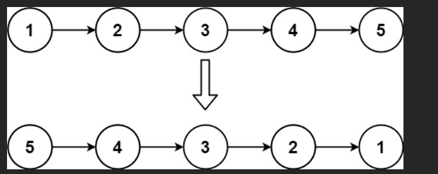
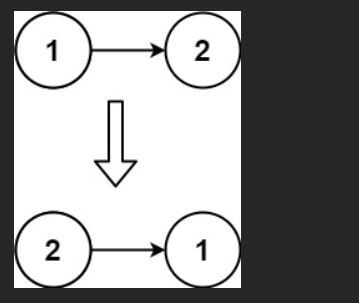

# 题

给你单链表的头节点 head ，请你**反转链表**，并返回**反转后的**链表。

## 示例 1：



输入：head = [1,2,3,4,5]
输出：[5,4,3,2,1]

## 示例 2：



输入：head = [1,2]
输出：[2,1]

## 示例 3：

输入：head = []
输出：[]

# 解

```js
/**
 * Definition for singly-linked list.
 * function ListNode(val, next) {
 *     this.val = val;
 *     this.next = next || null;
 * }
 */
/**
 * @param {ListNode} head
 * @return {Node}
 */
var reverseList = function (head) {
  let prev = null;
  let cur = head;

  while (cur !== null) {
    let next = cur.next; // 先保存下一个节点
    cur.next = prev; // 反转指针
    prev = cur; // prev 和 cur 都往前走一步
    cur = next;
  }

  return prev; // 最后 cur 为 null，prev 指向新头节点
};
```

太好了！我们就用你这版代码（**面试中最标准、最稳、最推荐的迭代写法**），结合一个具体例子，**手把手、一步一步、画图推演**，让你彻底明白为什么这几行代码能完美反转链表！

### 测试用例（经典例子）

```
原始链表：1 → 2 → 3 → 4 → 5 → null
目标：    5 → 4 → 3 → 2 → 1 → null
```

我们现在把每一次 while 循环都画出来看！

| 轮次     | prev | cur  | next（临时保存） | 执行 cur.next = prev 后 | prev 和 cur 移动后 | 当前链表真实样子（重点！）               |
| -------- | ---- | ---- | ---------------- | ----------------------- | ------------------ | ---------------------------------------- |
| 初始     | null | 1    | -                | -                       | -                  | 1→2→3→4→5→null                           |
| 第 1 轮  | null | 1    | 2                | 1→null                  | prev=1, cur=2      | 1→null 　　 2→3→4→5→null（1 被摘下来了） |
| 第 2 轮  | 1    | 2    | 3                | 2→1                     | prev=2, cur=3      | 2→1→null 　 3→4→5→null                   |
| 第 3 轮  | 2    | 3    | 4                | 3→2                     | prev=3, cur=4      | 3→2→1→null 　 4→5→null                   |
| 第 4 轮  | 3    | 4    | 5                | 4→3                     | prev=4, cur=5      | 4→3→2→1→null 　 5→null                   |
| 第 5 轮  | 4    | 5    | null             | 5→4                     | prev=5, cur=null   | 5→4→3→2→1→null 　（全部连好了！）        |
| 循环结束 | 5    | null | -                | -                       | -                  | 返回 prev → 5→4→3→2→1→null               |

完美！5 变成了新头节点。

### 再来一张超级清晰的动图式表格（建议保存！）

| 步骤 | 操作前的链表 | 保存 next | 反转当前指针 | 移动 prev 和 cur | 操作后的链表        |
| ---- | ------------ | --------- | ------------ | ---------------- | ------------------- |
| 1    | 1→2→3→4→5    | next=2    | 1→null       | prev=1, cur=2    | 1→null 　　 2→3→4→5 |
| 2    | 1←2→3→4→5    | next=3    | 2→1          | prev=2, cur=3    | 2→1→null 　 3→4→5   |
| 3    | 2←3→4→5      | next=4    | 3→2          | prev=3, cur=4    | 3→2→1→null 　 4→5   |
| 4    | 3←4→5        | next=5    | 4→3          | prev=4, cur=5    | 4→3→2→1→null 　 5   |
| 5    | 4←5          | next=null | 5→4          | prev=5, cur=null | 5→4→3→2→1→null      |

### 为什么必须先保存 next？（血泪教训！）

如果你写成这样会死：

```js
cur.next = prev; // 直接改指针
cur = cur.next; // 错！这时候 cur.next 已经变成 prev 了！你回到上一个节点了！
```

→ 永远只能在 1 和 null 之间循环，造成死循环或丢失节点！

**所以“先保存 next”是最关键的一步！**

### 特殊用例验证（面试官最爱问）

#### 空链表和单节点

```js
reverseList(null)        → 返回 null
reverseList(只一个节点) → 返回原节点（自己指向自己next=null）
```

代码天然支持，无需额外处理！

### 最终代码 + 极致清晰注释（直接背！）

```javascript
var reverseList = function (head) {
  let prev = null; // 反转后的新尾巴，一开始是 null
  let cur = head; // 当前要反转的节点

  while (cur !== null) {
    let next = cur.next; // 步骤1：先把下一个节点记住！（不记住就丢了）
    cur.next = prev; // 步骤2：当前节点指向上一个（反转核心！）
    prev = cur; // 步骤3：prev 往前走一步（准备迎接下一个新来的）
    cur = next; // 步骤4：cur 往前走一步（处理下一个节点）
  }

  return prev; // cur 变成 null 时，prev 正好是新头节点
};
```

### 一句话总结这道题的灵魂（背下来，面试直接说）

> “每次处理一个节点，都先记住下一个节点，然后把当前节点的指针反转指向上一个节点，再把 prev 和 cur 一起往前移动一步。直到 cur 变成 null，prev 就成了新头节点。”

现在你已经彻底掌握了反转链表！  
下次面试有人问你“请手写反转链表”，你怕了吗？”  
你只用说一句：