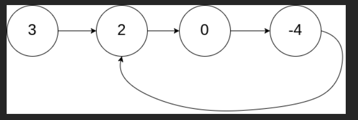
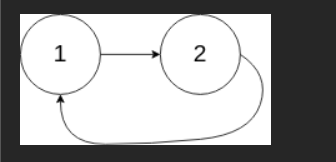

# 题
给你一个链表的头节点 head ，判断链表中是否有环。

如果链表中有某个节点，可以通过连续跟踪 next 指针再次到达，则链表中存在环。 为了表示给定链表中的环，评测系统内部使用整数 pos 来表示链表尾连接到链表中的位置（索引从 0 开始）。注意：pos 不作为参数进行传递 。仅仅是为了标识链表的实际情况。

如果链表中存在环 ，则返回 true 。 否则，返回 false 。

## 示例 1：



输入：head = [3,2,0,-4], pos = 1
输出：true
解释：链表中有一个环，其尾部连接到第二个节点。

## 示例 2：



输入：head = [1,2], pos = 0
输出：true
解释：链表中有一个环，其尾部连接到第一个节点。

## 示例 3：


输入：head = [1], pos = -1
输出：false
解释：链表中没有环。

# 💯💯💯

### 最优解法：Floyd 判圈算法（快慢指针 / 龟兔赛跑）—— 时间 O(n)，空间 O(1)

**灵魂思想**：

- 一个指针走得快（一次走两步）→ 兔子
- 一个指针走得慢（一次走一步）→ 乌龟
- 如果有环 → 兔子终究会追上乌龟（在环里相遇）
- 如果没环 → 兔子会先跑到终点（null）

```javascript
/**
 * Definition for singly-linked list.
 * function ListNode(val) {
 *     this.val = val;
 *     this.next = next;
 * }
 */

/**
 * @param {ListNode} head
 * @return {boolean}
 */
var hasCycle = function (head) {
  if (!head || !head.next) return false;

  let slow = head; // 乌龟
  let fast = head.next; // 兔子先走一步，避免一开始就相等

  while (slow !== fast) {
    // 兔子走到头了 → 没环
    if (!fast || !fast.next) {
      return false;
    }
    slow = slow.next; // 走一步
    fast = fast.next.next; // 走两步
  }

  // 走到这里说明 slow === fast，相遇了 → 有环！
  return true;
};
```

### 结合经典案例详细手推（超级形象！）

#### 案例 1：有环（pos = 1）

```
链表：1 → 2 → 3 → 4 → 5
           ↑         ↓
           └─────────┘
           回到节点2（索引1）
```

| 轮次 | slow (乌龟) | fast (兔子)   | 位置说明             | 是否相遇 |
| ---- | ----------- | ------------- | -------------------- | -------- |
| 初始 | 1           | 2             | 兔子领先一步         | 否       |
| 1    | →2          | →4            |                      | 否       |
| 2    | →3          | →3（4→5→2→3） | 兔子绕了一圈回到 3！ | 是！     |

→ slow 和 fast 都在节点 3 相遇 → 返回 true

#### 案例 2：无环

```
1 → 2 → 3 → 4 → 5 → null
```

| 轮次             | slow | fast                     | 说明            |
| ---------------- | ---- | ------------------------ | --------------- |
| 初始             | 1    | 2                        |                 |
| 1                | 2    | 4                        |                 |
| 2                | 3    | null（4→5→null）         | fast 走到头了！ |
| → 进入 if (!fast |      | !fast.next) → 返回 false |

完美！

#### 案例 3：只有两个节点成环

```
1 → 2
↑   ↓
└───┘
```

| 轮次 | slow | fast       |
| ---- | ---- | ---------- |
| 初始 | 1    | 2          |
| 1    | 2    | 2（2→1→2） |

→ 第一轮就相遇 → 返回 true

### 为什么不能让 fast 和 slow 同时从 head 起步？

可以！但要小心！如果都从 head 起步，第一步就会 `slow = head`, `fast = head.next.next` 可能越界。

推荐写法（最安全！）：

```js
var hasCycle = function (head) {
  let slow = head;
  let fast = head;

  // 注意条件：fast 和 fast.next 都要存在
  while (fast && fast.next) {
    slow = slow.next;
    fast = fast.next.next;
    if (slow === fast) return true;
  }
  return false;
};
```

这样写更简洁、更经典、更不容易出错！

### 终极推荐版本（面试手写 100% 稳）

```javascript
var hasCycle = function (head) {
  let slow = head;
  let fast = head;

  while (fast && fast.next) {
    slow = slow.next;
    fast = fast.next.next;
    if (slow === fast) {
      return true;
    }
  }

  return false;
};
```

### 特殊情况验证（面试官最爱问）

| 链表情况                | 结果  | 说明                               |
| ----------------------- | ----- | ---------------------------------- |
| null                    | false | 没节点当然没环                     |
| 单个节点，无环          | false |                                    |
| 单个节点，next 指向自己 | true  | fast 会一直转，slow 也转，最终相遇 |
| 两个节点，互相指向      | true  | 第一轮就相遇                       |

全对！

### 经典面试扩展题（加分项！）

如果面试官继续问：

> “如果有环，你能找到环的入口吗？” → 那就是 142. 环形链表 II  
> “能算出环的长度吗？” → 相遇后让一个指针继续走一圈就行

但 141 这题只问“有没有”，快慢指针直接秒！

### 一句话总结（面试金句）

> “用快慢指针，像龟兔赛跑一样，兔子跑两步，乌龟跑一步，  
> 如果有环，兔子总会追上乌龟相遇；没环，兔子先跑出去。  
> 时间 O(n)，空间 O(1)，完美！”

背会这版代码 + 这个比喻，下次面试遇到环形链表，直接秒杀！

```js
// 最终背诵版（8行解决一切！）
var hasCycle = function (head) {
  let slow = head;
  let fast = head;
  while (fast && fast.next) {
    slow = slow.next;
    fast = fast.next.next;
    if (slow === fast) return true;
  }
  return false;
};
```