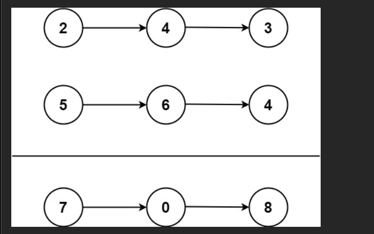

# 两数相加

给你两个 **非空** 的链表，表示两个**非负**的整数。

它们每位数字都是按照 **逆序** 的方式存储的，并且每个节点只能存储 **一位** 数字。

请你将两个数相加，并以相同形式返回一个表示和的**链表**。

你可以假设除了数字 `0` 之外，这两个数都不会以 `0` 开头。

## 示例 1：



输入：`l1 = [2,4,3], l2 = [5,6,4]`

输出：`[7,0,8]`

解释：`342 + 465 = 807`

## 示例 2：

输入：`l1 = [0], l2 = [0]`

输出：`[0]`

## 示例 3：

输入：`l1 = [9,9,9,9,9,9,9], l2 = [9,9,9,9]`

输出：`[8,9,9,9,0,0,0,1]`

# Problem Solving

## code

```js
/**
 * Definition for singly-linked list.
 * function ListNode(val, next) {
 *     this.val = (val === undefined ? 0 : val)
 *     this.next = (next === undefined ? null : next)
 * }
 */

/**
 * 两数相加（链表形式，逆序存储）
 * 思路：
 * 1. 使用虚拟头节点 dummy，简化结果链表的构建
 * 2. 同时遍历 l1 和 l2，对应位相加并处理进位
 * 3. 任一链表未结束或仍有进位时，循环继续
 * 4. 每次计算一位结果，创建新节点追加到结果链表
 */
```

```js
var addTwoNumbers = function (l1, l2) {
  const dummy = new ListNode(0); // 虚拟头节点，方便统一处理头结点
  let current = dummy; // 当前指针，用于构建新链表
  let carry = 0; // 进位，初始为 0

  // 只要 l1 或 l2 还有节点，或者仍存在进位，就继续计算
  while (l1 !== null || l2 !== null || carry !== 0) {
    // 如果链表已遍历结束，则当前位视为 0
    const x = l1 ? l1.val : 0;
    const y = l2 ? l2.val : 0;

    // 当前位的和 = 两个节点值 + 上一位的进位
    const sum = x + y + carry;

    // 计算新的进位（十进制加法，最多为 1）
    carry = Math.floor(sum / 10);

    // 当前位需要存储的数字
    const digit = sum % 10;

    // 将当前位结果创建为新节点，接到结果链表后面
    current.next = new ListNode(digit);
    current = current.next; // 移动结果链表指针

    // 原链表指针后移（如果还存在）
    if (l1) l1 = l1.next;
    if (l2) l2 = l2.next;
  }

  // 返回结果链表的真正头节点（跳过虚拟头节点）
  return dummy.next;
};
```

### 结合经典案例手把手执行（最经典例子）

```
l1 = 2 → 4 → 3
l2 = 5 → 6 → 4
```

| 步骤 | l1.val | l2.val | carry(进位) | sum | carry 更新 | digit | 新链表状态        |
| ---- | ------ | ------ | ----------- | --- | ---------- | ----- | ----------------- |
| 初始 | -      | -      | 0           | -   | -          | -     | dummy → null      |
| 1    | 2      | 5      | 0           | 7   | 0          | 7     | dummy → 7         |
| 2    | 4      | 6      | 0           | 10  | 1          | 0     | dummy → 7 → 0     |
| 3    | 3      | 4      | 1           | 8   | 0          | 8     | dummy → 7 → 0 → 8 |
| 4    | null   | null   | 0           | 0   | 0          | -     | 循环结束          |

返回：`7 → 0 → 8` → 代表 807 完美！

### 再来一个有进位到最高位的例子（容易出错！）

```
l1 = 9 → 9 → 9
l2 = 1
→ 999 + 1 = 1000
```

执行过程：

| 步骤 | x   | y   | carry | sum | 新 carry | digit | 新链表          |
| ---- | --- | --- | ----- | --- | -------- | ----- | --------------- |
| 1    | 9   | 1   | 0     | 10  | 1        | 0     | → 0             |
| 2    | 9   | 0   | 1     | 10  | 1        | 0     | → 0 → 0         |
| 3    | 9   | 0   | 1     | 10  | 1        | 0     | → 0 → 0 → 0     |
| 4    | 0   | 0   | 1     | 1   | 0        | 1     | → 0 → 0 → 0 → 1 |

结果：`0 → 0 → 0 → 1` → 1000 正确！

**关键点：while 条件里加了 `|| carry !== 0`，才能处理最高位进位！**

### 终极记忆口诀（背下来，面试 30 秒写完）

```
dummy做头，carry记进位，
while l1或l2或carry还有，
x y 取值（没了就补0），
sum = x + y + carry，
digit是个位，carry是十位，
current.next接新节点，
两个指针一起往前走，
最后返回dummy.next！
```

### 为什么这道题几乎所有面试都考？

因为它完美考察了：

- 链表遍历
- 边界处理（不同长度、进位）
- 代码细节（补 0、进位判断）
- 模拟真实算法思维（竖式加法）

### 总结：直接背这个版本，稳过！

```js
var addTwoNumbers = function (l1, l2) {
  const dummy = new ListNode();
  let cur = dummy;
  let carry = 0;

  while (l1 || l2 || carry) {
    const x = l1 ? l1.val : 0;
    const y = l2 ? l2.val : 0;
    const sum = x + y + carry;

    carry = sum >= 10 ? 1 : 0;
    cur.next = new ListNode(sum % 10);
    cur = cur.next;

    if (l1) l1 = l1.next;
    if (l2) l2 = l2.next;
  }

  return dummy.next;
};
```


## 一、你卡住的根本原因是什么？

大多数人不明白这题，**不是语法问题，而是三个“抽象点”没想通**：

1. **链表是“倒着存数字”的**
2. **进位 carry 是“跨节点”的状态**
3. **dummy 虚拟头节点到底有什么用**

一旦这 3 点通了，这道题就非常直观。

---

## 二、题目在干什么（先用“人话”讲）

### 原题含义（翻译成人话）

* `l1` 和 `l2` 是两个链表
* **每个节点存一位数字**
* **数字是倒着存的**

例子：

```
l1: 2 -> 4 -> 3   表示数字 342
l2: 5 -> 6 -> 4   表示数字 465
```

我们要算：

```
342 + 465 = 807
```

返回：

```
7 -> 0 -> 8
```

---

## 三、整体思路（先别看代码）

### 用你熟悉的方式类比

你小时候做加法是怎么做的？

```
  342
+ 465
-----
```

你是不是：

1. **从个位开始加**
2. **记住进位**
3. **一位一位往前算**

👉 这道题 **完全一样**
👉 只不过“数字不是写在纸上”，而是**藏在链表节点里**

---

## 四、核心思想一句话版本（非常重要）

> **同时遍历两个链表，每次算一位 + 进位，生成一个新节点**

---

## 五、为什么要用 dummy（虚拟头节点）？

### 问题：如果不用 dummy 会怎样？

你会遇到这个麻烦：

* 第一个节点要单独处理
* 后面的节点又是另一套逻辑

### dummy 的作用

```js
const dummy = new ListNode(0);
let current = dummy;
```

它的意义只有一句话：

> **让所有新节点都通过 `current.next` 统一接上**

最终：

```js
return dummy.next;
```

你可以把 dummy 当成：

* 一个“假的头”
* 一个“占位符”
* 一个“方便操作的起点”

**它本身不参与结果**

---

## 六、逐行拆解代码（重点）

### 1️⃣ 初始化

```js
const dummy = new ListNode(0);
let current = dummy;
let carry = 0;
```

* `current`：指向“当前结果链表的最后一个节点”
* `carry`：进位（0 或 1）

---

### 2️⃣ while 循环为什么这么写？

```js
while (l1 !== null || l2 !== null || carry !== 0)
```

意思是：

> **只要还有东西没算完，就继续**

三种情况必须继续：

* l1 还有节点
* l2 还有节点
* 两个都没了，但还有进位（比如 9 + 1）

---

### 3️⃣ 当前位怎么取？

```js
const x = l1 ? l1.val : 0;
const y = l2 ? l2.val : 0;
```

意思是：

* 链表没走完 → 用它的值
* 链表走完了 → 当作 0

👉 这一步非常关键
👉 它让**两个链表长度不一样**也能统一处理

---

### 4️⃣ 算和 + 进位

```js
const sum = x + y + carry;
carry = Math.floor(sum / 10);
const digit = sum % 10;
```

比如：

* `7 + 8 + 1 = 16`
* 当前位：`6`
* 进位：`1`

这和你小学一模一样。

---

### 5️⃣ 把结果接到新链表上

```js
current.next = new ListNode(digit);
current = current.next;
```

含义是：

1. 创建新节点
2. 接到结果链表后面
3. current 向前移动

---

### 6️⃣ 原链表指针前进

```js
if (l1) l1 = l1.next;
if (l2) l2 = l2.next;
```

各走各的，互不影响。

---

## 七、完整跑一遍例子（最重要）

### 输入

```
l1: 2 -> 4 -> 3
l2: 5 -> 6 -> 4
```

### 第 1 轮

```
x = 2, y = 5, carry = 0
sum = 7
digit = 7, carry = 0
结果: 7
```

### 第 2 轮

```
x = 4, y = 6, carry = 0
sum = 10
digit = 0, carry = 1
结果: 7 -> 0
```

### 第 3 轮

```
x = 3, y = 4, carry = 1
sum = 8
digit = 8, carry = 0
结果: 7 -> 0 -> 8
```

结束 ✔

---

## 八、你真正要记住的“思路模板”

以后看到**链表 + 数字 + 进位**，脑子里直接浮现这 5 步：

1. dummy 头节点
2. current 指针
3. carry 进位
4. while（链表没完 or 进位存在）
5. 每轮：取值 → 算和 → 建节点 → 指针前进

---

