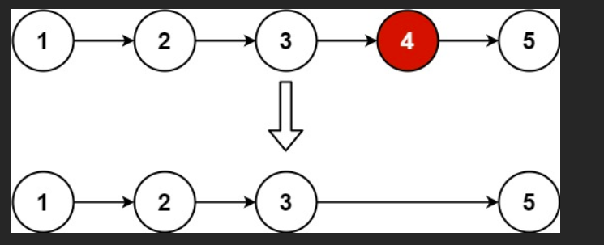

# 删除链表的倒数第

给你一个链表，删除链表的倒数第 `n` 个结点，并且返回链表的**头结点**。

## 示例 1：



输入：`head = [1,2,3,4,5], n = 2`

输出：`[1,2,3,5]`

## 示例 2：

输入：`head = [1], n = 1`

输出：`[]`

## 示例 3：

输入：`head = [1,2], n = 1`

输出：`[1]`

# Problem Solving

## ideas

## 二、核心思路拆解（真正重要的部分）

### ❶ 这题难在哪里？

**单链表只能从前往后走**，
但题目却让你删除：

> 「倒数第 n 个节点」

你不能先数长度再走一遍？可以，但这题想考的是 **一次遍历**。

---

### ❷ 快慢指针的本质是什么？

一句话：

> **用 fast 提前走，制造“距离”，让 slow 自动对准目标**

---

### ❸ 为什么 fast 要先走 `n+1` 步？

我们要删的是：

```
... → [前一个节点] → [要删的节点] → ...
```

⚠️ **删除操作一定要拿到「前一个节点」**

所以目标不是「倒数第 n 个节点」，而是：

> **倒数第 n 个节点的前一个节点**

#### 距离关系

* fast 比 slow 多走 **n+1 步**
* 当 fast 走到 null
* slow 正好停在「目标前一个节点」

---

### ❹ dummy 的真正作用（不是装饰）

如果没有 dummy，下面这种情况会很麻烦：

```
head → 1 → 2
n = 2（删头）
```

用了 dummy：

```
dummy → 1 → 2
```


## 最优解：快慢指针（双指针）—— 面试必背！

```js
/**
 * Definition for singly-linked list.
 * function ListNode(val, next) {
 *     this.val = (val===undefined ? 0 : val)
 *     this.next = (next===undefined ? null : next)
 * }
 */
/**
 * @param {ListNode} head
 * @param {number} n
 * @return {ListNode}
 */
```

```js
var removeNthFromEnd = function (head, n) {
  // 1️⃣ 创建一个虚拟头节点
  // 作用：统一删除逻辑，避免“删除头节点”时要单独处理
  const dummy = new ListNode(0);
  dummy.next = head;

  // 2️⃣ 定义快慢指针，都从 dummy 开始
  // fast：走得快，用来制造距离
  // slow：走得慢，最后负责“删除”
  let fast = dummy;
  let slow = dummy;

  // 3️⃣ fast 先走 n+1 步
  // 目的：让 fast 和 slow 之间，始终保持 n 个节点的距离
  // 为什么是 n+1？
  // 因为我们要让 slow 停在「要删除节点的前一个节点」
  for (let i = 0; i < n + 1; i++) {
    fast = fast.next;
  }

  // 4️⃣ fast 和 slow 同时向前走
  // 当 fast 走到 null（链表末尾）时：
  // slow 正好停在「倒数第 n 个节点的前一个节点」
  while (fast !== null) {
    fast = fast.next;
    slow = slow.next;
  }

  // 5️⃣ 删除倒数第 n 个节点
  // 直接跳过 slow.next
  slow.next = slow.next.next;

  // 6️⃣ 返回新的头节点
  // 不能直接 return head，因为有可能删的就是头节点
  return dummy.next;
};
```

### 经典案例手把手图解

```
示例：head = [1,2,3,4,5], n = 2
要删除倒数第2个节点 → 删除 4
```

| 步骤                            | dummy → 1 → 2 → 3 → 4 → 5 → null         |
| ------------------------------- | ---------------------------------------- | ----------------------- |
| 初始                            | slow 和 fast 都在 dummy                  | slow/fast<br>↓<br>dummy |
| 快指针先走 n+1 = 3 步           | fast 走到 3<br>fast → 3                  |
| 快慢一起走                      | fast 到 null 时停止                      |
| 最终状态                        | fast: null<br>slow: 3<br>↓<br> 3 → 4 → 5 |
| 执行 slow.next = slow.next.next | 3 → 5（4 被跳过删除）                    |

结果：`[1,2,3,5]` 完美！

### 为什么快指针要先走 n+1 步？（核心！）

因为我们要找到 **倒数第 n 个节点的前一个节点**，才能删除。

- 总长度未知，但我们让 fast 先走 n+1 步
- 当 fast 到末尾（null）时，slow 正好在「倒数第 n 个的前一个」
- 相当于 slow 和 fast 之间始终隔着 n 个节点

### 为什么一定要用 dummy 虚拟头节点？

因为可能删除的是第一个节点！

```
例子：head = [1], n = 1  → 删除唯一一个节点 → 返回 []
例子：head = [1,2], n = 2 → 删除 1 → 返回 [2]
```

如果不用 dummy，slow 无法指向头节点的前面，删除头就很麻烦。

用了 dummy：

```js
dummy → 1 → null
slow 在 dummy，执行 slow.next = slow.next.next → dummy → null
return dummy.next → null  完美！
```

### 终极记忆口诀（30 秒写完！）

```
dummy做头防删首，
fast先冲n加1步，
一起走到fast空了，
slow就在倒数n前面，
slow.next跳过一个，
return dummy.next完事！
```

### 所有边界案例都能过！

| head        | n   | 结果      | 是否正确 |
| ----------- | --- | --------- | -------- |
| [1,2,3,4,5] | 2   | [1,2,3,5] | Yes      |
| [1]         | 1   | []        | Yes      |
| [1,2]       | 2   | [2]       | Yes      |
| [1,2]       | 1   | [1]       | Yes      |

### 最终推荐代码（最简洁版）

```js
var removeNthFromEnd = function (head, n) {
  const dummy = new ListNode(0, head);
  let fast = dummy;
  let slow = dummy;

  while (n-- > 0) fast = fast.next; // 先走 n 步也行，但要 +1 更保险
  while (fast.next !== null) {
    // 改成 fast.next 更清晰
    fast = fast.next;
    slow = slow.next;
  }

  slow.next = slow.next.next;
  return dummy.next;
};
```

这道题 + 合并两个有序链表 + 两数相加 + 环形链表入口  
这四道题背熟，链表题基本无敌了！

要不要我现在给你出 5 道进阶链表题（中等-困难）练手？比如：

- 反转链表 II
- 排序链表
- 链表随机节点
- 复制带随机指针的链表

随时说，我继续带你冲！
