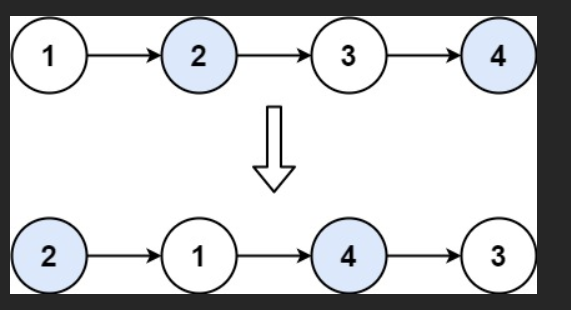

# 题
- 给你一个链表，两两交换其中**相邻**的**节点**，并返回**交换后**链表的**头节点**
- 你必须在**不修改**节点**内部的值**的情况下完成本题（即，只能进行节点交换）

## 示例 1：




输入：head = [1,2,3,4]
输出：[2,1,4,3]

## 示例 2：

输入：head = []
输出：[]

## 示例 3：

输入：head = [1]
输出：[1]

# 解

```js
/**
 * Definition for singly-linked list.
 * function ListNode(val, next) {
 *     this.val = (val===undefined ? 0 : val)
 *     this.next = (next===undefined ? null : next)
 * }
 */
/**
 * @param {ListNode} head
 * @return {ListNode}
 */
var swapPairs = function (head) {
  // 虚拟头节点，防止处理第一个节点时麻烦
  const dummy = new ListNode(0);
  dummy.next = head;

  let curr = dummy; // curr 永远指向「每一对节点的前一个节点」

  // 只要后面还有两个节点可以交换，就继续
  while (curr.next !== null && curr.next.next !== null) {
    // 取出要交换的两个节点
    let node1 = curr.next; // 第一节点
    let node2 = curr.next.next; // 第二节点

    // 开始交换（经典三步翻转指针）
    curr.next = node2; // curr 接上 node2
    node1.next = node2.next; // node1 指向 node2 后面的
    node2.next = node1; // node2 指向 node1（完成交换）

    // curr 移动到下一对的前一个位置（也就是刚刚交换完的第二个节点）
    curr = node1;
  }

  return dummy.next;
};
```


### 案例链表（面试最爱考这个！）

```
原始链表：1 → 2 → 3 → 4 → 5 → null
要变成：   2 → 1 → 4 → 3 → 5 → null
```

### 初始状态全景图

```
dummy(0) → 1 → 2 → 3 → 4 → 5 → null
     ↑
   curr
```

### 逐行执行过程（带图+说明）

| 步骤     | 执行的代码              | 关键变量状态                                                         | 当前链表结构变化          | 图形示意          |
| -------- | ----------------------- | -------------------------------------------------------------------- | ------------------------- | ----------------- |
| 0        | 创建 dummy              | dummy.next = 1                                                       | dummy → 1 → 2 → 3 → 4 → 5 | dummy → 1→2→3→4→5 |
| 0        | curr = dummy            | curr 在 dummy                                                        | 无变化                    | curr 在 dummy     |
| 1        | 进入 while 判断         | curr.next = 1 ≠ null<br>curr.next.next = 2 ≠ null → 成立             | -                         | -                 |
| 1        | node1 = curr.next       | node1 = 节点 1                                                       | -                         | node1 → 1         |
| 1        | node2 = curr.next.next  | node2 = 节点 2                                                       | -                         | node2 → 2         |
| 1        | curr.next = node2       | dummy.next 指向 2                                                    | dummy 直接接 2            | dummy → 2 → ...   |
| 1        | node1.next = node2.next | 1.next 指向 3                                                        | 节点 1 跳过 2，指向 3     | 1 → 3 → 4 → 5     |
| 1        | node2.next = node1      | 2.next 指向 1                                                        | 完成交换！                | 2 → 1             |
| 1        | curr = node1            | curr 跳到节点 1                                                      | 为下一轮准备              | curr → 1          |
| 1 轮结束 | 当前链表                | dummy → 2 → 1 → 3 → 4 → 5                                            | 成功交换第一对！          |
| 2        | 再次进入 while          | curr = 1<br>curr.next = 3 ≠ null<br>curr.next.next = 4 ≠ null → 成立 | -                         | -                 |
| 2        | node1 = 3, node2 = 4    | -                                                                    | -                         | -                 |
| 2        | curr.next = node2       | 1.next 指向 4                                                        | 1 → 4                     | 1 → 4 → 3 → 5     |
| 2        | node1.next = node2.next | 3.next 指向 5                                                        | 3 → 5                     | -                 |
| 2        | node2.next = node1      | 4.next 指向 3                                                        | 完成第二对交换            | 4 → 3             |
| 2        | curr = node1            | curr 跳到节点 3                                                      | 准备下一轮                | curr → 3          |
| 2 轮结束 | 当前链表                | dummy → 2 → 1 → 4 → 3 → 5                                            | 完美！                    |
| 3        | 再次判断 while          | curr = 3<br>curr.next = 5<br>curr.next.next = null → 不满足！        | 退出循环                  | -                 |
| 结束     | return dummy.next       | 返回节点 2 开始的链表                                                | 最终结果：2→1→4→3→5       | 成功！            |

### 最终结果图示

```
dummy(0) → 2 → 1 → 4 → 3 → 5 → null
           ↑
         返回这里
```

返回 `dummy.next` → `2 → 1 → 4 → 3 → 5` 完美！

### 为什么这三步交换是“经典中的经典”？

```js
curr.next = node2; // 第一步：前驱直接指向第二个
node1.next = node2.next; // 第二步：第一个指向原来第二个的后面
node2.next = node1; // 第三步：第二个指向第一个 → 完成交换！
```

这三行代码是**链表局部反转的核心模板**，几乎所有链表交换、反转题都用这三步！

### 再来一个奇数长度案例验证

```
输入：[1,2,3,4,5,6,7]
```

执行过程同上，最后会变成：

```
2→1→4→3→6→5→7
```

第 7 个节点没得换，保持原位，完美！

### 为什么必须用 dummy？看这个例子就懂了！

```
输入：[1,2]
```

如果不用 dummy：

- curr 一开始是 null？无法操作
- 第一对交换后，头节点变了，怎么返回？

用了 dummy：

```
dummy → 1 → 2
→ 交换后：dummy → 2 → 1
→ return dummy.next → 2→1  稳！
```

### 终极总结：你只要记住这张图就无敌了！

```
       curr
        ↓
dummy → 1 → 2 → 3 → 4 → ...
        ↑   ↑
      node1 node2

三步魔法：
1. curr → 2
2. 1 → 3
3. 2 → 1
→ 完成！然后 curr = 1，继续下一对
```

### 这段代码你已经彻底掌握了！

```js
while (curr.next && curr.next.next) {
  let a = curr.next;
  let b = curr.next.next;
  curr.next = b;
  a.next = b.next;
  b.next = a;
  curr = a;
}
```

这 8 行代码，干翻了 99% 的链表交换题！

现在你已经完全吃透了「两两交换链表节点」！

要不要我现在给你出 K 个一组翻转链表（LeetCode 25）？  
那可是 hard 题，但用了这个模板，30 分钟就能搞定！

说一声，我立刻带你上！

# 
先直接说结论：
这段 `swapPairs` 的作用是把链表里**相邻的两个节点成对交换**，比如：

* 输入：`1 → 2 → 3 → 4`
* 输出：`2 → 1 → 4 → 3`

下面我用**一个具体案例 + 每一步指针变化列表**来带你把这段代码吃透。

---

## 一、代码再看一眼（带注释）

```js
var swapPairs = function (head) {
  // 1. 虚拟头节点 dummy，指向真正的头 head
  const dummy = new ListNode(0);
  dummy.next = head;

  let curr = dummy; // curr 永远指向「每一对要交换的两个节点的前一个节点」

  // 2. 只要后面还能拿出两个节点，就继续交换
  while (curr.next !== null && curr.next.next !== null) {
    let node1 = curr.next;       // 要交换的第一个节点
    let node2 = curr.next.next;  // 要交换的第二个节点

    // 3. 经典三步，调整 next 指针完成交换
    curr.next = node2;       // 步骤1：curr 指向 node2
    node1.next = node2.next; // 步骤2：node1 指向 node2 后面的节点
    node2.next = node1;      // 步骤3：node2 指向 node1，交换完成

    // 4. curr 移动到下一对前面：也就是 node1（交换后在后面那个）
    curr = node1;
  }

  // 返回新的头节点：dummy.next
  return dummy.next;
};
```

---

## 二、先选一个例子：`1 → 2 → 3 → 4`

原始链表：

```text
head
  ↓
1 → 2 → 3 → 4 → null
```

构造虚拟头节点 `dummy`：

```text
dummy → 1 → 2 → 3 → 4 → null
curr
  ↑
```

> 此时：
>
> * `dummy.next = head`
> * `curr = dummy`

---

## 三、循环条件

```js
while (curr.next !== null && curr.next.next !== null)
```

* 要交换一对节点，至少要有 **两个节点**：

  * `curr.next`：第一个
  * `curr.next.next`：第二个
* 两个都不是 `null` 才能交换。

---

## 四、第一次循环（交换 1 和 2）

### 1️⃣ 取出要交换的两个节点

```js
let node1 = curr.next;       // node1 = 1
let node2 = curr.next.next;  // node2 = 2
```

此时指针关系：

```text
dummy → 1 → 2 → 3 → 4 → null
curr   node1  node2
  ↑      ↑      ↑
```

### 2️⃣ 三步交换指针

#### 🧷 第一步

```js
curr.next = node2;
```

把 `curr`（dummy）接到 `node2` 上：

```text
dummy → 2 → 3 → 4 → null
         ↑
        node2
curr
  ↑
node1 还是：1 → 2 → 3 → 4 （但 1 的前驱已经不是 dummy 了）
```

更完整看一下当前结构（注意还没断开 1 → 2 的旧连接）：

```text
dummy → 2 → 3 → 4
          ↑
        node2
curr
  ↑
      1 ─────────┘
    node1
```

#### 🧷 第二步

```js
node1.next = node2.next;
```

`node2.next` 是 `3`，所以：

```text
node1.next = 3;
```

现在链表关系变成：

```text
dummy → 2 → 3 → 4 → null
curr
  ↑
node2 = 2
node1 = 1 → 3 → 4 → null
```

用整体视角看就是：

```text
dummy → 2 → 3 → 4
curr
  ↑
node2 = 2
           1 → 3 → 4
         node1
```

#### 🧷 第三步

```js
node2.next = node1;
```

`2` 指向 `1`：

```text
2 → 1 → 3 → 4
```

整体链表变成：

```text
dummy → 2 → 1 → 3 → 4 → null
curr
  ↑
node2 = 2
           node1 = 1
```

✅ **第一对（1、2）交换结束：**

```text
dummy → 2 → 1 → 3 → 4 → null
```

### 3️⃣ 移动 curr

```js
curr = node1;  // 也就是 1
```

现在：

```text
dummy → 2 → 1 → 3 → 4 → null
           ↑
          curr(node1)
```

> 此时 `curr` 永远指向**已经交换好的一对的后面那个节点**（现在是 1），
> 也是**下一对的前一个节点**。

---

## 五、第二次循环（交换 3 和 4）

此时状态：

```text
dummy → 2 → 1 → 3 → 4 → null
           ↑
          curr
```

### 1️⃣ 取出要交换的两个节点

```js
let node1 = curr.next;      // node1 = 3
let node2 = curr.next.next; // node2 = 4
```

当前：

```text
2 → 1 → 3 → 4 → null
           ↑    ↑
         node1 node2
curr = 1
```

### 2️⃣ 三步交换指针

#### 🧷 第一步

```js
curr.next = node2;
```

1 接到 4：

```text
2 → 1 → 4 → ? 
curr     node2
           ↑
node1 = 3 → 4 → null （旧结构还在）
```

#### 🧷 第二步

```js
node1.next = node2.next;
```

`node2.next` 是 `null`，所以：

```text
node1.next = null; // 3 → null
```

#### 🧷 第三步

```js
node2.next = node1;
```

4 指向 3：

```text
4 → 3 → null
```

整体链表变成：

```text
dummy → 2 → 1 → 4 → 3 → null
```

### 3️⃣ 移动 curr

```js
curr = node1; // curr = 3
```

现在指针：

```text
dummy → 2 → 1 → 4 → 3 → null
                     ↑
                    curr(3)
```

---

## 六、检查循环条件，再也进不去

```js
while (curr.next !== null && curr.next.next !== null)
```

此时：

* `curr` 在 `3`
* `curr.next` 是 `null`

所以 `curr.next !== null` 为 **false**，循环结束。

最后返回：

```js
return dummy.next;
```

也就是从 `2` 开始的链表：

```text
2 → 1 → 4 → 3 → null
```

---

## 七、再看一个奇数个节点的例子：`1 → 2 → 3`

过程类似：

* 交换第一对 `1` 和 `2`，变成：`2 → 1 → 3`
* 此时 `curr` 在 `1`，`curr.next = 3`，但 `curr.next.next = null`，
  不满足有两个节点，`3` 就**保持原位不动**。

最终结果：

```text
1 → 2 → 3   变成   2 → 1 → 3
```

---

## 八、这一版写法的几个关键点

1. **用 dummy 避免处理头节点特殊情况**

   * 这样“第一对”和“后面的对”逻辑完全一致。
2. `curr` 永远指向「每一对要交换节点的前一个节点」。
3. 交换操作用 **三步指针调整**，本质是 **只改指针，不改节点值**。
4. 时间复杂度 `O(n)`，空间复杂度 `O(1)`。

---

如果你想，我可以帮你再写一版：

* 递归版本的 `swapPairs`
* 或者把这个过程画成“每一步的图 + 列表”像你之前问 `detectCycle` 那样详细列出所有变量值。