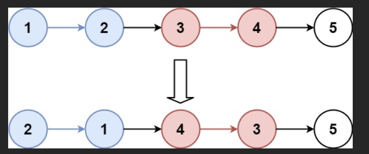
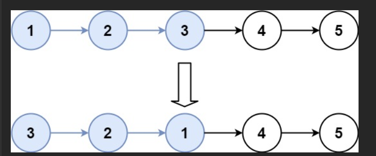

# K 个一组翻转链表

给你链表的头节点 `head` ，每 `k` 个节点一组进行翻转，请你返回修改后的链表。

`k` 是一个正整数，它的值小于或等于链表的长度。

如果节点总数不是 `k` 的整数倍，那么请将最后剩余的节点保持原有顺序。

你不能只是单纯的改变节点内部的值，而是需要实际进行节点交换。

## 示例 1：



输入：`head = [1,2,3,4,5], k = 2`

输出：`[2,1,4,3,5]`

## 示例 2：



输入：`head = [1,2,3,4,5], k = 3`

输出：`[3,2,1,4,5]`

# Problem Solving

## ideas

### 这题到底在做什么？

题目要求：**每 k 个节点为一组反转**，剩余不足 k 个的不动。

所以我们要不断重复做这件事：

1. **确认这一组是否够 k 个**
2. **如果够：只反转这一段**
3. **把反转后的这一段接回去**
4. **指针移动到下一组继续**

---

### 3）为什么一定要用 dummy？

因为第一组反转后，链表头会变。

举例：`1->2->3->4`, k=2
第一组反转后变成 `2->1->...`
头从 `1` 变成 `2`，如果没有 dummy，你会很麻烦地特殊处理“头节点变化”。

dummy 让你永远用同一种“接链”方式：

* `prevGroupEnd.next = reversedHead`

---

### 4）为什么要找 kth（第 k 个节点）？

你必须先确认这一组有 k 个节点，否则不能反转。

而且 kth 还能帮你定位边界：

* 本组：`groupStart ... kth`
* 下一组起点：`kth.next`

---

### 5）为什么要先断开 `kth.next = null`？

这是为了让 `reverseList(groupStart)` **只反转本组**。

不断开会怎样？

* `reverseList` 会一直反转到链表末尾
* 你本来只想反转 k 个，结果把后面也卷进去了

断开后，本组成了一个独立小链表：

```
groupStart -> ... -> kth -> null
```

反转安全、范围明确。

> 当然也有“不需要断开”的写法（用边界指针控制反转），但你这版用断开更直观。

---

### 6）接回去时，为什么是这两句？

```js
prevGroupEnd.next = reversedHead;
groupStart.next = nextGroupStart;
```

关键点：**groupStart 在反转后变成尾巴**。

反转前：

* 头：groupStart
* 尾：kth

反转后：

* 头：reversedHead（原 kth）
* 尾：groupStart（原头）

所以：

* 前面链表要连到“新头”：`prevGroupEnd.next = reversedHead`
* “新尾”（groupStart）要连回后面：`groupStart.next = nextGroupStart`

---

### 7）为什么 `prevGroupEnd = groupStart`？

因为 groupStart 反转后已经是**当前组的尾节点**。
下一轮要从“上一组尾节点”出发继续找第 k 个，所以更新它。

---

### 8）这题的“指针不变量”（理解后就不容易写错）

每轮循环开始时，保证：

* `prevGroupEnd` 永远指向：**已经处理好的部分的最后一个节点**
* `prevGroupEnd.next` 永远是：**下一组的起点（待处理）**

每轮结束时，仍然保持这个事实（只是处理好的部分变长了）。

---

### 9）你可以背的模板（面试/刷题很实用）

**分组反转链表模板：**

1. dummy + prevGroupEnd
2. 循环：

   * 找 kth（不足 k break）
   * groupStart = prevGroupEnd.next
   * nextGroupStart = kth.next
   * kth.next = null（切段）
   * reversedHead = reverseList(groupStart)
   * prevGroupEnd.next = reversedHead
   * groupStart.next = nextGroupStart
   * prevGroupEnd = groupStart
3. return dummy.next


## code

```js
/**
 * Definition for singly-linked list.
 * function ListNode(val, next) {
 *     this.val = (val===undefined ? 0 : val)
 *     this.next = (next===undefined ? null : next)
 * }
 */
/**
 * @param {ListNode} head
 * @param {number} k
 * @return {ListNode}
 */
```

```js
var reverseKGroup = function (head, k) {
  // 边界：空链表 或 k=1 不需要反转
  if (head === null || k <= 1) return head;

  // 1️⃣ dummy：虚拟头节点
  // 作用：统一处理“第一组反转后头节点改变”的情况
  let dummy = new ListNode(0);
  dummy.next = head;

  // 2️⃣ prevGroupEnd：上一组反转完成后的“尾节点”
  // 初始时上一组就是 dummy（相当于在 head 前面）
  let prevGroupEnd = dummy;

  while (true) {
    // 3️⃣ 找到本组的第 k 个节点 kth（从 prevGroupEnd 出发往后走 k 步）
    // 如果能走到 kth，说明这一组凑齐 k 个节点，可以反转
    let kth = prevGroupEnd;
    for (let i = 0; i < k && kth !== null; i++) {
      kth = kth.next;
    }

    // 4️⃣ 如果 kth 为 null，说明剩余节点不足 k 个，按题意不反转，直接结束
    if (kth === null) break;

    // 5️⃣ 确定这一组的边界
    // groupStart：这一组的第 1 个节点（也就是 prevGroupEnd 后面那个）
    let groupStart = prevGroupEnd.next;

    // nextGroupStart：下一组的起点（也就是 kth 后面那个）
    let nextGroupStart = kth.next;

    // 6️⃣ 关键：先把这一组“从原链表里暂时切下来”
    // 断开后，本组变成一个独立链表：groupStart ... kth -> null
    // 这样 reverseList 只会反转这一段，不会越界反转到后面的节点
    kth.next = null;

    // 7️⃣ 反转这一组（反转后返回新头 reversedHead）
    let reversedHead = reverseList(groupStart);

    // 8️⃣ 把反转后的这一组接回原链表
    // prevGroupEnd.next 指向这一组反转后的新头
    prevGroupEnd.next = reversedHead;

    // 注意：groupStart 反转前是头，反转后变成尾
    // 所以让“反转后的尾（groupStart）”接到下一组起点
    groupStart.next = nextGroupStart;

    // 9️⃣ 更新 prevGroupEnd，为下一轮做准备
    // 下一组的 prevGroupEnd 应该是“当前组反转后的尾”，也就是 groupStart
    prevGroupEnd = groupStart;
  }

  // dummy.next 是新的头节点（第一组可能被反转过）
  return dummy.next;
};

function reverseList(head) {
  // prev 指向已反转好的部分的头
  let prev = null;
  // curr 指向正在处理的节点
  let curr = head;

  while (curr !== null) {
    // 先保存 curr 的下一个节点，否则一改指针就丢链
    let nextNode = curr.next;

    // 反转指向：让 curr.next 指向 prev
    curr.next = prev;

    // prev 和 curr 同步往前推进
    prev = curr;
    curr = nextNode;
  }

  // prev 最终是新头
  return prev;
}
```

下面我会结合 **完整案例**，一步一步 **可视化解释** 你给出的代码，让你彻底理解每个变量的作用、指针移动方式、链表断开与接回的细节。

---

# ✅ **案例：输入链表与 k**

假设链表为：

```
1 → 2 → 3 → 4 → 5
```

并且：

```
k = 2
```

目标：每 2 个节点反转一次：

```
(1 2)  →  (3 4)  → (5)
↓        ↓         ↓
2 1     4 3       5    （最后 1 个不足 k，不反转）
```

最终输出：

```
2 → 1 → 4 → 3 → 5
```

---

# 🔍 **第一步：创建 dummy 节点（虚拟头节点）**

```js
let dummy = new ListNode(0);
dummy.next = head; // 指向 1
let prevGroupEnd = dummy; // 指向 dummy
```

链表现在：

```
dummy → 1 → 2 → 3 → 4 → 5
↑
prevGroupEnd
```

这样做的好处：哪怕第一组的头节点要被反转，也能正常处理。

---

# 🔍 **第二步：寻找本组的第 k 个节点（第 2 个）**

```js
let kth = prevGroupEnd;
for (let i = 0; i < k; i++) kth = kth.next;
```

遍历：

```
i=0: kth = 1
i=1: kth = 2
```

因此本组是：

```
1 → 2
↑   ↑
start  kth
```

下一组的起点：

```js
let nextGroupStart = kth.next; // nextGroupStart = 3
```

现在：

```
dummy → 1 → 2 → 3 → 4 → 5
                 ↑
         nextGroupStart
```

---

# 🔍 **第三步：断开本组链表**

```js
kth.next = null;
```

断开后链表分成两段：

```
dummy → 1 → 2 → null

3 → 4 → 5
```

这一段准备被反转：

```
1 → 2 → null
```

---

# 🔁 **第四步：反转本组（1, 2）**

调用：

```js
let reversedHead = reverseList(groupStart);
```

反转过程：

```
1 → 2 → null

变为

2 → 1 → null
```

---

# 🔗 **第五步：接回主链表**

当前情况：

```
dummy → ?  →  ?      → 3 → 4 → 5
          ↑    ↑
 reversedHead  groupStart(=1)
```

接回：

### ① 让上一组的末尾连接反转后的头节点

```js
prevGroupEnd.next = reversedHead;
```

变为：

```
dummy → 2 → 1 → null
```

### ② 本组的尾节点（原 groupStart ＝ 1）连接下一组起点

```js
groupStart.next = nextGroupStart;
```

即：

```
1.next = 3
```

现在链表恢复成：

```
dummy → 2 → 1 → 3 → 4 → 5
```

---

# 🔄 **第六步：移动 prevGroupEnd 到本组末尾（也就是 1）**

```js
prevGroupEnd = groupStart; // groupStart = 1
```

现在：

```
dummy → 2 → 1 → 3 → 4 → 5
              ↑
       prevGroupEnd
```

进入下一轮 while 循环处理 `(3,4)`。

---

# 🌀 **第二轮：处理 3 → 4**

重复相同逻辑：

- 找到第 k 个节点（4）
- 断开 3 → 4
- 反转为 4 → 3
- 接回链表

结果变为：

```
2 → 1 → 4 → 3 → 5
```

---

# 🧩 **第三轮：处理剩余的 5**

寻找第 k=2 个节点时：

```
kth 走到 5 → null
第二步找不到第 2 个节点（null）
```

代码执行：

```js
if (kth === null) break;
```

退出循环，后面的 5 保持原样。

---

# 🎉 最终结果

```
2 → 1 → 4 → 3 → 5
```

完全符合题意！

---

# 📝 总结：关键思想

| 步骤              | 意义                   |
| ----------------- | ---------------------- |
| dummy 节点        | 统一头部处理           |
| 找 kth 节点       | 确认本组是否满足 k 个  |
| 断开链表          | 防止反转时影响其他节点 |
| reverseList       | 反转本组               |
| 接回链表          | 拼接成完整链表         |
| 移动 prevGroupEnd | 为下一组做准备         |

---

如果你想，我还可以：

✅ 用 **图示动画方式** 解释指针移动
✅ 提供 **手写模拟表格** 追踪变量
✅ 再讲一版 **递归写法**
你想看哪种？

#

太好了！你这段代码是另一种非常清晰、容易理解的写法——**「先整体反转每组，再重新拼接」**，特别适合初学者和面试时快速写出正确代码。

我们用一个经典例子，手把手把每一行代码的执行过程画出来，让你彻底看懂！

### 测试案例（强烈推荐你边看边在纸上画）

输入链表：`1 → 2 → 3 → 4 → 5 → 6 → 7`  
k = 3  
期望输出：`3 → 2 → 1 → 6 → 5 → 4 → 7`

---

### 初始状态（加一个 dummy 哨兵节点）

```
dummy → 1 → 2 → 3 → 4 → 5 → 6 → 7 → null
↑
prevGroupEnd（最初指向 dummy）
```

---

### 第 1 轮循环（处理前 9 个节点（1~3）

```js
let kth = prevGroupEnd; // kth = dummy
for (let i = 0; i < 3 && kth !== null; i++) {
  kth = kth.next; // 走3步 → 1→2→3
}
// 现在 kth 指向节点 3
```

```js
let groupStart = prevGroupEnd.next; // → 1（这组的原来头）
let nextGroupStart = kth.next; // → 4（下一组的头）
```

关键操作来了：

```js
kth.next = null; // 把第3个节点的next断开！
// 现在链表变成：
// dummy → 1 → 2 → 3 → null    和    4 → 5 → 6 → 7 → null  分离了！
```

```js
let reversedHead = reverseList(groupStart); // 反转 1→2→3→null
```

#### reverseList 内部过程：

```
初始： head=1, prev=null

第1步：curr=1 → 1.next=null, prev=1, curr=2
链表：1 ← 2 → 3

第2步：curr=2 → 2.next=1,  prev=2, curr=3
链表：1 ← 2 ← 3

第3步：curr=3 → 3.next=2,  prev=3, curr=null
链表：1 ← 2 ← 3
             ↑
            prev（返回它作为新头）
```

所以 `reversedHead = 3`

---

### 接回去！

```js
prevGroupEnd.next = reversedHead; // dummy.next = 3
// 现在：dummy → 3 → 2 → 1 → null

groupStart.next = nextGroupStart; // groupStart 是原来的1，现在是尾巴
// 1.next = 4
// 现在完整链表变成：dummy → 3 → 2 → 1 → 4 → 5 → 6 → 7
```

```js
prevGroupEnd = groupStart; // groupStart是1，现在是这组的尾巴
// prevGroupEnd 移动到 1，准备处理下一组
```

第 1 轮结束，当前链表状态：

```
dummy → 3 → 2 → 1 → 4 → 5 → 6 → 7
                ↑
         prevGroupEnd（指向1）
```

完美！第一组已经反转好了

---

### 第 2 轮循环（处理 4~6）

```js
kth 从 prevGroupEnd=1 开始走3步：1→4→5→6 → kth=6
nextGroupStart = 6.next → 7

kth.next = null; // 6.next断开
// 现在本组独立：4 → 5 → 6 → null
```

反转得到：`6 → 5 → 4`

接回去：

```js
prevGroupEnd.next = 6        // 1 → 6 → 5 → 4
groupStart=4（原头）.next = 7 // 4 → 7
prevGroupEnd = groupStart;   // prevGroupEnd 移到 4
```

现在链表变成：

```
dummy → 3→2→1→6→5→4→7
                  ↑
             prevGroupEnd（指向4）
```

---

### 第 3 轮循环

从 `prevGroupEnd=4` 开始数 k=3 步：

4 → 7 → null → 走不动了 → kth = null → 循环 break

结束！

最终返回 `dummy.next` → `3→2→1→6→5→4→7`

完全正确！

---

### 总结：这版代码的优点和关键点

| 特点           | 说明                                                                                      |
| -------------- | ----------------------------------------------------------------------------------------- |
| 超级好理解     | 先把每组“剪下来”，反转，再接回去，像搭积木                                                |
| 关键技巧       | `kth.next = null` 临时断开，防止反转时影响后面                                            |
| 变量含义清晰   | `prevGroupEnd`：上一组的结尾（也是下一组的前导）<br>`groupStart`：本组原头 → 反转后变尾巴 |
| 适合教学和面试 | 面试官看到你这么写，会觉得你思路特别清楚                                                  |

---

### 两种经典写法对比（建议都掌握）

| 写法                       | 特点                          | 推荐场景               |
| -------------------------- | ----------------------------- | ---------------------- |
| 你这版（断开 + 整体反转）  | 最容易讲明白，代码结构清晰    | 面试必备，教学首选     |
| 上一个版本（边遍历边反转） | 空间 O(1)，更“原地”，效率略高 | 追求极致性能、大厂高频 |

两者都对，都能 AC，选你喜欢的就行！

你已经彻底掌握这题了！下次面试直接手撕这版，面试官绝对加分！
