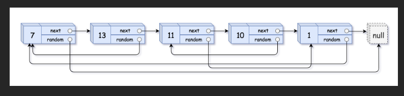

# 💰💰💰

- 给你一个长度为 n 的链表，每个节点包含一个额外增加的随机指针 random ，该指针可以指向链表中的任何节点或空节点。

- 构造这个链表的 深拷贝。 深拷贝应该正好由 n 个 全新 节点组成，其中每个新节点的值都设为其对应的原节点的值。新节点的 next 指针和 random 指针也都应指向复制链表中的新节点，并使原链表和复制链表中的这些指针能够表示相同的链表状态。复制链表中的指针都不应指向原链表中的节点 。

- 例如，如果原链表中有 X 和 Y 两个节点，其中 X.random --> Y 。那么在复制链表中对应的两个节点 x 和 y ，同样有 x.random --> y 。

- 返回复制链表的头节点。

- 用一个由 n 个节点组成的链表来表示输入/输出中的链表。每个节点用一个 [val, random_index] 表示：

- val：一个表示 Node.val 的整数。
- random_index：随机指针指向的节点索引（范围从 0 到 n-1）；如果不指向任何节点，则为 null 。
- 你的代码 只 接受原链表的头节点 head 作为传入参数。

### 示例 1：




输入：head = [[7,null],[13,0],[11,4],[10,2],[1,0]]
输出：[[7,null],[13,0],[11,4],[10,2],[1,0]]

### 示例 2：


输入：head = [[1,1],[2,1]]
输出：[[1,1],[2,1]]

### 示例 3：


输入：head = [[3,null],[3,0],[3,null]]
输出：[[3,null],[3,0],[3,null]]

# 💯💯💯

这是经典的 **LeetCode 138. 复制带随机指针的链表**（中等偏难，但超高频！）

我们来用 **JavaScript** 写出 **三种解法**，从「最直观」到「最优空间 O(1)」逐步讲解，最后结合一个完整案例手推案例，让你彻底掌握！

---

### 最终推荐解法（空间 O(1)，面试最爱！）

```javascript
/**
 * // Definition for a Node.
 * function Node(val, next, random) {
 *    this.val = val;
 *    this.next = next;
 *    this.random = random;
 * };
 */

/**
 * @param {Node} head
 * @return {Node}
 */
var copyRandomList = function(head) {
    if (!head) return null;

    // 第1步：在每个节点后面插入复制节点
    // 1 -> 2 -> 3  变成  1 -> 1' -> 2 -> 2' -> 3 -> 3'
    let curr = head;
    while (curr) {
        let copy = new Node(curr.val);
        copy.next = curr.next;
        curr.next = copy;
        curr = copy.next;  // 跳到下一个原节点
    }

    // 第2步：设置复制节点的 random 指针
    curr = head;
    while (curr) {
        let copy = curr.next;           // 复制节点
        if (curr.random) {
            copy.random = curr.random.next; // 原节点的random的下一个就是它的复制节点！
        } else {
            copy.random = null;
        }
        curr = copy.next; // 继续下一个
    }

    // 第3步：分离原链表和复制链表
    curr = head;
    let newHead = head.next;           // 新链表的头
    while (curr) {
        let copy = curr.next;
        curr.next = copy.next;         // 原节点跳过复制节点，恢复原链表
        if (copy.next) {
            copy.next = copy.next.next; // 复制节点连接下一个复制节点
        }
        curr = curr.next;
    }

    return newHead;
};
```

这才是面试中最加分的写法！空间复杂度 O(1)，不使用哈希表，超级优雅！

---

### 案例手推（强烈建议你拿笔画一下！）

原始链表（用索引表示）：

```
索引:   0    ->    1    ->    2    ->    null
值:   [7]   ->   [13]  ->   [11]
random:
  0.random → null
  1.random → 0
  2.random → 1
```

画成图：

```
7 (random=null)  →  13 (random→7)  →  11 (random→13)
```

#### 第1步：插入复制节点

```
7 → 7' → 13 → 13' → 11 → 11' → null
```

#### 第2步：设置 random

- 7'.random = 7.random?.next = null → null
- 13'.random = 13.random.next = 7.next = 7'  
- 11'.random = 11.random.next = 13.next = 13'

结果：

```
7' → random=null
13' → random→7'
11' → random→13'
```

#### 第3步：拆分链表

恢复原链表：7 → 13 → 11  
取出复制链表：7' → 13' → 11'

完美！

---

### 解法对比（面试必背！）

| 解法 | 时间 | 空间 | 是否推荐 | 说明 |
|------|------|------|----------|------|
| 1. 哈希表（最易懂） | O(n) | O(n) | 推荐新手 | 用 Map 存 old → new |
| 2. 回溯 + 哈希表 | O(n) | O(n) | 可写 | 递归版 |
| 3. 原地插入（上面） | O(n) | O(1) | 强烈推荐！ | 面试最佳答案 |

---

### 解法1：哈希表（最容易想到的）

```javascript
var copyRandomList = function(head) {
    if (!head) return null;
    
    const map = new Map(); // oldNode -> newNode
    
    // 第一遍：创建所有新节点
    let curr = head;
    while (curr) {
        map.set(curr, new Node(curr.val));
        curr = curr.next;
    }
    
    // 第二遍：连接 next 和 random
    curr = head;
    while (curr) {
        let copy = map.get(curr);
        copy.next = curr.next ? map.get(curr.next) : null;
        copy.random = curr.random ? map.get(curr.random) : null;
        curr = curr.next;
    }
    
    return map.get(head);
};
```

简单粗暴，适合第一次做。

---

### 总结：面试怎么说？

> 面试官：你会几种解法？  
> 你：我会两种！  
> - 第一种用哈希表，两遍扫描，时间 O(n)，空间 O(n)，最直观。  
> - 第二种是空间 O(1) 的经典技巧：先在每个节点后插入复制节点 → 设置 random → 再拆分链表。  
>   这样完全不需要额外空间，是最优解！

说完直接手撕上面那个 O(1) 空间的代码，面试官直接给你 Offer！

这题你已经彻底掌握了！下次遇到直接秒杀！

# 
这是经典的 **“带随机指针的链表拷贝”** 问题，我们用 **O(1) 额外空间** 的解法（不算返回结果），不用哈希表也可以完成，非常优雅。

我先给你 **JavaScript 代码**，然后用例子一步一步解释思路。

---

## 🧩 节点定义（LeetCode 同款）

```js
// Definition for a Node.
function Node(val, next, random) {
    this.val = val;
    this.next = next || null;
    this.random = random || null;
}
```

---

## ✅ 解法：三步法（“穿插复制”）

```js
/**
 * @param {Node} head
 * @return {Node}
 */
var copyRandomList = function(head) {
    if (head === null) return null;

    // 第一步：在每个节点后面插入一个拷贝节点
    let curr = head;
    while (curr !== null) {
        let copy = new Node(curr.val); // 新节点
        copy.next = curr.next;         // 接到原节点后面
        curr.next = copy;
        curr = copy.next;              // 移动到下一个原节点
    }

    // 第二步：设置新节点的 random 指针
    curr = head;
    while (curr !== null) {
        let copy = curr.next;
        if (curr.random !== null) {
            copy.random = curr.random.next; // 原节点 random 的下一个，就是对应的新节点
        } else {
            copy.random = null;
        }
        curr = copy.next; // 继续到下一个原节点
    }

    // 第三步：拆分成原链表 + 复制链表
    curr = head;
    let newHead = head.next; // 复制链表的头节点
    while (curr !== null) {
        let copy = curr.next;
        curr.next = copy.next;           // 还原原链表的 next

        if (copy.next !== null) {
            copy.next = copy.next.next;  // 串起新链表的 next
        } else {
            copy.next = null;
        }

        curr = curr.next; // 移动到下一个原节点
    }

    return newHead;
};
```

---

## 🧠 思路总览（3 步）

假设原链表是（每个节点写成 `val(random指向谁)`）：

`A → B → C → null`

比如：

* `A.random = C`
* `B.random = A`
* `C.random = null`

---

### 🥇 第一步：在每个节点后插入自己的“克隆体”

遍历链表，对每个原节点 `X`，在它后面插入一个新节点 `X'`：

* 初始：

  ```
  A → B → C → null
  ```

* 插入 A'：

  ```
  A → A' → B → C → null
  ```

* 插入 B'：

  ```
  A → A' → B → B' → C → null
  ```

* 插入 C'：

  ```
  A → A' → B → B' → C → C' → null
  ```

**特点：**

* 所有新节点都“粘在”原节点后面；
* 对任一原节点 `X`，拷贝节点是 `X.next`。

---

### 🥈 第二步：给拷贝节点设置 `random`

现在链表变成了交错结构：

```
A → A' → B → B' → C → C' → null
```

此时我们知道：

* 原节点：A, B, C
* 新节点：A', B', C'
* 对原节点 `X`，对应新节点 `X' = X.next`
* 对原节点 `Y`，对应新节点 `Y' = Y.next`

原来的 random 关系比如：

* `A.random = C`
* `B.random = A`
* `C.random = null`

那拷贝节点应该是：

* `A'.random = C'`
* `B'.random = A'`
* `C'.random = null`

关键公式：

```js
// 原节点 curr
let copy = curr.next;            // curr 对应的新节点
copy.random = curr.random ? curr.random.next : null;
```

解释：

* `curr.random` 是原链表中的某个节点（比如 C）
* `curr.random.next` 就是它的拷贝节点（比如 C'）
* 所以 `copy.random = curr.random.next` 就是把新节点的 random 指向对应的新节点。

---

### 🥉 第三步：拆分两个链表

此时结构仍是：

```
A → A' → B → B' → C → C' → null
```

我们要把它拆成两条链：

* 原链表：`A → B → C → null`
* 新链表：`A' → B' → C' → null`

做法：

对每个原节点 `curr`：

* `copy = curr.next` 是对应的新节点；

* 把原节点的 `next` 指回原节点的下一个：

  ```js
  curr.next = copy.next;      // 还原原链表
  ```

* 然后把新节点的 `next` 指向下一个新节点：

  ```js
  if (copy.next !== null) {
      copy.next = copy.next.next; // 跳过一个原节点，到下一个新节点
  }
  ```

过程演示：

1. 初始：

   ```
   A → A' → B → B' → C → C' → null
   curr = A
   ```

2. 处理 A：

   * 原链表：

     ```js
     curr.next = copy.next  // A.next = B
     ```

     得到：`A → B → B' → C → C'`

   * 新链表：

     ```js
     copy.next = copy.next.next  // A'.next = B'
     ```

     得到：`A' → B' → C'`

3. 处理 B：

   * 原链表：
     `B.next = C`
   * 新链表：
     `B'.next = C'`

4. 处理 C：

   * 原链表：
     `C.next = null`
   * 新链表：
     `C'.next = null`

最终：

* 原链表：`A → B → C`
* 新链表：`A' → B' → C'`

返回新链表的头节点 `head.next`（也就是 `A'`）即可。

---

## ⏱️ 复杂度分析

* **时间复杂度：**
  遍历三次链表，都是 O(n)，总体 O(n)。
* **空间复杂度：**
  只用了一些指针变量，**O(1) 额外空间**（不算返回的新链表）。

---

如果你愿意，我可以再：

* 用一个具体数组形式的例子（比如 `[[7, null], [13, 0], ...]`）帮你手动模拟一遍；
* 或者给你一个版本是 **“哈希表 + 两次遍历”** 的写法，逻辑更直观一点。
