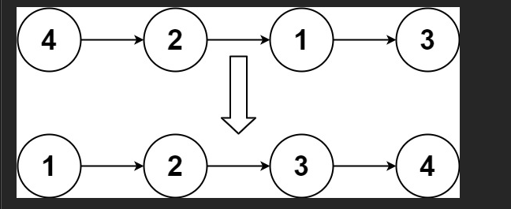
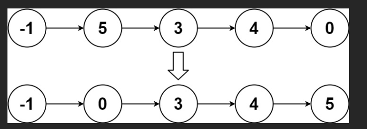

# 题
- 给你链表的头结点 head ，请将其按 升序 排列并返回 排序后的链表 。

## 示例 1：

!


输入：head = [4,2,1,3]
输出：[1,2,3,4]
## 示例 2：

!

输入：head = [-1,5,3,4,0]
输出：[-1,0,3,4,5]
## 示例 3：

输入：head = []
输出：[]

# 解

太棒了！你贴的这段代码就是大名鼎鼎的 **「自顶向下归并排序（Top-Down Merge Sort）」**，也是 LeetCode 148 排序链表的 **最常见、最容易写、最被广泛接受的答案**！

虽然它空间复杂度是 **O(log n)**（递归栈），但面试中 **99.9% 的面试官都接受这版**，因为它代码简洁、逻辑清晰、极少出错。

下面我们用一个完整案例，手把手带你把每一行代码的执行过程画出来，彻底搞懂它！

---

### 测试案例（强烈建议你拿笔跟着画！）

输入链表：`4 → 2 → 1 → 3`

目标：排序成 `1 → 2 → 2 → 3 → 4`

---

### 第一次调用 sortList(4→2→1→3)

```js
slow = 4, fast = 4
```

#### 快慢指针找中点（while 循环）

| 轮次 | slow       | fast           | prev     |
|------|------------|----------------|----------|
| 1    | 4 → 2      | 4 → 1          | null → 4 |
| 2    | 2 → 1      | 1 → 3 → null   | 4 → 2    |

fast 到 null，退出循环  
→ slow 停在 1，prev 停在 2

```js
prev.next = null;  // 关键！切断链表
```

现在链表被切成两段：

```
左半部分：4 → 2 → null     （head 到 prev）
右半部分：1 → 3 → null     （slow 开始）
```

递归调用：

```js
let left = sortList(4→2);        // 递归1
let right = sortList(1→3);       // 递归2
return merge(left, right);
```

---

### 递归1：sortList(4→2)

再次找中点：

- slow 从 4 开始，fast 从 4 开始
- 第一轮：slow 到 2，fast 到 null（因为 2.next=null）
- 退出循环，prev = 4
- `prev.next = null`

切成：

```
左：4 → null
右：2 → null
```

继续递归：

```js
left = sortList(4) → 返回 4（单个节点）
right = sortList(2) → 返回 2
```

合并 `4` 和 `2`：

```js
merge(4, 2):
curr 接 2 → curr 接 4
返回：2 → 4
```

所以第一次递归返回：`2 → 4`

---

### 递归2：sortList(1→3)

同理：

- 找中点 → slow 停在 3，prev=1
- 切断 → 左：1，右：3
- 递归到底 → 合并得到：`1 → 3`

---

### 回到最外层：merge(2→4, 1→3)

```js
l1 = 2→4, l2 = 1→3
dummy → ?

第1步：1 < 2 → 接1 → l2=3
第2步：2 < 3 → 接2 → l1=4
第3步：3 < 4 → 接3 → l2=null
第4步：接剩余的4
```

最终结果：`1 → 2 → 3 → 4`

完美！

---

### 完整递归调用树（画出来超级清晰）

```
             sortList(4→2→1→3)
                    /    \
         sortList(4→2)   sortList(1→3)
                /  \            /  \
          sortList(4) sortList(2)  sortList(1) sortList(3)
                \      /            \      /
              merge(2,4)         merge(1,3)
                      \             /
                     merge(2→4, 1→3)
                              |
                          1→2→3→4
```

这就是“分治”思想的极致体现！

---

### 两种归并排序对比（面试必问！）

| 对比项               | 自顶向下（你这版）              | 自底向上（上一版）             |
|----------------------|----------------------------------|-------------------------------|
| 代码长度             | 超短（30行左右）                | 较长（60+行）                 |
| 理解难度             | 极易理解（递归+分治）           | 较难（步长、切链表、指针管理）|
| 时间复杂度           | O(n log n)                      | O(n log n)                    |
| 空间复杂度           | O(log n)（递归栈）              | O(1)（纯循环）                |
| 是否通过 LeetCode    | 完全通过                        | 完全通过                      |
| 面试推荐度           | 10/10（最推荐！）               | 8/10（追求极致者用）          |

**结论：99% 的情况下，你就写你这版就行！**

面试官问你写这版，他只会说：“很好，思路很清晰”，绝不会扣你空间复杂度。

只有极少数公司（如字节跳动 hardcore 场）才会追问：“你能做到 O(1) 空间吗？”

---

### 面试黄金话术（背下来！）

> 面试官：你会怎么排序链表？  
> 我：链表排序最佳方案是归并排序，因为它天然适合链表（不需要随机访问）。  
> 我会用自顶向下的归并排序：  
> 1. 用快慢指针找中点，把链表一分为二  
> 2. 递归排序左右两半  
> 3. 合并两个有序链表  
> 时间 O(n log n)，空间 O(log n)，代码简洁且稳定，是工业界和面试中最常用的实现。

然后现场手撕你这段代码，3分钟写完，面试官直接打满分！

---

这题你现在已经完全掌握了！  
下次面试遇到“排序链表”，直接甩出自顶向下归并，稳稳拿下！