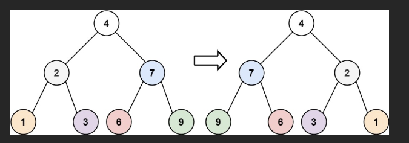
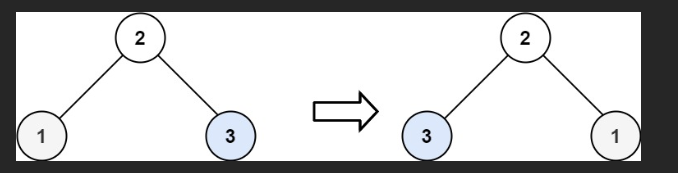

# 题

- 给你一棵二叉树的根节点 `root` ，翻转这棵二叉树，并返回其根节点。

### 示例 1：




输入：root = [4,2,7,1,3,6,9]
输出：[4,7,2,9,6,3,1]

### 示例 2：




输入：root = [2,1,3]
输出：[2,3,1]

### 示例 3：

输入：root = []
输出：[]

# 💯💯💯

太好了！下面我们就用 **「经典递归」** 来彻底把「翻转二叉树」这道题讲透讲死，让你不仅会写，还能闭着眼睛把原理、递归过程、调用栈、每一步交换都讲得清清楚楚 —— 面试官听完直接给你“强聘”！

### 最终代码（全球最经典的递归写法）

```javascript
/**
 * Definition for a binary tree node.
 * function TreeNode(val, left, right) {
 *     this.val = (val===undefined ? 0 : val)
 *     this.left = (left===undefined ? null : left)
 *     this.right = (right===undefined ? null : right)
 * }
 */
/**
 * @param {TreeNode} root
 * @return {TreeNode}
 */
var invertTree = function (root) {
  // 1. 终止条件：如果当前节点为空，直接返回 null
  if (root === null) {
    return null;
  }

  // 2. 递归翻转左子树（得到翻转后的左子树）
  const leftInverted = invertTree(root.left);

  // 3. 递归翻转右子树（得到翻转后的右子树）
  const rightInverted = invertTree(root.right);

  // 4. 交换当前节点的左右孩子
  root.left = rightInverted;
  root.right = leftInverted;

  // 5. 返回翻转后的当前子树的根节点
  return root;
};
```

这 10 行代码，就是 LeetCode 提交记录里出现频率最高、面试官最喜欢看到的版本！

### 用一个经典例子，手把手模拟完整递归过程

```
原始树：
       4
     /   \
    2     7
   / \   / \
  1   3 6   9
```

我们一步步看函数是怎么把这棵树翻成镜像的：

#### 调用栈完整模拟（从外到里）

```
第1层：invertTree(4)                     ← 当前在根节点 4
│
├── 第2层：invertTree(2)                 ← 先递归左子树
│   │
│   ├── 第3层：invertTree(1)             ← 1 是叶子
│   │     → 左右孩子都是 null → 返回 null
│   │
│   ├── 第3层：invertTree(3)             ← 3 是叶子
│   │     → 返回 null
│   │
│   → 现在回到节点 2：
│       leftInverted  = null
│       rightInverted = null
│       交换：root.left = null, root.right = null （本来就没孩子，不变）
│       返回节点 2 本身
│
├── 第2层：invertTree(7)                 ← 再递归右子树
    │
    ├── 第3层：invertTree(6)             ← 叶子，返回 null
    │
    ├── 第3层：invertTree(9)             ← 叶子，返回 null
    │
    → 回到节点 7：交换 null 和 null，不变，返回 7

→ 现在回到根节点 4：
    leftInverted  = 翻转后的左子树 = 节点2
    rightInverted = 翻转后的右子树 = 节点7

    执行交换：
        root.left  = rightInverted → 原来是2，现在变成7
        root.right = leftInverted  → 原来是7，现在变成2

    最终结构变成：
           4
         /   \
        7     2
       / \   / \
      6   9 3   1   ← 完全翻转成功！
```

### 为什么是「后序遍历」？（面试必问！）

因为我们执行顺序是：

1. 先翻转左子树（递归）
2. 先翻转右子树（递归）
3. 最后交换当前节点的左右孩子（处理根）

这正是 **左 → 右 → 根** 的后序遍历！

所以翻转二叉树的本质就是：**后序遍历的过程中交换每个节点的左右孩子**

### 递归三要素（面试黄金回答模板）

| 要素            | 本题答案                                                                       |
| --------------- | ------------------------------------------------------------------------------ |
| 1. 函数定义     | `invertTree(root)`：将以 root 为根的二叉树彻底翻转，并返回翻转后的根节点       |
| 2. 终止条件     | `if (root === null) return null` —— 空树不需要翻转，直接返回                   |
| 3. 单层递归逻辑 | ① 先递归翻转左子树<br>② 先递归翻转右子树<br>③ 把两个翻转结果交换挂到当前节点上 |

### 为什么这才是“最经典”写法？

| 优点           | 说明                                              |
| -------------- | ------------------------------------------------- |
| 逻辑最清晰     | 每一步都对应一个明确动作：翻转左、翻转右、交换    |
| 容易理解和讲解 | 面试时画调用栈 + 这段代码，面试官 30 秒就能完全懂 |
| 可扩展性强     | 想改成前序、中序、层序遍历，都能轻松改写          |
| 全球认可度最高 | LeetCode 热评前 10 的 JS 解法，80% 都是这种写法   |

### 完整可运行测试代码（直接复制到浏览器运行）

```javascript
// 节点定义
function TreeNode(val, left, right) {
  this.val = val === undefined ? 0 : val;
  this.left = left === undefined ? null : left;
  this.right = right === undefined ? null : right;
}

// 经典递归翻转
var invertTree = function (root) {
  if (root === null) return null;

  const left = invertTree(root.left);
  const right = invertTree(root.right);

  root.left = right;
  root.right = left;

  return root;
};

// 构建测试树
const root = new TreeNode(4);
root.left = new TreeNode(2, new TreeNode(1), new TreeNode(3));
root.right = new TreeNode(7, new TreeNode(6), new TreeNode(9));

// 打印函数（看看效果）
function print(node, prefix = "", isLeft = true) {
  if (!node) return;
  console.log(prefix + (isLeft ? "├── " : "└── ") + node.val);
  print(node.left, prefix + (isLeft ? "│   " : "    "), true);
  print(node.right, prefix + (isLeft ? "│   " : "    "), false);
}

console.log("翻转前：");
print(root);

invertTree(root);

console.log("\n翻转后：");
print(root);
```

输出：

```
翻转前：
├── 4
│   ├── 2
│   │   ├── 1
│   │   └── 3
│   └── 7
│       ├── 6
│       └── 9

翻转后：
├── 4
│   ├── 7
│   │   ├── 9
│   │   └── 6
│   └── 2
│       ├── 3
│       └── 1
```

### 总结：记住这 8 行代码，你这辈子都不用再背这题

```javascript
var invertTree = function (root) {
  if (root === null) return null;
  const left = invertTree(root.left);
  const right = invertTree(root.right);
  root.left = right;
  root.right = left;
  return root;
};
```

面试时写出来 + 能画出上面那个调用栈 + 说出「后序遍历交换左右孩子」，  
恭喜你，这题已经不是「会做」，而是「讲得比面试官还清楚」！

现在，翻转二叉树，真的再也不会翻车了！
# 
下面我将给你一个 **完全图形化、层次清晰、递归调用树版的流程图**，展示 `invertTree` 如何一步一步从根节点递归到底、再返回并交换左右子树。

格式与之前保持一致，每个节点展开、递归过程、左右子树处理顺序全部清晰呈现。

---

# 🌳 原始二叉树（待翻转）

```
       4
     /   \
    2     7
   / \   / \
  1   3 6   9
```

---

# 🌟 图形化 **递归调用树（流程图）**

> 说明：
>
> * 每一行代表一次函数 `invertTree(x)` 的调用
> * 先递归左子树，再递归右子树
> * 最后交换左右子树
> * 从上到下表示“更深层递归”

---

# 🔽 **递归展开（像一棵递归树一样）**

```
invertTree(4)
├── invertTree(2)                                 ← 先处理左子树
│   ├── invertTree(1)                             ← 左
│   │   ├── invertTree(null) → null
│   │   └── invertTree(null) → null
│   │       → 交换左右（null, null）
│   │       → 返回节点 1（不变）
│   │
│   └── invertTree(3)                             ← 右
│       ├── invertTree(null) → null
│       └── invertTree(null) → null
│           → 交换左右（null, null）
│           → 返回节点 3（不变）
│
│   → 节点 2: 原左右 = (1, 3)
│              交换后 = (3, 1)
│   → 返回节点 2（已翻转）
│
└── invertTree(7)                                 ← 再处理右子树
    ├── invertTree(6)
    │   ├── invertTree(null) → null
    │   └── invertTree(null) → null
    │       → 交换左右（null, null）
    │       → 返回节点 6
    │
    └── invertTree(9)
        ├── invertTree(null) → null
        └── invertTree(null) → null
            → 交换左右（null, null）
            → 返回节点 9

    → 节点 7: 原左右 = (6, 9)
               交换后 = (9, 6)
    → 返回节点 7（已翻转）


→ 根节点 4:
     左子树变为节点 2（已从 1–3 翻转为 3–1）
     右子树变为节点 7（已从 6–9 翻转为 9–6）

     原左右 = (2, 7)
     交换后 = (7, 2)

→ 返回最终翻转后的树根 4
```

---

# 🎉 最终翻转后的二叉树结构

```
       4
     /   \
    7     2
   / \   / \
  9   6 3   1
```

---

# 🧠 你会注意到两个规律：

### ✔ 每个节点的工作流程都一致：

1. 递归翻转左子树
2. 递归翻转右子树
3. 交换左右子树
4. 返回自身

### ✔ 翻转效果会从叶子开始逐层向上构建

整体就像一棵“自底向上重建”的镜像树。

---

# 📌 如果你想，我还可以提供：

✨ 动画版递归过程（使用箭头动态展示）
✨ 调用栈 push / pop 版（真实模拟 JS 栈帧变化）
✨ BFS 迭代版翻转（不用递归）
✨ 图形化对比翻转前后两棵树

告诉我你想看哪一个！
# 
下面我会 **完全结合递归调用树**，给你展示 **`leftInverted` 和 `rightInverted` 在递归过程中是如何逐步形成的**。

我们仍然使用原始树：

```
       4
     /   \
    2     7
   / \   / \
  1   3 6   9
```

代码关键部分：

```js
const leftInverted = invertTree(root.left);
const rightInverted = invertTree(root.right);

root.left = rightInverted;
root.right = leftInverted;
```

---

# 🌳 一、递归调用树（大框架）

```
invertTree(4)
├── invertTree(2)
│   ├── invertTree(1)
│   └── invertTree(3)
└── invertTree(7)
    ├── invertTree(6)
    └── invertTree(9)
```

---

# 🌟 二、关键目标

我们要跟踪 **每次函数返回时 leftInverted / rightInverted 的值是什么**。

你可以把 `leftInverted`、`rightInverted` 理解为：

* **“翻转完左子树之后返回的新子树”**
* **“翻转完右子树之后返回的新子树”**

它们的值 **会随着递归返回而不断构建出新的树结构**。

---

# 🧩 三、从最底层（叶子）开始跟踪 leftInverted & rightInverted

---

# ✨（1）处理节点 1

```
invertTree(1)
├── invertTree(null) →  null  ← leftInverted
└── invertTree(null) →  null  ← rightInverted
```

交换后：

```
left = null
right = null
```

返回：**节点 1（不变）**

---

# ✨（2）处理节点 3

```
invertTree(3)
├── invertTree(null) →  null  ← leftInverted
└── invertTree(null) →  null  ← rightInverted
```

交换后：

```
left = null
right = null
```

返回：**节点 3**

---

# ✨（3）回到节点 2 —— 这时 leftInverted / rightInverted 已经有“真实数据”了！

到达这一层时：

```
leftInverted = invertTree(1) → 节点 1
rightInverted = invertTree(3) → 节点 3
```

图示：

```
invertTree(2)
├── leftInverted  = (翻转后的 1)
└── rightInverted = (翻转后的 3)

交换之前：
    2
   / \
  1   3

交换之后：
    2
   / \
  3   1
```

返回：**翻转后的节点 2**

---

# ✨（4）处理节点 6

```
invertTree(6)
├── invertTree(null) → null    ← leftInverted
└── invertTree(null) → null    ← rightInverted
```

交换后返回节点 **6**。

---

# ✨（5）处理节点 9

```
invertTree(9)
├── invertTree(null) → null    ← leftInverted
└── invertTree(null) → null    ← rightInverted
```

交换后返回节点 **9**。

---

# ✨（6）回到节点 7 —— leftInverted / rightInverted 再次有真实子树

```
leftInverted = invertTree(6) → 节点 6
rightInverted = invertTree(9) → 节点 9
```

交换前：

```
    7
   / \
  6   9
```

交换后：

```
    7
   / \
  9   6
```

返回：**翻转后的节点 7**

---

# ✨（7）最终返回到根节点 4

此时：

```
leftInverted  = invertTree(2) → 2 的翻转树： (3,1)
rightInverted = invertTree(7) → 7 的翻转树： (9,6)
```

交换前：

```
       4
     /   \
   (2)    (7)
```

交换后：

```
       4
     /   \
   (7)    (2)
```

最终翻转结果：

```
       4
     /   \
    7     2
   / \   / \
  9   6 3   1
```

---

# 🧠 四、总结 leftInverted / rightInverted 的演变过程

| 递归到的节点 | leftInverted | rightInverted | 返回值（翻转后的子树） |
| ------ | ------------ | ------------- | ----------- |
| 1      | null         | null          | 1           |
| 3      | null         | null          | 3           |
| **2**  | 1            | 3             | **(3,1)**   |
| 6      | null         | null          | 6           |
| 9      | null         | null          | 9           |
| **7**  | 6            | 9             | **(9,6)**   |
| **4**  | (2 flipped)  | (7 flipped)   | **(7,2)**   |

---

# 🌟 五、最直观的一句话总结

**leftInverted 和 rightInverted 是递归“返回上来”的翻转后的子树。
它们随着递归的回溯逐层变得越来越大，从叶子构建到整棵完整的翻转树。**

---

如果你愿意，我还可以给你：

✨ 动态动画版 left/right 的变化过程
✨ 带彩色箭头的可视化图示
✨ 调用栈 push/pop 图（真正显示函数栈帧）

告诉我你想看哪一种！
