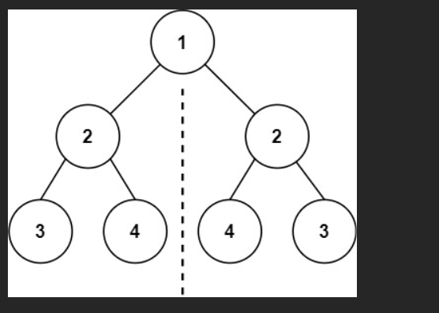
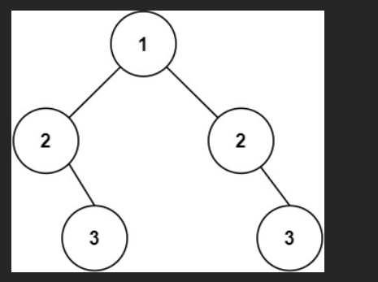

# 题

给你一个二叉树的根节点 `root` ， 检查它是否轴对称。

### 示例 1：



输入：`root = [1,2,2,3,4,4,3]`

输出：`true`

### 示例 2：



输入：`root = [1,2,2,null,3,null,3]`

输出：`false`

# 解题

## 思路（关键思想）

设一个函数 `isMirror(left, right)` 判断**两棵子树是否互为镜像**。

对于 `left` 和 `right`，要对称，必须同时满足：

1. 两个节点的值相同：`left.val === right.val`
2. 左边的左子树 和 右边的右子树 对称：`isMirror(left.left, right.right)`
3. 左边的右子树 和 右边的左子树 对称：`isMirror(left.right, right.left)`

再加上几种边界情况：

- `left` 和 `right` 都是 `null`：对称（都是空树）
- 一个是 `null`，另一个不是：不对称


## code

```js
/**
 * Definition for a binary tree node.
 * function TreeNode(val, left, right) {
 *     this.val = (val===undefined ? 0 : val)
 *     this.left = (left===undefined ? null : left)
 *     this.right = (right===undefined ? null : right)
 * }
 */
/**
 * @param {TreeNode} root
 * @return {boolean}
 */
function isSymmetric(root) {
  if (!root) return true; // 空树也是对称的

  // 检查左子树和右子树是否互为镜像
  function isMirror(left, right) {
    // 情况 1：左右都为空 -> 对称
    if (!left && !right) return true;

    // 情况 2：一个为空一个不为空 -> 不对称
    if (!left || !right) return false;

    // 情况 3：值不相等 -> 不对称
    if (left.val !== right.val) return false;

    // 情况 4：继续向下递归检查
    // 左的左 vs 右的右，左的右 vs 右的左
    return isMirror(left.left, right.right) && isMirror(left.right, right.left);
  }

  const result = isMirror(root.left, root.right);
  return result;
}
```

## 一、题目翻译一下

给你一棵二叉树的根节点 `root`，判断这棵树是不是绕着中轴线对称的。比如：

**对称：**

```
      1
    /   \
   2     2
  / \   / \
 3  4  4   3
```

**不对称：**

```
      1
    /   \
   2     2
    \     \
     3     3
```


## 三、JS 代码（递归）

---

## 四、结合具体案例走一遍

### 案例 1：对称的树

```text
      1
    /   \
   2     2
  / \   / \
 3  4  4   3
```

构造一下（伪代码）：

```js
const root = new TreeNode(
  1,
  new TreeNode(2, new TreeNode(3), new TreeNode(4)),
  new TreeNode(2, new TreeNode(4), new TreeNode(3))
);
```

调用：`isSymmetric(root)`

**递归过程（简化版）：**

1. 检查 `root.left(2)` 和 `root.right(2)`

   - 值相等 -> 继续

2. 递归 1：`isMirror(left.left(3), right.right(3))`

   - 值相等，继续往下：
   - `isMirror(3.left(null), 3.right(null))` -> 两个都是 `null` -> `true`
   - `isMirror(3.right(null), 3.left(null))` -> 两个都是 `null` -> `true`
   - 所以这对子树镜像 -> `true`

3. 递归 2：`isMirror(left.right(4), right.left(4))`

   - 同样过程，最终也会得到 `true`

4. 所以根节点左右子树镜像，整棵树对称，函数返回 `true`。

---

### 案例 2：不对称的树

```
      1
    /   \
   2     2
    \     \
     3     3
```

构造：

```js
const root = new TreeNode(
  1,
  new TreeNode(2, null, new TreeNode(3)),
  new TreeNode(2, null, new TreeNode(3))
);
```

调用：`isSymmetric(root)`

**递归过程（关键地方）：**

1. 检查 `root.left(2)` 和 `root.right(2)`

   - 值相等 -> 继续

2. 检查 `isMirror(left.left(null), right.right(3))`

   - 一个是 `null`，一个不是 -> 直接返回 `false`
   - 说明结构不对称（左边该有左子树却没有）

因为这个 `false`，最终整棵树被判定为 **不对称**。

---

## 五、如何自己验证

你可以自己写几个例子测试一下：

```js
console.log(isSymmetric(root1)); // 对称的树 -> true
console.log(isSymmetric(root2)); // 不对称的树 -> false
```

也可以试：

- 只有一个根节点：一定是对称（左、右子树都是 null）
- 左子树有节点，右子树没节点：一定不对称

直接上“递归调用树”的流程图，让你一眼看明白整套递归是怎么跑的 👇

---

## 一、题目代码回顾（核心是 `isMirror`）

```js
function isSymmetric(root) {
  if (!root) return true; // 空树也是对称的

  function isMirror(left, right) {
    if (!left && !right) return true; // 情况 1
    if (!left || !right) return false; // 情况 2
    if (left.val !== right.val) return false; // 情况 3

    // 情况 4：递归检查“外侧”和“内侧”
    return isMirror(left.left, right.right) && isMirror(left.right, right.left);
  }

  return isMirror(root.left, root.right);
}
```

树结构：

```
      1
    /   \
   2     2
  / \   / \
 3  4  4   3
```

---

## 二、从根开始的递归调用树（像流程图）

### Step 1：入口

```text
isSymmetric(root)
└── 调用 isMirror(root.left, root.right)
        = isMirror(2(左), 2(右))
```

---

### Step 2：第 1 层 isMirror 调用

```text
isMirror(2L, 2R)                          ← 两边值相等，继续递归

检查：2 == 2 ✅ 通过

继续：
return isMirror(2L.left, 2R.right)   &&   isMirror(2L.right, 2R.left)
     = isMirror(3, 3)                &&   isMirror(4, 4)
```

把这一步画成“递归树”的样子：

```text
                 isMirror(2L, 2R)
                 /               \
        isMirror(3, 3)       isMirror(4, 4)
```

---

### Step 3：处理 isMirror(3, 3)

```text
isMirror(3, 3)

1. 都不为空 ✅
2. 值相等：3 == 3 ✅

继续递归：
return isMirror(3.left, 3.right) && isMirror(3.right, 3.left)
     = isMirror(null, null)      && isMirror(null, null)
```

画成递归子树：

```text
            isMirror(3, 3)
             /          \
isMirror(null, null)  isMirror(null, null)
        |                   |
       true                true

=> isMirror(3, 3) 返回：true && true = true
```

---

### Step 4：处理 isMirror(4, 4)

对称地，逻辑一样：

```text
isMirror(4, 4)

1. 都不为空 ✅
2. 值相等：4 == 4 ✅

继续：
return isMirror(4.left, 4.right) && isMirror(4.right, 4.left)
     = isMirror(null, null)      && isMirror(null, null)
```

递归树：

```text
            isMirror(4, 4)
             /          \
isMirror(null, null)  isMirror(null, null)
        |                   |
       true                true

=> isMirror(4, 4) 返回：true && true = true
```

---

## 三、把整棵“递归调用树”拼在一起

完整调用结构如下（**从上到下越走越深**）：

```text
1. isSymmetric(root)
   └── isMirror(root.left, root.right)
       = isMirror(2L, 2R)

2. isMirror(2L, 2R)
   ├── isMirror(3, 3)
   │   ├── isMirror(null, null) → true
   │   └── isMirror(null, null) → true
   │       → 返回 true && true = true    ← “外侧 & 内侧” 都对称
   │
   └── isMirror(4, 4)
       ├── isMirror(null, null) → true
       └── isMirror(null, null) → true
           → 返回 true && true = true

3. 回到 isMirror(2L, 2R)
   左结果：isMirror(3, 3) → true
   右结果：isMirror(4, 4) → true

   → isMirror(2L, 2R) 返回：true && true = true

4. 回到 isSymmetric(root)
   → 返回 true （这棵树轴对称）
```

---

## 四、把递归树画成一张“总流程图”

```text
                          isSymmetric(root)
                                   |
                                   ▼
                         isMirror(2L, 2R)
                          /             \
                         /               \
                isMirror(3, 3)             isMirror(4, 4)
                 /        \                           /        \
                /          \                         /          \
   isMirror(null,null) isMirror(null,null) isMirror(null,null) isMirror(null,null)
          |                  |               |                   |
         true               true            true                true

   isMirror(3,3) = true && true = true
   isMirror(4,4) = true && true = true

isMirror(2L,2R) = true && true = true

isSymmetric(root) = true
```
