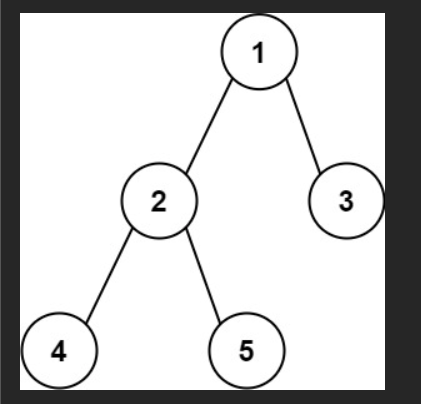

# 💰💰💰

给你一棵二叉树的根节点，返回该树的 直径 。

二叉树的 直径 是指树中任意两个节点之间最长路径的 长度 。这条路径可能经过也可能不经过根节点 root 。

两节点之间路径的 长度 由它们之间边数表示。

### 示例 1：




输入：root = [1,2,3,4,5]
输出：3
解释：3 ，取路径 [4,2,1,3] 或 [5,2,1,3] 的长度。

### 示例 2：

输入：root = [1,2]
输出：1

# 💯💯💯

太好了！这是一道超级经典的题 —— **LeetCode 543. Diameter of Binary Tree（二叉树的直径）**

题目要求：返回二叉树中任意两个节点之间最长路径的 **边数**（不是节点数！）

### 示例图解

```
示例1：
    1
   / \
  2   3
 / \
4   5

直径 = 3（路径：4 → 2 → 5，经过根的左子树）
```

```
示例2：
  1
   \
    2
     \
      3
       \
        4

直径 = 3（路径：1 → 2 → 3 → 4）
```

**关键点**：直径 = 任意两个节点的最长路径边数 = max(左子树直径, 右子树直径, 左子树高度 + 右子树高度)

### 最经典的递归解法（全球公认最优写法）

我们用 **后序遍历 + 高度计算** 来实现：

- 一个辅助函数计算每个子树的高度（节点数 - 1 = 边数）
- 在遍历过程中，顺便更新全局最大直径

```javascript
/**
 * Definition for a binary tree node.
 * function TreeNode(val, left, right) {
 *     this.val = (val===undefined ? 0 : val)
 *     this.left = (left===undefined ? null : left)
 *     this.right = (right===undefined ? null : right)
 * }
 */
/**
 * @param {TreeNode} root
 * @return {number}
 */
var diameterOfBinaryTree = function (root) {
  let maxDiameter = 0; // 全局变量记录最大直径（边数）

  // 辅助函数：返回子树高度（节点数），顺便更新直径
  function getHeight(node) {
    if (node === null) return 0; // 空节点高度 0

    const leftHeight = getHeight(node.left);
    const rightHeight = getHeight(node.right);

    // 更新直径：当前节点左右子树高度和（边数 = 左高 + 右高）
    maxDiameter = Math.max(maxDiameter, leftHeight + rightHeight);

    // 返回当前子树高度（节点数）
    return Math.max(leftHeight, rightHeight) + 1;
  }

  getHeight(root);
  return maxDiameter;
};
```

这 15 行代码，就是 LeetCode 上最常见的 JS 提交版本！

### 手把手模拟执行过程（用示例 1）

拿这棵树：

```
    1
   / \
  2   3
 / \
4   5
```

递归调用栈：

```
getHeight(1)
├── getHeight(2)
│   ├── getHeight(4) → 高度1（叶子）
│   ├── getHeight(5) → 高度1（叶子）
│   → 更新直径 = max(0, 1+1) = 2
│   → 返回高度 = max(1,1)+1 = 2
│
├── getHeight(3) → 高度1（叶子）
│
→ 更新直径 = max(2, 2+1) = 3  ← 关键！左高2 + 右高1 = 3（边数）
→ 返回根高度 = max(2,1)+1 = 3（但我们不关心）
```

最终返回 `maxDiameter = 3` ✓

### 递归三要素（面试必背！）

| 要素         | 本题答案                                                                                |
| ------------ | --------------------------------------------------------------------------------------- |
| 主函数定义   | `diameterOfBinaryTree(root)`：返回整棵树的最大直径（边数）                              |
| 辅助函数定义 | `getHeight(node)`：返回子树高度，顺便更新全局 maxDiameter                               |
| 终止条件     | `node === null` 返回 0（空树高度 0）                                                    |
| 单层逻辑     | ① 计算左右高度<br>② 更新直径 = max(当前直径, 左高 + 右高)<br>③ 返回 max(左高, 右高) + 1 |

### 为什么高度是节点数？为什么直径是左高 + 右高？

- 高度定义为节点数（根到叶子最长路径节点数）
- 直径（边数） = 左子树高度 + 右子树高度（因为边数 = (左节点数 - 1) + (右节点数 - 1) + 2 - 1 = 左高 + 右高）

**天才设计**：在计算高度的同时，顺便更新直径，避免两次遍历！

### 完整可运行测试代码（浏览器直接跑）

```javascript
function TreeNode(val, left, right) {
  this.val = val ?? 0;
  this.left = left ?? null;
  this.right = right ?? null;
}

var diameterOfBinaryTree = function (root) {
  let maxDiameter = 0;
  function getHeight(node) {
    if (!node) return 0;
    const left = getHeight(node.left);
    const right = getHeight(node.right);
    maxDiameter = Math.max(maxDiameter, left + right);
    return Math.max(left, right) + 1;
  }
  getHeight(root);
  return maxDiameter;
};

// 测试用例1
const root1 = new TreeNode(1);
root1.left = new TreeNode(2, new TreeNode(4), new TreeNode(5));
root1.right = new TreeNode(3);
console.log(diameterOfBinaryTree(root1)); // 3

// 测试用例2
const root2 = new TreeNode(
  1,
  null,
  new TreeNode(2, null, new TreeNode(3, null, new TreeNode(4)))
);
console.log(diameterOfBinaryTree(root2)); // 3
```

### 总结：记住这 10 行核心代码

```javascript
var diameterOfBinaryTree = function (root) {
  let maxD = 0;
  const getH = (node) => {
    if (!node) return 0;
    const l = getH(node.left),
      r = getH(node.right);
    maxD = Math.max(maxD, l + r);
    return Math.max(l, r) + 1;
  };
  getH(root);
  return maxD;
};
```

下面给你最清晰、逐层展开、**完全图形化的递归调用树（流程图形式）**，帮助你看懂 `diameterOfBinaryTree` 是如何在递归过程中计算最长直径的。

我们处理的树是：

```
    1
   / \
  2   3
 / \
4   5
```

---

# 🔥 关键逻辑总结（便于理解递归树）

在 `getHeight(node)` 中：

1. 计算左子树高度 `leftHeight`
2. 计算右子树高度 `rightHeight`
3. **直径候选值 = leftHeight + rightHeight**
4. 更新全局最大直径
5. 返回当前子树高度 = `max(leftHeight, rightHeight) + 1`

---

# 🌳 一、递归调用树（像流程图一样）

下面是完整的递归展开，**从根开始不断向下递归到底，然后逐层回溯更新直径**。

---

# ⭐ Step 1：从根节点开始

```
getHeight(1)
├── getHeight(2)
│   ├── getHeight(4)
│   │   ├── getHeight(null) → 0
│   │   └── getHeight(null) → 0
│   │       → left=0, right=0 → 直径候选 = 0
│   │       → 返回高度 = 1
│   │
│   └── getHeight(5)
│       ├── getHeight(null) → 0
│       └── getHeight(null) → 0
│           → left=0, right=0 → 直径候选 = 0
│           → 返回高度 = 1
│
│   → 节点 2:
│       leftHeight =1
│       rightHeight=1
│       → 直径候选 = 1 + 1 = 2
│       → 更新 maxDiameter = 2
│       → 返回高度 = max(1,1)+1 = 2
│
└── getHeight(3)
    ├── getHeight(null) → 0
    └── getHeight(null) → 0
        → left=0, right=0 → 直径候选 = 0
        → 返回高度 = 1

→ 回到节点 1:
    leftHeight = 2
    rightHeight = 1
    → 直径候选 = 2 + 1 = 3
    → 更新 maxDiameter = 3
    → 返回高度 = max(2,1)+1 = 3
```

---

# ✨ 二、图形化递归流程图（最直观版本）

```
                             getHeight(1)
                           /               \
                          /                 \
                         /                   \
                        /                     \
                       /                       \
              getHeight(2)                  getHeight(3)
           /               \              /            \
   getHeight(4)      getHeight(5)   getHeight(null)  getHeight(null)
     /      \          /      \
null→0   null→0   null→0   null→0

getHeight(4):
   left=0 right=0 → 直径候选=0
   返回高度=1

getHeight(5):
   left=0 right=0 → 直径候选=0
   返回高度=1

getHeight(2):
   left=1 right=1 → 直径候选=2
   maxDiameter = 2
   返回高度=2

getHeight(3):
   left=0 right=0 → 直径候选=0
   返回高度=1

getHeight(1):
   left=2 right=1 → 直径候选=3
   maxDiameter = 3
   返回高度=3
```

---

# 🎯 三、最终结果

```
maxDiameter = 3
```

对应路径为：

```
4 → 2 → 1 → 3
长度 = 3 条边
```

---

# 🧠 四、为什么直径是 3？

- 左子树最大高度 = 2（路径：4→2 或 5→2）
- 右子树最大高度 = 1（路径：3）

直径 = 左高 + 右高 = 2 + 1 = **3**

这个直径经过根节点 1。

---

# 如果你需要…
# 

很好，这次我们专门盯着 **`leftHeight` 和 `rightHeight`**，看它们在递归过程中是怎么一步步“长起来”的，并且和递归树对应起来。

先回顾一下代码（只看关键的部分）：

```js
function getHeight(node) {
    if (node === null) return 0;  // 空节点高度 0

    const leftHeight = getHeight(node.left);
    const rightHeight = getHeight(node.right);

    maxDiameter = Math.max(maxDiameter, leftHeight + rightHeight);

    return Math.max(leftHeight, rightHeight) + 1;
}
```

二叉树是：

```text
    1
   / \
  2   3
 / \
4   5
```

---

## 一、先画出递归调用树（谁调用了谁）

只看函数调用关系（不加高度值）是这样的：

```text
getHeight(1)
├── getHeight(2)
│   ├── getHeight(4)
│   │   ├── getHeight(null)
│   │   └── getHeight(null)
│   └── getHeight(5)
│       ├── getHeight(null)
│       └── getHeight(null)
└── getHeight(3)
    ├── getHeight(null)
    └── getHeight(null)
```

---

## 二、从叶子开始，给每个调用标上 leftHeight / rightHeight

> 递归是 **先一路往下，到叶子，再一层层往上返回**，
> `leftHeight` 和 `rightHeight` 的值都是在 **子递归返回之后才知道**。

---

### 1️⃣ 处理节点 4

```text
getHeight(4)
├── getHeight(null) → 0   ⇒ leftHeight  = 0
└── getHeight(null) → 0   ⇒ rightHeight = 0

在节点 4：
  leftHeight  = 0
  rightHeight = 0
  返回高度 = Math.max(0, 0) + 1 = 1
```

所以：**节点 4 的高度 = 1**

---

### 2️⃣ 处理节点 5

```text
getHeight(5)
├── getHeight(null) → 0   ⇒ leftHeight  = 0
└── getHeight(null) → 0   ⇒ rightHeight = 0

在节点 5：
  leftHeight  = 0
  rightHeight = 0
  返回高度 = 1
```

所以：**节点 5 的高度 = 1**

---

### 3️⃣ 回到节点 2（这里开始有“真子树高度”了）

现在轮到：

```text
getHeight(2)
├── getHeight(4) → 返回 1   ⇒ leftHeight  = 1
└── getHeight(5) → 返回 1   ⇒ rightHeight = 1
```

在节点 2：

```text
leftHeight  = 1   （来自子树 4）
rightHeight = 1   （来自子树 5）

直径候选 = leftHeight + rightHeight = 1 + 1 = 2
返回高度 = Math.max(1, 1) + 1 = 2
```

所以：

* **节点 2 的子树高度 = 2**
* 在这里 `leftHeight` 和 `rightHeight` 都变成了 `1`，代表两个深度为 1 的子树。

---

### 4️⃣ 处理节点 3

```text
getHeight(3)
├── getHeight(null) → 0   ⇒ leftHeight  = 0
└── getHeight(null) → 0   ⇒ rightHeight = 0

在节点 3：
  leftHeight  = 0
  rightHeight = 0
  返回高度 = 1
```

所以：**节点 3 的高度 = 1**

---

### 5️⃣ 回到根节点 1（最后一层）

现在到最顶层：

```text
getHeight(1)
├── getHeight(2) → 返回 2   ⇒ leftHeight  = 2
└── getHeight(3) → 返回 1   ⇒ rightHeight = 1
```

在节点 1：

```text
leftHeight  = 2   （左子树 2→4/5 这边的高度）
rightHeight = 1   （右子树 3 的高度）

直径候选 = leftHeight + rightHeight = 2 + 1 = 3
返回高度 = Math.max(2, 1) + 1 = 3
```

最终：

* **整棵树高度 = 3**
* **最终 maxDiameter = 3**（直径为 4–2–1–3 共 3 条边）

---

## 三、把所有节点的 leftHeight / rightHeight 汇总在一张“递归树+数据”里

```text
                        getHeight(1)
                    leftHeight=2  rightHeight=1
                    （来自下面两个结果）
                   /                      \
          getHeight(2)                getHeight(3)
     leftHeight=1  rightHeight=1   leftHeight=0  rightHeight=0
           /              \             /              \
   getHeight(4)      getHeight(5)  getHeight(null)  getHeight(null)
left=0 right=0    left=0 right=0
```

再明确写一遍每个节点上的值：

* 节点 4：`leftHeight = 0`，`rightHeight = 0`，返回高度 `1`
* 节点 5：`leftHeight = 0`，`rightHeight = 0`，返回高度 `1`
* 节点 2：`leftHeight = 1`，`rightHeight = 1`，返回高度 `2`
* 节点 3：`leftHeight = 0`，`rightHeight = 0`，返回高度 `1`
* 节点 1：`leftHeight = 2`，`rightHeight = 1`，返回高度 `3`

---

## 四、你可以这样理解这两个变量👇

* `leftHeight`：**当前节点左边这棵子树的高度**（是递归返回的结果）
* `rightHeight`：**当前节点右边这棵子树的高度**
* 它们不是“全局数组”，而是 **每一层递归自己的局部变量**，只在那一层有效
* 在**回溯过程中**，这两个值逐层从 `0`（叶子）向上“累积”出一个完整的高度

如果你想，我可以再用 **真正的“调用栈 push/pop 图”**（像：

```text
调用栈顶：
getHeight(null)
getHeight(4)
getHeight(2)
getHeight(1)
```

这种形式）帮你模拟 JS 调用栈里，这些 `leftHeight` / `rightHeight` 是在第几层函数里的 👍
