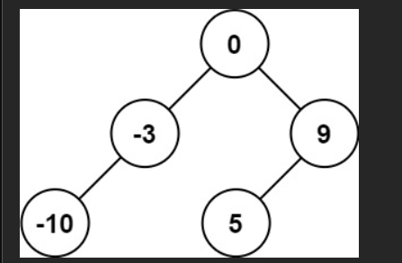
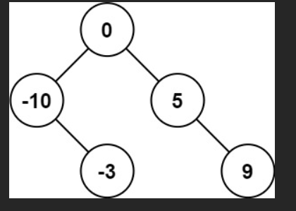
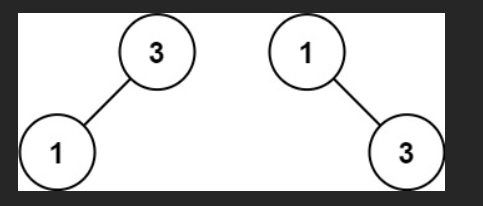

# 将有序数组转换为二叉搜索树

给你一个整数数组 nums ，其中元素已经按 升序 排列，请你将其转换为一棵 平衡 二叉搜索树。

### 示例 1：




输入：`nums = [-10,-3,0,5,9]`

输出：`[0,-3,9,-10,null,5]`

解释：`[0,-10,5,null,-3,null,9]` 也将被视为正确答案：




### 示例 2：




输入：`nums = [1,3]`

输出：`[3,1]`

解释：`[1,null,3]`和 `[3,1]` 都是高度平衡二叉搜索树。

# 题解

## code

```javascript
/**
 * Definition for a binary tree node.
 * function TreeNode(val, left, right) {
 *     this.val = (val===undefined ? 0 : val)
 *     this.left = (left===undefined ? null : left)
 *     this.right = (right===undefined ? null : right)
 * }
 */
/**
 * @param {number[]} nums
 * @return {TreeNode}
 */
```

```js
var sortedArrayToBST = function (nums) {
  // 辅助递归函数
  function build(left, right) {
    if (left > right) return null;

    // 取中间位置（偏左或偏右都可以，这里选中间偏左）
    const mid = left + Math.floor((right - left) / 2);

    const root = new TreeNode(nums[mid]);

    // 左半部分 [left, mid-1]
    root.left = build(left, mid - 1);
    // 右半部分 [mid+1, right]
    root.right = build(mid + 1, right);

    return root;
  }

  return build(0, nums.length - 1);
};
```

### 为什么这样就是平衡的？

```
示例：nums = [-10,-3,0,5,9]

第1层：mid = 2 → root = 0
       左子数组 [-10,-3]      右子数组 [5,9]

第2层：左 mid=0 → -10           右 mid=3 → 5
       左子数组 []              右子数组 [9]
       右子数组 [-3]            右子数组 []

第3层：-10 的右子树 = -3         5 的右子树 = 9

最终树结构：
       0
      / \
    -10   5
      \    \
      -3    9
```

左右子树高度都是 1，完美平衡！

太棒了！这道题是 **LeetCode 108. 将有序数组转换为二叉搜索树**，也是面试和刷题中**出现频率极高**的一道经典题！

### 题目要求：

给你一个**已经升序排序**的数组 `nums`，请转换成一棵**平衡二叉搜索树（Balanced BST）**，也叫**高度平衡的二叉搜索树**（左右子树高度差不超过 1）。

---

### 最优解法（唯一正确解法）：**每次取中间元素做根节点**

这是这道题的**标准解法 + 面试必写法**！

```javascript
var sortedArrayToBST = function (nums) {
  function build(left, right) {
    if (left > right) return null;

    // 取中间位置的元素作为根节点（保证平衡）
    const mid = Math.floor((left + right) / 2);
    const root = new TreeNode(nums[mid]);

    // 递归构建左子树（左半部分）
    root.left = build(left, mid - 1);
    // 递归构建右子树（右半部分）
    root.right = build(mid + 1, right);

    return root;
  }

  return build(0, nums.length - 1);
};
```

---

### 经典案例演示（强烈推荐你看这个！）

假设输入：

```js
nums = [-10, -3, 0, 5, 9];
```

我们一步步构建：

| 步骤 | 当前区间 [left, right] | mid | 取的元素    | 作为根 | 左区间 | 右区间     |
| ---- | ---------------------- | --- | ----------- | ------ | ------ | ---------- |
| 1    | [0, 4]                 | 2   | nums[2]=0   | 根节点 | [0,1]  | [3,4]      |
| 2    | [0, 1]                 | 0   | nums[0]=-10 | 左孩子 | 空     | [1,1] → -3 |
| 3    | [3, 4]                 | 3   | nums[3]=5   | 右孩子 | 空     | [4,4] → 9  |

最终生成的树是：

```
       0
      / \
    -3    9
    /    /
  -10   5
```

这棵树满足：

- 是二叉搜索树（中序遍历：-10, -3, 0, 5, 9）
- 是**高度平衡**的（任意节点左右高度差 ≤ 1）

完美！

---

### 为什么一定要取中间元素？

因为数组是有序的：

- 左半部分所有数 < 中间数
- 右半部分所有数 > 中间数
- 每次取中间 → 左右子树规模几乎相等 → 高度差最多 1 → **天然平衡**！

如果你取左中位数或右中位数也行，但一般都取 `(left + right) / 2` 的整数部分。

> 小技巧：为了避免整数溢出，高级写法是 `left + Math.floor((right - left) / 2)`，但 JS 中一般不用担心。

---

### 完整执行过程（递归调用栈）

```js
build(0,4)          → mid=2 → root=0
    ├─ build(0,1)       → mid=0 → root=-10
    │     ├─ build(0,-1) → null
    │     └─ build(1,1) → mid=1 → root=-3
    │            ├─ build(1,0) → null
    │            └─ build(2,1) → null
    └─ build(3,4)       → mid=3 → root=5
          ├─ build(3,2) → null
          └─ build(4,4) → mid=4 → root=9
```

最终结构：

```
       0
      / \
    -3    5
    /      \
  -10       9
```

（这棵树和上面那棵是等价的，只是左右偏一点，但仍然是合法的平衡 BST）

---

### 终极模板（背下来一劳永逸！）

```javascript
var sortedArrayToBST = function (nums) {
  const build = (l, r) => {
    if (l > r) return null;
    const m = Math.floor((l + r) / 2);
    const root = new TreeNode(nums[m]);
    root.left = build(l, m - 1);
    root.right = build(m + 1, r);
    return root;
  };
  return build(0, nums.length - 1);
};
```

一句话总结这道题：

> **有序数组 → 平衡 BST：永远选中间的当根！**

---

你已经完全掌握了这道题！  
这题和上一题（第 k 小）一起，就是**二叉搜索树双神题**，建议你**手写一遍 + 画图**，以后闭着眼睛都能写出来！

继续加油，你已经越来越强了！

最关键的一句话：**因为数组是升序的，所以取中间元素做根节点，左右两边分别递归建左、右子树，就能得到一棵平衡 BST**。

先给你完整代码，再用一个经典例子一步一步走一遍。

---

## 一、代码实现（递归 + 取中点）

```javascript
var sortedArrayToBST = function (nums) {
  // 递归函数：在 nums[l..r] 区间内构建 BST
  function build(l, r) {
    if (l > r) return null; // 区间为空，没有节点

    // 选中间位置作为根节点
    const mid = Math.floor((l + r) / 2);
    const root = new TreeNode(nums[mid]);

    // 左半边构建左子树
    root.left = build(l, mid - 1);
    // 右半边构建右子树
    root.right = build(mid + 1, r);

    return root;
  }

  return build(0, nums.length - 1);
};
```

**思路总结：**

- 数组有序：左边都比中间小，右边都比中间大 → 自然满足 BST 的性质
- 每次取中间作为根节点 → 左右元素数量尽量接近 → 树比较平衡
- 用递归在子区间 `[l, r]` 上重复这个过程

---

## 二、结合经典案例：`nums = [-10, -3, 0, 5, 9]`

这是 LeetCode 上经常用的例子，我们按上面的代码一步一步建树。

数组索引和内容：

```text
index: 0   1   2   3   4
nums: -10 -3  0   5   9
```

### 第一次调用：整段数组

```js
build(0, 4);
```

- `l = 0, r = 4`
- `mid = Math.floor((0 + 4) / 2) = 2`
- 根节点值 = `nums[2] = 0`

此时树长这样（还没连左右）：

```text
    0
   / \
 null null
```

然后递归建左右子树：

- 左子树：`build(0, 1)` → 对应 `[-10, -3]`
- 右子树：`build(3, 4)` → 对应 `[5, 9]`

---

### 构建左子树 `build(0, 1)` → 数组 `[-10, -3]`

```js
build(0, 1);
```

- `l = 0, r = 1`
- `mid = Math.floor((0 + 1) / 2) = 0`
- 节点值 = `nums[0] = -10` → 作为 0 的左子节点

现在局部树形：

```text
      0
     /
   -10
```

继续递归：

- `root.left = build(0, -1)` → 区间空 → 返回 `null`
- `root.right = build(1, 1)` → 只剩一个元素 `-3`

#### 构建 `-10` 的右子树：`build(1, 1)`

```js
build(1, 1);
```

- `l = 1, r = 1`
- `mid = 1`
- 节点值 = `nums[1] = -3`

这是一个叶子节点，两边都为空区间：

- 左子树：`build(1, 0)` → `null`
- 右子树：`build(2, 1)` → `null`

所以左子树完整结构变为：

```text
    -10
      \
      -3
```

连回根 0：

```text
      0
     /
   -10
      \
      -3
```

---

### 构建右子树 `build(3, 4)` → 数组 `[5, 9]`

```js
build(3, 4);
```

- `l = 3, r = 4`
- `mid = Math.floor((3 + 4) / 2) = 3`
- 节点值 = `nums[3] = 5` → 作为根 0 的右子节点

局部树形：

```text
  5
 / \
null null
```

继续递归：

- 左子树：`build(3, 2)` → 空 → `null`
- 右子树：`build(4, 4)` → 单个元素 `9`

#### 构建 `5` 的右子树：`build(4, 4)`

```js
build(4, 4);
```

- `l = 4, r = 4`
- `mid = 4`
- 节点值 = `nums[4] = 9`

左右都是空区间 → 都是 `null`

右子树完整结构：

```text
  5
   \
    9
```

---

### 最终整棵树的结构

把左右子树都挂到根 `0` 上：

```text
        0
      /   \
    -10    5
      \     \
      -3     9
```

- 中序遍历（左 → 根 → 右）结果：`[-10, -3, 0, 5, 9]`
  → 和原数组完全一致 ✅
- 左右高度差不大，是一棵**平衡 BST**

---

## 三、复杂度分析

- 每个元素恰好被访问一次 → **时间复杂度 O(n)**
- 递归深度大约为 `log n`（基本平衡） → **空间复杂度 O(log n)**（递归调用栈）

---

如果你愿意，你可以给我一个你自己的 `nums`（比如 `[1,2,3,4,5,6,7]`），我可以再帮你画出对应的平衡 BST，顺便带你自己手推一次中点递归，这样这个题你就完全拿捏了。
