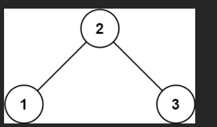
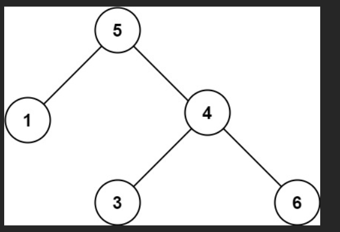

# 💰💰💰

给你一个二叉树的根节点 root ，判断其是否是一个有效的二叉搜索树。

有效 二叉搜索树定义如下：

节点的左子树只包含 严格小于 当前节点的数。
节点的右子树只包含 严格大于 当前节点的数。
所有左子树和右子树自身必须也是二叉搜索树。

### 示例 1：




输入：root = [2,1,3]
输出：true

### 示例 2：




输入：root = [5,1,4,null,null,3,6]
输出：false
解释：根节点的值是 5 ，但是右子节点的值是 4 。

# 💯💯💯

太棒了！你问的是 **LeetCode 98. Validate Binary Search Tree（验证二叉搜索树）**，这是一道**超级经典、面试必考**的题！

### 经典反例（最容易错的案例！）

```js
root = [5, 1, 4, null, null, 3, 6];
```

画出这棵树：

```
        5
       / \
      1   4
         / \
        3   6
```

**表面上看**：

- 5 的左子树是 1（小于 5）√
- 5 的右子树是 4（但 4 < 5？？）已经错了！

但更隐蔽的是：**就算你把 4 改成 6**，树变成 [5,1,6,null,null,3,7]，你以为是对的？

**错！**  
因为右子树里的 **3 < 5**，这违反了“右子树所有节点都必须 > 根节点”！

**本题的案例正是最坑的那个**：[5,1,4,null,null,3,6]  
它违反了：**4 的左子节点 3 < 根节点 5**，但 3 出现在了 5 的右边 → **不是合法 BST**！

正确答案：**false**

---

### 终极正确解法：递归 + 传递上下界（必须掌握！）

单纯中序遍历“看起来递增”是不够的！  
必须用 **带上下界的递归** 才能 100% 正确！

```javascript
var isValidBST = function (root) {
  function dfs(node, min, max) {
    if (!node) return true; // 空节点合法

    // 当前节点必须严格大于下界 min，且严格小于上界 max
    if (node.val <= min || node.val >= max) {
      return false;
    }

    // 左子树：所有节点都要 < node.val → 上界变成 node.val
    // 右子树：所有节点都要 > node.val → 下界变成 node.val
    return dfs(node.left, min, node.val) && dfs(node.right, node.val, max);
  }

  // 初始时：节点值范围是 -Infinity 到 +Infinity
  return dfs(root, -Infinity, +Infinity);
};
```

---

### 结合案例一步一步执行（你必须看懂这个过程！）

树结构：

```
        5
       / \
      1   4
         / \
        3   6
```

调用栈过程：

| 调用 | 当前节点 | min | max | node.val 是否合法？ | 左子树检查 | 右子树检查 | 结果      |
| ---- | -------- | --- | --- | ------------------- | ---------- | ---------- | --------- |
| 1    | 5        | -∞  | +∞  | 5 在范围内 → 合法   | 检查左     | 检查右     | 待定      |
| 2    | 1 (左)   | -∞  | 5   | 1 < 5 → 合法        | 1 无左     | 1 无右     | true      |
| 3    | 4 (右)   | 5   | +∞  | 4 ≥ 5？不合法！     | 直接 false | 不执行     | **false** |

**一旦发现 4 >= 5，直接返回 false，提前结束！**

但即使你没提前结束，继续看更深：

假设它继续检查 4 的左子树：

- 调用 dfs(3, 5, 4) → 3 < 5？不合法！也错
- 调用 dfs(6, 4, +∞) → 6 >= 4 且 6 > 5？6 >= 4 合法，但前面已经错了

反正只要有一个错，整棵树就不是 BST。

**最终返回 false，正确！**

---

### 为什么不能只用中序遍历？

你可能会想：“我中序遍历得到 [1,5,3,4,6]，发现 5 → 3 不是递增，就判断 false，不行吗？”

**可以！也是正确解法！**  
但有缺陷：需要遍历整棵树 + 存前一个值，空间 O(n)

而**带上下界的递归**：

- 可以提前剪枝（一发现不合法就返回）
- 不需要额外空间存遍历序列
- 逻辑更符合 BST 定义（面试官更喜欢！）

---

### 两种解法对比（推荐你都记住）

| 方法                 | 代码简洁度 | 是否提前剪枝 | 空间复杂度   | 推荐指数 |
| -------------------- | ---------- | ------------ | ------------ | -------- |
| 带上下界递归（推荐） | ★★★★★      | Yes          | O(h)         | 5 星     |
| 中序遍历检查递增     | ★★★★       | No           | O(n) 或 O(h) | 4 星     |

**面试必写：带上下界的版本！**

---

### 终极模板（背下来一劳永逸）

```javascript
var isValidBST = function (root) {
  function check(node, lower, upper) {
    if (!node) return true;
    if (node.val <= lower || node.val >= upper) return false;
    return (
      check(node.left, lower, node.val) && check(node.right, node.val, upper)
    );
  }
  return check(root, -Infinity, Infinity);
};
```

你现在彻底掌握了这道题的精髓！

记住一句话：

> **“左子树所有节点 < root，右子树所有节点 > root”**  
> → 递归时把这个范围传下去，就是无敌解法！

继续加油，你已经越来越强了！

下面我给你一个**完整解法代码**，然后用案例 `root = [5,1,4,null,null,3,6]` **一步一步走一遍**，帮你真正理解“有效 BST”这个条件到底是怎么被检查出来的。

---

## 一、核心思路：每个节点都要落在一个「合法区间」里

**BST 定义（严格版）：**

- 左子树所有节点值 **< 当前节点值**
- 右子树所有节点值 **> 当前节点值**
- 并且每棵子树本身也要是 BST

关键点：
不仅仅是 “左 < 根 < 右” 这一层关系，
而是 **整棵右子树里所有的节点都要 > 根节点**，
整棵左子树里所有节点都要 < 根节点。

所以我们可以用「当前节点允许的合法范围」来判断：

- 对根节点：范围是 `(-∞, +∞)`
- 去左子树时：**上界变小**（不能 ≥ 当前节点值）
- 去右子树时：**下界变大**（不能 ≤ 当前节点值）

只要某个节点的值**不在这个区间里面**，就说明不是合法的 BST。

---

## 二、代码实现（递归 + 上下界）

```javascript
var isValidBST = function (root) {
  // helper(node, lower, upper) 表示：
  // 判断以 node 为根的这棵树，是否所有节点的值都在 (lower, upper) 这个范围内
  function helper(node, lower, upper) {
    if (node === null) return true; // 空树是合法的

    if (node.val <= lower || node.val >= upper) {
      return false; // 当前节点不在合法区间内，直接 false
    }

    // 左子树：所有值必须在 (lower, node.val) 之间
    if (!helper(node.left, lower, node.val)) {
      return false;
    }

    // 右子树：所有值必须在 (node.val, upper) 之间
    if (!helper(node.right, node.val, upper)) {
      return false;
    }

    return true; // 当前节点合法，并且左右子树都合法
  }

  // 初始时，根节点的合法区间是 (-∞, +∞)
  return helper(root, -Infinity, Infinity);
};
```

---

## 三、先把案例树画出来

`root = [5,1,4,null,null,3,6]` 对应的树是：

```text
        5
      /   \
     1     4
          / \
         3   6
```

直观来看，这棵树是不是 BST？

- 根为 5
- 左子树：1（没问题，比 5 小）
- 右子树：以 4 为根，右边有 6（比 4 大 OK），左边是 3（比 4 小，看起来也像 OK）

**但！！！问题在于：**
`3` 虽然比 `4` 小，但它在 `5` 的右子树里，
**所以它也必须大于 5 才行**。
但显然 `3 < 5`，所以这个树其实不是合法 BST。

接下来我们用代码一步一步走，就能看到这个错误是怎么被检查出来的。

---

## 四、模拟递归执行过程（重点）

我们从入口开始：

```js
return helper(root, -Infinity, Infinity);
```

也就是：

- 当前节点：`5`
- 合法区间：`(-∞, +∞)`

---

### 1）检查根节点 5

调用：

```js
helper(5, -∞, +∞)
```

1. `node.val = 5`

2. 判断区间：

   ```js
   if (5 <= -∞ || 5 >= +∞) // false
   ```

   ✅ 合法 → 继续

3. 处理左子树：

   ```js
   helper(node.left, lower, node.val);
   // 即 helper(1, -∞, 5)
   ```

---

### 2）检查左子树节点 1

调用：

```js
helper(1, -∞, 5)
```

1. `node.val = 1`

2. 判断区间：

   ```js
   if (1 <= -∞ || 1 >= 5) // false
   ```

   ✅ 1 在 (-∞, 5) 范围内，没问题

3. 检查 1 的左子树：

   ```js
   helper(node.left, -∞, 1) // node.left = null
   → helper(null, -∞, 1) // 直接返回 true
   ```

4. 检查 1 的右子树：

   ```js
   helper(node.right, 1, 5) // node.right = null
   → helper(null, 1, 5) // 直接返回 true
   ```

5. 左右子树都 OK，`helper(1, -∞, 5)` 返回 `true`

回到节点 5 这里，左子树检查完毕 ✅

---

### 3）检查右子树根节点 4

回到根节点：

```js
// 刚才左子树 helper(1, -∞, 5) 返回 true

// 现在检查右子树：
helper(node.right, node.val, upper);
// 即 helper(4, 5, +∞)
```

调用：

```js
helper(4, 5, +∞)
```

1. `node.val = 4`
2. 检查区间 `(5, +∞)`：

   ```js
   if (4 <= 5 || 4 >= +∞) // 4 <= 5 为 true
     return false;
   ```

> 这里就已经发现问题了：
> 右子树里的根节点 4 **必须 > 5**，但实际上 4 < 5 ❌

所以 `helper(4, 5, +∞)` 直接返回 `false`。

此时整棵树已经被判定为不是 BST 了，后面的 `3` 和 `6` 就算不检查，结果已经确定为 `false`。

---

### 你可能会问：

**“但我直觉上只看局部：1 < 5，3 < 4，4 < 5，6 > 4，好像没问题啊？”**

这就是很多人一开始会犯的错：
只比较**父子节点**，而没有考虑到**“一个节点必须和所有祖先节点保持 BST 关系”**。

我们这个“上下界（lower, upper）”方案，正是为了把“所有祖先的限制”一直往下带：

- 对根 `5`：范围是 `(-∞, +∞)`
- 对左子树 `1`：范围变成 `(-∞, 5)`（只要求比 5 小）
- 对右子树 `4`：范围变成 `(5, +∞)`（必须比 5 大，不只是比父亲 5 的某个局部关系）

一旦节点不在自己的合法区间里，就违反了某个更上层祖先的限制。

---

## 五、总结一下这个写法的优点

1. **严格符合 BST 定义**（包含“所有子树”的含义）
2. 逻辑清晰：每一层只做一件事：检查当前节点是否在允许范围内，然后把范围传给子节点
3. 自然支持“严格小于 / 严格大于”（通过 `<` / `>` 或 `<=` / `>=` 控制）

---

如果你想，我可以再给你一个**基于中序遍历（inorder）的写法**，利用“中序遍历结果必须是严格递增的”来判断是不是 BST，然后我们可以拿同一个例子再模拟一遍，对比两种思路。
