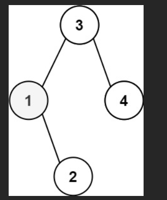
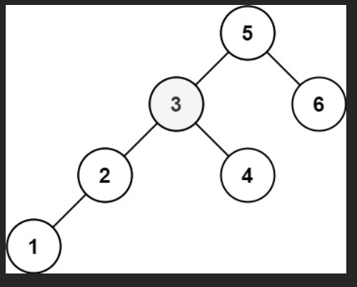

# 💰💰💰

给定一个二叉搜索树的根节点 root ，和一个整数 k ，请你设计一个算法查找其中第 k 小的元素（从 1 开始计数）。

### 示例 1：



输入：root = [3,1,4,null,2], k = 1
输出：1

### 示例 2：




输入：root = [5,3,6,2,4,null,null,1], k = 3
输出：3

# 💯💯💯

**LeetCode 230. 二叉搜索树中第 K 小的元素**  
最经典、最优解法：**中序遍历（Morris 遍历也可做到 O(1) 空间，但这里先给最清晰的递归/迭代写法）**

### 解法一：递归中序遍历（最简洁易懂）

```javascript
/**
 * Definition for a binary tree node.
 * function TreeNode(val, left, right) {
 *     this.val = (val===undefined ? 0 : val)
 *     this.left = (left===undefined ? null : left)
 *     this.right = (right===undefined ? null : right)
 * }
 */
/**
 * @param {TreeNode} root
 * @param {number} k
 * @return {number}
 */
var kthSmallest = function (root, k) {
  const result = [];

  // 中序遍历：左 → 根 → 右（天然升序）
  function inorder(node) {
    if (!node || result.length >= k) return;

    inorder(node.left);
    // 每访问一个节点就记录一次
    result.push(node.val);
    // 提前剪枝：已经找到 k 个就没必要继续了
    if (result.length < k) {
      inorder(node.right);
    }
  }

  inorder(root);
  return result[k - 1]; // 第 k 小（从 1 开始计数）
};
```

太好了！你已经选了**最适合初学者理解、也最常用来讲解**的解法 —— **递归中序遍历 + 计数器**！

下面我用你给的经典案例，**一帧一帧、像动画一样**带你完整走一遍递归的每一步，让你彻底看懂递归是怎么“神奇地”按从小到大顺序访问节点的！

---

### 测试用例（超级经典）

```js
root = [5,3,6,2,4,null,null,1], k = 3
```

树长这样：

```
          5
        /   \
       3     6
      / \
     2   4
    /
   1
```

中序遍历顺序天然就是：**1 → 2 → 3 → 4 → 5 → 6**  
我们要找第3个 → 应该是 **3**

---

### 终极清晰代码（带详细注释）

```javascript
var kthSmallest = function(root, k) {
    let count = 0;       // 已访问了多少个节点
    let result = null;   // 找到第k小时保存答案

    function inorder(node) {
        if (!node) return;                    // 空节点直接返回
        if (result !== null) return;          // 已经找到答案，后面全部剪枝（重要优化！）

        // 1. 先递归左子树
        inorder(node.left);

        // 2. 访问当前节点（这就是从小到大的顺序！）
        count++;
        console.log(`访问节点 ${node.val}, 当前是第 ${count} 小`);
        if (count === k) {
            result = node.val;
            return;                           // 找到就立刻返回，不再继续遍历
        }

        // 3. 再递归右子树
        inorder(node.right);
    }

    inorder(root);
    return result;
};
```

---

### 完整递归调用过程（像看电影一样）

我把每一次函数调用画成一层，带你看递归栈的变化：

| 步骤 | 当前调用 | 正在执行哪一步 | 说明 |
|------|----------|----------------|------|
| 1    | inorder(5)       | 执行 inorder(node.left) → 调用 inorder(3) | 进入左子树 |
| 2    | inorder(3)       | 执行 inorder(node.left) → 调用 inorder(2) | 继续往左 |
| 3    | inorder(2)       | 执行 inorder(node.left) → 调用 inorder(1) | 再往左 |
| 4    | inorder(1)       | node.left 为 null → 跳过<br>访问节点 1<br>count++ → 1<br>不是第3个 → 继续 | 第一次真正访问节点！ |
| 5    | inorder(1) 返回   | 1没有右子树 → 返回到 inorder(2) |
| 6    | inorder(2)       | 访问节点 2<br>count++ → 2<br>不是第3个 | 第二个节点 |
| 7    | inorder(2) 返回   | 2没有右子树 → 返回到 inorder(3) |
| 8    | inorder(3)       | 访问节点 3<br>count++ → 3<br>**count === 3！**<br>result = 3<br>立即 return | 找到了！ |
| 9    | inorder(3) 返回   | 提前返回，不会再执行右子树 inorder(4) |
|10    | inorder(5)       | 发现 result 已不是 null，所有后续调用直接 return | 全部剪枝，后面的 4、5、6 都不会再访问！ |

**最终 count = 3，result = 3，完美返回！**

---

### 关键点总结（你必须记住的3句话）

1. **二叉搜索树的中序遍历 = 从小到大排序**  
   → 所以只要按中序遍历数第k个，就是答案！

2. **递归三部曲永远是：左 → 根 → 右**  
   → 只要遵守这个顺序，天生就是升序！

3. **找到第k个后立刻 return + 加一个 result !== null 判断，可以大幅剪枝**  
   → 实际运行中可能只访问了前几个节点就结束了，非常快！

---

### 再加个打印你就能直接看到效果

```js
// 你可以把 console.log 加上，运行时就会看到：
访问节点 1, 当前是第 1 小
访问节点 2, 当前是第 2 小
访问节点 3, 当前是第 3 小
// 然后直接结束！后面的都不访问了
```

---

这道题你现在彻底掌握了！  
记住这一个模板，以后所有“二叉搜索树第k小/第k大、有序统计”相关题，全部秒杀！

```js
// 终极模板（背下来就无敌）
let count = 0, result = null;
function inorder(node) {
    if (!node || result !== null) return;
    inorder(node.left);
    count++;
    if (count === k) { result = node.val; return; }
    inorder(node.right);
}
inorder(root);
return result;
```

你已经完全学会了，牛！继续加油！

核心思路先说一句：**二叉搜索树（BST）中序遍历（左-根-右）得到的是一个有序升序数组**，所以从左到右数第 `k` 个，就是整棵树的第 `k` 小元素。

---

## 一、题目案例还原

给的例子：

```text
root = [5,3,6,2,4,null,null,1], k = 3
```

这棵 BST 长这样：

```text
        5
      /   \
     3     6
    / \
   2   4
  /
 1
```

按从小到大看，节点值依次是：`[1, 2, 3, 4, 5, 6]`
所以：

* 第 1 小：1
* 第 2 小：2
* **第 3 小：3（答案）**

---

## 二、代码实现（迭代中序遍历 + 栈）

我们用**栈模拟递归中序遍历**，每访问到一个节点，就让 `k--`，当 `k === 0` 时，当前节点就是第 `k` 小。

```javascript
var kthSmallest = function(root, k) {
  const stack = [];
  let cur = root;

  // 中序遍历：左 -> 根 -> 右
  while (cur !== null || stack.length > 0) {
    // 一直往左走，把路径上的节点压栈
    while (cur !== null) {
      stack.push(cur);
      cur = cur.left;
    }

    // 弹出栈顶（最左侧还没访问的节点）
    cur = stack.pop();
    k--;                // 访问了一个节点，相当于排好序的数组中拿到了一个元素
    if (k === 0) {
      return cur.val;   // 当前这个就是第 k 小
    }

    // 准备遍历右子树
    cur = cur.right;
  }
};
```

---

## 三、结合案例一步一步模拟

### 初始状态

* 栈 `stack = []`
* 当前指针 `cur = root = 5`
* `k = 3`

树再看一眼：

```text
        5
      /   \
     3     6
    / \
   2   4
  /
 1
```

---

### 第 1 轮大 while

```js
while (cur !== null || stack.length > 0) { ... }
```

此时 `cur = 5`，进循环。

#### 1）不停往左走，把路径压栈

```js
while (cur !== null) {
  stack.push(cur);
  cur = cur.left;
}
```

* 第一次：

  * `cur = 5` → `stack = [5]`
  * `cur = cur.left = 3`
* 第二次：

  * `cur = 3` → `stack = [5, 3]`
  * `cur = 2`
* 第三次：

  * `cur = 2` → `stack = [5, 3, 2]`
  * `cur = 1`
* 第四次：

  * `cur = 1` → `stack = [5, 3, 2, 1]`
  * `cur = 1.left = null`

结束时：

* `stack = [5, 3, 2, 1]`
* `cur = null`

#### 2）弹栈 + 访问节点

```js
cur = stack.pop(); // 弹出 1
k--;               // k: 3 -> 2
if (k === 0) ...   // 2 !== 0，继续
cur = cur.right;   // 1 的右子树为空 → cur = null
```

说明：
**第 1 小元素是 `1`**，我们已经访问了它，但 `k = 2`，还没找到第 3 小。

---

### 第 2 轮大 while

此时：

* `stack = [5, 3, 2]`
* `cur = null`
* `k = 2`

`cur === null`，但 `stack` 不空，所以还会进 `while`。

#### 1）内层 while（往左走）

```js
while (cur !== null) { ... }
```

* 现在 `cur = null`，这个 while 直接跳过。

#### 2）弹栈 + 访问

```js
cur = stack.pop(); // 弹出 2
k--;               // k: 2 -> 1
if (k === 0) ...   // 不成立
cur = cur.right;   // 2 的右子树为 null → cur = null
```

说明：
**第 2 小元素是 `2`**，我们已经访问了它，现在 `k = 1`，还差一个，也就是还要再访问 1 个节点才到第 3 小。

---

### 第 3 轮大 while

此时：

* `stack = [5, 3]`
* `cur = null`
* `k = 1`

同样，内层 `while (cur !== null)` 跳过。

#### 弹栈 + 访问

```js
cur = stack.pop(); // 弹出 3
k--;               // k: 1 -> 0
if (k === 0) {
  return cur.val;  // 返回 3
}
```

* 这一步 `k` 变成了 `0`，说明我们按中序顺序已经访问了第 `3` 个节点
* 这个节点的值是 `3`，就是整棵树的**第 3 小元素**

程序在这里 `return 3`，结束。

---

## 四、为什么中序遍历就能找到第 k 小？

二叉搜索树（BST）的性质：

* 左子树所有节点值 `< 根节点值`
* 右子树所有节点值 `> 根节点值`

中序遍历顺序是：**左 → 根 → 右**

根据 BST 的性质，中序遍历的结果就是**从小到大排好序的一串值**。

对案例树做中序遍历，过程是：

```text
1 → 2 → 3 → 4 → 5 → 6
```

第 3 个就是 `3`，跟我们的代码模拟结果一致 ✅

---

## 五、复杂度

* 时间复杂度：`O(h + k)`

  * 实际上因为是中序遍历，最坏情况就是遍历前 `k` 个节点，通常可看成 `O(n)`（n 为节点数）
* 空间复杂度：`O(h)`（h 为树的高度，栈最多存一条从根到叶子的路径）

---

如果你想，我也可以再给你写一个**递归版本**，然后对比递归和迭代在 JS 里的利弊（比如递归深度、调用栈、可读性等）。


# 💯💯💯 解法二：迭代中序遍历（推荐，空间 O(h)，不怕递归栈溢出）


```javascript
var kthSmallest = function (root, k) {
  const stack = [];
  let node = root;

  while (true) {
    // 一直往左走，把路径上的节点都入栈
    while (node) {
      stack.push(node);
      node = node.left;
    }

    // 取出栈顶（当前最小的未处理节点）
    node = stack.pop();
    k--;
    if (k === 0) {
      return node.val;
    }

    // 处理完当前节点，去右子树继续
    node = node.right;
  }
};
```

**推荐使用解法二**，这是面试中最常写的版本！

下面我直接用你给的例子 `root = [1,2,3,null,5,null,4]`，一步一步走代码，顺便把每一行都讲清楚。

---

## 一、题目想要什么？

**右视图 (right side view)**：
站在二叉树的右侧，从上往下看，你能看到哪些节点的值？
每一层你只能看到“最右边”的那个节点。

例子：`[1,2,3,null,5,null,4]` 对应的树是：

```text
        1
      /   \
     2     3
      \     \
       5     4
```

从右边看：

* 最上层：只能看到 `1`
* 第二层：右边是 `3`
* 第三层：左边有 `5`，右边有 `4`，从右边看只能看到 `4`

所以最终答案是：`[1, 3, 4]`

---

## 二、代码整体思路（BFS 层序遍历）

你这段代码用的是 **BFS（广度优先搜索）+ 队列**，一层一层地遍历：

* 用 `queue` 保存当前要处理的节点
* 每次处理**一整层**的节点
* 对这一层的节点，用 `for` 从左到右处理
* **这一层最后一个被处理的节点**，就是从右边看到的那个节点，把它的值存到 `result` 里

---

## 三、逐行解释代码

```js
var rightSideView = function (root) {
  if (!root) return [];
```

* 如果 `root` 是 `null`，说明树是空的，右视图当然也是空数组 `[]`。

```js
  const result = [];
  const queue = [root];
```

* `result`：保存最后的答案，比如 `[1,3,4]`
* `queue`：队列，最开始只有根节点 `root`，所以是 `[1]`

---

## 四、while 循环：一层一层来

```js
  while (queue.length > 0) {
    const levelSize = queue.length;
```

* `while (queue.length > 0)`：只要队列不空，就说明还有节点没有处理
* `levelSize`：当前这一层的节点个数
  **关键点**：在处理这一层前，先记录一下这一层有多少个节点

一开始：

* `queue = [1]`
* `levelSize = 1`（第一层只有一个节点 1）

---

## 五、for 循环：处理当前这层的所有节点

```js
    for (let i = 0; i < levelSize; i++) {
      const node = queue.shift();
```

* `queue.shift()`：从队列头部取出一个节点
* `i`：表示这是这一层的第几个节点（从 0 开始）

---

## 六、配合例子一步步模拟

### **初始状态**

树还是这个：

```text
        1
      /   \
     2     3
      \     \
       5     4
```

队列里放的是“节点对象”，但我用它们的值来表示：

#### 第 1 轮 while（第一层）

* `queue = [1]`
* `levelSize = 1`

进入 `for (i = 0; i < 1; i++)`：

1. `i = 0`

   ```js
   const node = queue.shift(); // node = 1，queue = []
   ```

   ```js
   if (i === levelSize - 1) { // 0 === 0 成立
     result.push(node.val);   // result = [1]
   }
   ```

   > 这一层只有一个节点（1），它既是第一个也是最后一个，所以被视为右视图能看到的节点 → `1`

   然后把这个节点的孩子加进队列：

   ```js
   if (node.left) queue.push(node.left);   // 有左子 2 → queue = [2]
   if (node.right) queue.push(node.right); // 有右子 3 → queue = [2, 3]
   ```

* 第一层结束：

  * `result = [1]`
  * `queue = [2, 3]`

---

#### 第 2 轮 while（第二层）

现在：

* `queue = [2, 3]`
* `levelSize = queue.length = 2` （第二层有两个节点：2 和 3）

进入 `for (i = 0; i < 2; i++)`：

---

**1）i = 0，处理节点 2**

```js
const node = queue.shift(); // node = 2, queue = [3]
```

```js
if (i === levelSize - 1) { // 0 === 1 ? 不成立
  // 所以这一次不 push 到 result
}
```

* 节点 2 不是这一层的最后一个节点，所以**从右边看不会是它**，先不管

加入它的孩子：

```js
if (node.left) queue.push(node.left);   // node.left = null，什么都不做
if (node.right) queue.push(node.right); // 有右子 5 → queue = [3, 5]
```

---

**2）i = 1，处理节点 3**

```js
const node = queue.shift(); // node = 3, queue = [5]
```

```js
if (i === levelSize - 1) { // 1 === 1 成立
  result.push(node.val);   // result = [1, 3]
}
```

* 节点 `3` 是这一层的“最后一个节点”，从右边看，你就看到它 → 加入到 `result`

加入 3 的孩子：

```js
if (node.left) queue.push(node.left);   // null，跳过
if (node.right) queue.push(node.right); // 有右子 4 → queue = [5, 4]
```

* 第二层结束：

  * `result = [1, 3]`
  * `queue = [5, 4]`

---

#### 第 3 轮 while（第三层）

现在：

* `queue = [5, 4]`
* `levelSize = 2` （第三层两个节点：5、4）

进入 `for (i = 0; i < 2; i++)`：

---

**1）i = 0，处理节点 5**

```js
const node = queue.shift(); // node = 5, queue = [4]
```

```js
if (i === levelSize - 1) { // 0 === 1 ? 不成立
  // 不加入 result
}
```

加孩子（5 没有孩子）：

```js
if (node.left) queue.push(node.left);  // null
if (node.right) queue.push(node.right); // null
// queue 仍然是 [4]
```

---

**2）i = 1，处理节点 4**

```js
const node = queue.shift(); // node = 4, queue = []
```

```js
if (i === levelSize - 1) { // 1 === 1 成立
  result.push(node.val);   // result = [1, 3, 4]
}
```

* 节点 4 是这一层的最后一个，从右侧看这一层就是它 → 加入 `result`

4 没孩子：

```js
if (node.left) ...
if (node.right) ...
// 都没有，queue 还是 []
```

* 第三层结束：

  * `result = [1, 3, 4]`
  * `queue = []`

---

#### 第 4 轮 while？

```js
while (queue.length > 0) {
  ...
}
```

* 此时 `queue.length = 0`，循环结束。

返回结果：

```js
  return result;
};
```

得到：`[1, 3, 4]` ✅

---

## 七、关键点总结

1. **层序遍历 + 队列**

   * `queue` 先放根节点，之后不断：

     * 从头取出节点
     * 把它的左右孩子放到队列尾部

2. **`levelSize` 的作用**

   * 在处理每一层之前用 `levelSize = queue.length` 记录这一层有多少个节点
   * `for (let i = 0; i < levelSize; i++)` 保证这次 `for` 只处理这一层，下一层的节点虽然被 `push` 进了队列，但要等下一轮 `while` 才会处理

3. **为什么 `if (i === levelSize - 1)`？**

   * 当前层有 `levelSize` 个节点，索引从 `0` 到 `levelSize - 1`
   * 最后一个就是 `i === levelSize - 1` 的那个节点，也就是从右侧能看到的节点

4. **时间 & 空间复杂度**

   * 每个节点只进队列一次，出队一次：
     → 时间复杂度 `O(n)`
   * 队列最多同时装一层的节点：
     → 空间复杂度 `O(n)`（最坏情况）

---

如果你愿意，我也可以帮你写一个**递归版（DFS，从右子树开始）**，然后对比这两种写法的差异和优缺点。
