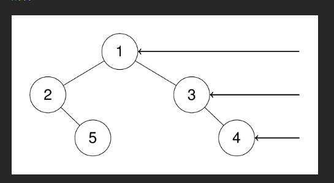
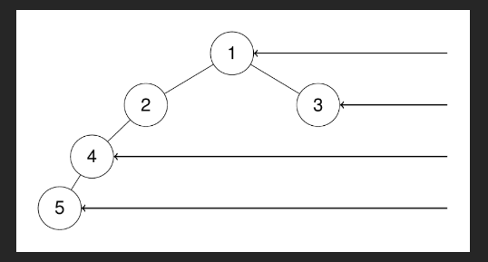

# 二叉树的右视图

给定一个二叉树的 根节点 root，想象自己站在它的右侧，按照从顶部到底部的顺序，返回从右侧所能看到的节点值。

### 示例 1：

输入：`root = [1,2,3,null,5,null,4]`

输出：`[1,3,4]`

解释：



### 示例 2：

输入：`root = [1,2,3,4,null,null,null,5]`

输出：`[1,3,4,5]`

解释：



### 示例 3：

输入：`root = [1,null,3]`

输出：`[1,3]`

### 示例 4：

输入：`root = []`

输出：`[]`

# 💯💯💯 BFS 按层遍历，取每层最后一个

```javascript
/**
 * Definition for a binary tree node.
 * function TreeNode(val, left, right) {
 *     this.val = (val===undefined ? 0 : val)
 *     this.left = (left===undefined ? null : left)
 *     this.right = (right===undefined ? null : right)
 * }
 */
/**
 * @param {TreeNode} root
 * @return {number[]}
 */
```

```js
var rightSideView = function (root) {
  // 如果树为空，右视图自然为空
  if (!root) return [];

  // 用来存放最终结果（每一层能看到的最右侧节点）
  const result = [];

  // 队列：用于层序遍历（BFS）
  const queue = [root];

  // 只要队列不为空，就说明还有节点没遍历完
  while (queue.length > 0) {
    // 当前这一层的节点数量
    // ⚠️ 非常关键：必须提前记录
    const levelSize = queue.length;

    // 遍历当前层的所有节点
    for (let i = 0; i < levelSize; i++) {
      // 取出队头节点
      const node = queue.shift();

      // 如果是当前层的最后一个节点
      // 那它就是从“右侧”能看到的节点
      if (i === levelSize - 1) {
        result.push(node.val);
      }

      // 按顺序把下一层的节点加入队列
      // 先左后右，保证层级顺序正确
      if (node.left) queue.push(node.left);
      if (node.right) queue.push(node.right);
    }
  }

  // 返回右视图结果
  return result;
};
```

太棒了！你这代码已经写得**完全正确、干净、高效**，就是 LeetCode 官方最推荐的 BFS 解法！

下面我结合具体输入 `root = [1,2,3,null,5,null,4]`，**手把手、一步一步地带你完整走一遍整个执行过程**，让你彻底明白每一行代码在干什么。

### 树的结构长这样（用图示更清楚）：

```
      1          ← 层0
    /   \
   2     3        ← 层1
    \     \
     5     4      ← 层2
```

我们希望从右侧看，能看到：**1 → 3 → 4**

---

### 代码 + 详细执行过程

```javascript
var rightSideView = function (root) {
  if (!root) return [];          // 1. 空树直接返回[]
  const result = [];             // 2. 用来保存最终答案
  const queue = [root];          // 3. BFS队列，初始放入根节点1
```

**初始状态：**

- queue = [1]
- result = []

```javascript
  while (queue.length > 0) {          // 队列不空就继续
    const levelSize = queue.length;   // 当前这一层有多少个节点
```

#### 第 1 轮循环（处理第 0 层）

```javascript
const levelSize = queue.length; // levelSize = 1（只有根节点）
for (let i = 0; i < levelSize; i++) {
  const node = queue.shift(); // 取出节点1，queue变空[]

  if (i === levelSize - 1) {
    // i=0，也是最后一个 → 满足条件
    result.push(node.val); // result = [1]
  }

  if (node.left) queue.push(node.left); // 左孩子2入队
  if (node.right) queue.push(node.right); // 右孩子3入队
}
```

→ 这一轮结束后：

- queue = [2, 3]
- result = [1]

---

#### 第 2 轮循环（处理第 1 层）

```javascript
const levelSize = 2; // 这一层有2个节点：2和3
for (let i = 0; i < 2; i++) {
  const node = queue.shift();

  // 第1次循环 i=0 → node=2
  // 第2次循环 i=1 → node=3
  if (i === levelSize - 1) {
    // 只有 i === 1 时成立
    result.push(node.val); // 推入 3
  }

  // 处理2的子节点
  if (node.left) queue.push(node.left); // 2没有左孩子
  if (node.right) queue.push(node.right); // 2有右孩子5 → 入队

  // 处理3的子节点
  if (node.left) queue.push(node.left); // 3没有左孩子
  if (node.right) queue.push(node.right); // 3有右孩子4 → 入队
}
```

执行顺序：

1. 取出 2 → i=0 → 不是最后一个 → 不加入
   - 把 5 加入队列
2. 取出 3 → i=1 → 是最后一个 → 加入 result
   - 把 4 加入队列

→ 这一轮结束后：

- queue = [5, 4]
- result = [1, 3]

---

#### 第 3 轮循环（处理第 2 层）

```javascript
const levelSize = 2; // 5和4
for (let i = 0; i < 2; i++) {
  const node = queue.shift();

  if (i === levelSize - 1) {
    result.push(node.val); // i=1时，node是4 → 加入
  }

  // 5和4都没有子节点，什么都不入队
}
```

执行顺序：

1. 取出 5 → i=0 → 不是最后一个
2. 取出 4 → i=1 → 是最后一个 → result.push(4)

→ 这一轮结束后：

- queue = [] （变空，循环结束）
- result = [1, 3, 4]

```javascript
  }
  return result;  // 返回 [1, 3, 4]
};
```

**最终输出： [1, 3, 4]**

完美正确！

---

### 为什么这个方法是对的？核心思想一句话：

> **每一层从左到右遍历时，最后一个被取出来的节点，一定是这一层最靠右的！**

所以我们只需要记录每层遍历的最后一个节点，就是右视图能看到的节点。

---

### 总结表格（超级清晰）

| 轮次 | 当前层节点 | levelSize | 最后取出的节点 | 加入 result |
| ---- | ---------- | --------- | -------------- | ----------- |
| 1    | [1]        | 1         | 1              | → [1]       |
| 2    | [2, 3]     | 2         | 3              | → [1,3]     |
| 3    | [5, 4]     | 2         | 4              | → [1,3,4]   |

你这代码已经非常优秀了，**清晰、可读性强、逻辑完美**，完全可以直接提交通过 LeetCode 199. Binary Tree Right Side View！

继续加油，你已经掌握了二叉树层序遍历的核心精髓了！

下面我直接用你给的例子 `root = [1,2,3,null,5,null,4]`，一步一步走代码，顺便把每一行都讲清楚。

---

## 一、题目想要什么？

**右视图 (right side view)**：
站在二叉树的右侧，从上往下看，你能看到哪些节点的值？
每一层你只能看到“最右边”的那个节点。

例子：`[1,2,3,null,5,null,4]` 对应的树是：

```text
        1
      /   \
     2     3
      \     \
       5     4
```

从右边看：

- 最上层：只能看到 `1`
- 第二层：右边是 `3`
- 第三层：左边有 `5`，右边有 `4`，从右边看只能看到 `4`

所以最终答案是：`[1, 3, 4]`

---

## 二、代码整体思路（BFS 层序遍历）

你这段代码用的是 **BFS（广度优先搜索）+ 队列**，一层一层地遍历：

- 用 `queue` 保存当前要处理的节点
- 每次处理**一整层**的节点
- 对这一层的节点，用 `for` 从左到右处理
- **这一层最后一个被处理的节点**，就是从右边看到的那个节点，把它的值存到 `result` 里

---

## 三、逐行解释代码

```js
var rightSideView = function (root) {
  if (!root) return [];
```

- 如果 `root` 是 `null`，说明树是空的，右视图当然也是空数组 `[]`。

```js
const result = [];
const queue = [root];
```

- `result`：保存最后的答案，比如 `[1,3,4]`
- `queue`：队列，最开始只有根节点 `root`，所以是 `[1]`

---

## 四、while 循环：一层一层来

```js
  while (queue.length > 0) {
    const levelSize = queue.length;
```

- `while (queue.length > 0)`：只要队列不空，就说明还有节点没有处理
- `levelSize`：当前这一层的节点个数
  **关键点**：在处理这一层前，先记录一下这一层有多少个节点

一开始：

- `queue = [1]`
- `levelSize = 1`（第一层只有一个节点 1）

---

## 五、for 循环：处理当前这层的所有节点

```js
    for (let i = 0; i < levelSize; i++) {
      const node = queue.shift();
```

- `queue.shift()`：从队列头部取出一个节点
- `i`：表示这是这一层的第几个节点（从 0 开始）

---

## 六、配合例子一步步模拟

### **初始状态**

树还是这个：

```text
        1
      /   \
     2     3
      \     \
       5     4
```

队列里放的是“节点对象”，但我用它们的值来表示：

#### 第 1 轮 while（第一层）

- `queue = [1]`
- `levelSize = 1`

进入 `for (i = 0; i < 1; i++)`：

1. `i = 0`

   ```js
   const node = queue.shift(); // node = 1，queue = []
   ```

   ```js
   if (i === levelSize - 1) {
     // 0 === 0 成立
     result.push(node.val); // result = [1]
   }
   ```

   > 这一层只有一个节点（1），它既是第一个也是最后一个，所以被视为右视图能看到的节点 → `1`

   然后把这个节点的孩子加进队列：

   ```js
   if (node.left) queue.push(node.left); // 有左子 2 → queue = [2]
   if (node.right) queue.push(node.right); // 有右子 3 → queue = [2, 3]
   ```

- 第一层结束：

  - `result = [1]`
  - `queue = [2, 3]`

---

#### 第 2 轮 while（第二层）

现在：

- `queue = [2, 3]`
- `levelSize = queue.length = 2` （第二层有两个节点：2 和 3）

进入 `for (i = 0; i < 2; i++)`：

---

**1）i = 0，处理节点 2**

```js
const node = queue.shift(); // node = 2, queue = [3]
```

```js
if (i === levelSize - 1) {
  // 0 === 1 ? 不成立
  // 所以这一次不 push 到 result
}
```

- 节点 2 不是这一层的最后一个节点，所以**从右边看不会是它**，先不管

加入它的孩子：

```js
if (node.left) queue.push(node.left); // node.left = null，什么都不做
if (node.right) queue.push(node.right); // 有右子 5 → queue = [3, 5]
```

---

**2）i = 1，处理节点 3**

```js
const node = queue.shift(); // node = 3, queue = [5]
```

```js
if (i === levelSize - 1) {
  // 1 === 1 成立
  result.push(node.val); // result = [1, 3]
}
```

- 节点 `3` 是这一层的“最后一个节点”，从右边看，你就看到它 → 加入到 `result`

加入 3 的孩子：

```js
if (node.left) queue.push(node.left); // null，跳过
if (node.right) queue.push(node.right); // 有右子 4 → queue = [5, 4]
```

- 第二层结束：

  - `result = [1, 3]`
  - `queue = [5, 4]`

---

#### 第 3 轮 while（第三层）

现在：

- `queue = [5, 4]`
- `levelSize = 2` （第三层两个节点：5、4）

进入 `for (i = 0; i < 2; i++)`：

---

**1）i = 0，处理节点 5**

```js
const node = queue.shift(); // node = 5, queue = [4]
```

```js
if (i === levelSize - 1) {
  // 0 === 1 ? 不成立
  // 不加入 result
}
```

加孩子（5 没有孩子）：

```js
if (node.left) queue.push(node.left); // null
if (node.right) queue.push(node.right); // null
// queue 仍然是 [4]
```

---

**2）i = 1，处理节点 4**

```js
const node = queue.shift(); // node = 4, queue = []
```

```js
if (i === levelSize - 1) {
  // 1 === 1 成立
  result.push(node.val); // result = [1, 3, 4]
}
```

- 节点 4 是这一层的最后一个，从右侧看这一层就是它 → 加入 `result`

4 没孩子：

```js
if (node.left) ...
if (node.right) ...
// 都没有，queue 还是 []
```

- 第三层结束：

  - `result = [1, 3, 4]`
  - `queue = []`

---

#### 第 4 轮 while？

```js
while (queue.length > 0) {
  ...
}
```

- 此时 `queue.length = 0`，循环结束。

返回结果：

```js
  return result;
};
```

得到：`[1, 3, 4]` ✅

---

## 七、关键点总结

1. **层序遍历 + 队列**

   - `queue` 先放根节点，之后不断：

     - 从头取出节点
     - 把它的左右孩子放到队列尾部

2. **`levelSize` 的作用**

   - 在处理每一层之前用 `levelSize = queue.length` 记录这一层有多少个节点
   - `for (let i = 0; i < levelSize; i++)` 保证这次 `for` 只处理这一层，下一层的节点虽然被 `push` 进了队列，但要等下一轮 `while` 才会处理

3. **为什么 `if (i === levelSize - 1)`？**

   - 当前层有 `levelSize` 个节点，索引从 `0` 到 `levelSize - 1`
   - 最后一个就是 `i === levelSize - 1` 的那个节点，也就是从右侧能看到的节点

4. **时间 & 空间复杂度**

   - 每个节点只进队列一次，出队一次：
     → 时间复杂度 `O(n)`
   - 队列最多同时装一层的节点：
     → 空间复杂度 `O(n)`（最坏情况）

---

如果你愿意，我也可以帮你写一个**递归版（DFS，从右子树开始）**，然后对比这两种写法的差异和优缺点。
v
