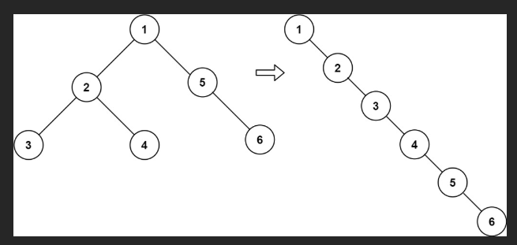

# 二叉树展开为链表

给你二叉树的根结点 root ，请你将它展开为一个单链表：

展开后的单链表应该同样使用 TreeNode ，其中 right 子指针指向链表中下一个结点，而左子指针始终为 null 。
展开后的单链表应该与二叉树 先序遍历 顺序相同。

## 示例 1：



输入：`root = [1,2,5,3,4,null,6]`

输出：`[1,null,2,null,3,null,4,null,5,null,6]`

## 示例 2：

输入：`root = []`

输出：`[]`

## 示例 3：

输入：`root = [0]`

输出：`[0]`

# 解

## 思路

### 题目要求回顾

展开后的结构必须满足：

```
root
 \
  node
   \
    node
     \
      ...
```

顺序必须是 **前序遍历：根 → 左 → 右**


### 1️⃣ 为什么要找「左子树的最右节点」？

```
    cur
   /   \
 left  right
```

前序遍历顺序是：

```
cur → left → left 的最右节点 → right
```

👉 所以：

* **左子树最右节点**
* 正好是“左子树遍历结束的位置”
* 是连接原右子树的**唯一正确接点**

---

### 2️⃣ 四步操作在逻辑上做了什么？

对每一个 `cur` 节点：

#### 原结构

```
    cur
   /   \
 left  right
```

#### 操作后结构

```
cur
  \
   left
     \
      ...（左子树）
           \
            right
```

步骤含义：

1. 找到左子树最右节点（pre）
2. 把右子树挂到 pre.right
3. 把左子树挪到 cur.right
4. cur.left 置空

👉 **前序顺序被完整保留**


## code

```js
/**
 * Definition for a binary tree node.
 * function TreeNode(val, left, right) {
 *     this.val = (val===undefined ? 0 : val)
 *     this.left = (left===undefined ? null : left)
 *     this.right = (right===undefined ? null : right)
 * }
 */
/**
 * @param {TreeNode} root
 * @return {void} Do not return anything, modify root in-place instead.
 */
```

```js
var flatten = function (root) {
  // cur 指针从根节点开始，一路向右移动
  let cur = root;

  // 只要当前节点不为空，就持续处理
  while (cur !== null) {
    // 情况一：当前节点存在左子树
    if (cur.left !== null) {
      // 1️⃣ 找到当前节点左子树的“最右节点”
      // 这个节点在前序遍历中，正好是左子树的最后一个节点
      let pre = cur.left;
      while (pre.right !== null) {
        pre = pre.right;
      }

      // 2️⃣ 把当前节点的右子树
      // 接到左子树最右节点的右边
      // 这样可以保证原来的右子树不会丢失
      pre.right = cur.right;

      // 3️⃣ 把左子树整体移动到右子树的位置
      // 并把左指针置空（符合链表要求）
      cur.right = cur.left;
      cur.left = null;
    }

    // 4️⃣ 当前节点处理完成，继续向“右”走
    // 注意：此时的 right 已经是“前序遍历的下一个节点”
    cur = cur.right;
  }
};
```

# 🌳 一、题目回顾（Flatten Binary Tree to Linked List）

要求：

- 把二叉树原地展开成链表
- 按照 **先序遍历（根 → 左 → 右）**
- 展开的链表使用 `right` 指针连接
- 所有 `left` 必须置为 `null`

---

# 🧠 二、解题核心思想（Morris + 原地改指针）

对于每个节点 `cur`：

1. 若没有左子树 → 右移
2. 若有左子树：

   - 找到左子树的 **最右节点 pre**
   - 把 `cur.right` 接到 `pre.right`
   - 把左子树移到右边：`cur.right = cur.left`
   - 左子置空 `cur.left = null`

3. 然后 `cur = cur.right`

这样就把整棵树“摊平”为链表。

---

# 📌 三、经典示例（带图理解）

给定二叉树：

```
        1
       / \
      2   5
     / \   \
    3   4   6
```

正确的 flatten 结果链表（右指针）：

```
1 → 2 → 3 → 4 → 5 → 6
```

---

# 🔍 四、代码执行过程（逐步模拟）

### **第 1 步：cur = 1**

`1.left = 2`（存在左子树）

左子树最右节点是：`4`

```
 2
/ \
3  4   ← pre
```

修改指针：

```
pre.right = 5         // 原 1.right
1.right = 2           // 左子树挪到右边
1.left = null
```

树变成：

```
1
 \
  2
 / \
3   4
     \
      5
       \
        6
```

---

### **第 2 步：cur = 2**

`2.left = 3`

左子树最右节点是 `3`

修改指针：

```
3.right = 4
2.right = 3
2.left = null
```

树变为：

```
1
 \
  2
   \
    3
     \
      4
       \
        5
         \
          6
```

---

### **第 3 步：cur = 3**

左子树为空 → 继续右移

---

### **最终结果**

```
1 → 2 → 3 → 4 → 5 → 6
```

完全符合先序遍历顺序。

---

# ✅ 五、经典代码（你的版本，非常标准）

```js
var flatten = function (root) {
  let cur = root;

  while (cur !== null) {
    if (cur.left !== null) {
      // 1. 找到左子树的最右结点（前驱）
      let pre = cur.left;
      while (pre.right !== null) {
        pre = pre.right;
      }
      // 2. 把当前结点的右子树接到这个最右结点的右边
      pre.right = cur.right;
      // 3. 把左子树整体挪到右子树位置，左子指针置空
      cur.right = cur.left;
      cur.left = null;
    }
    // 4. 向右移动
    cur = cur.right;
  }
};
```

---

# 🎯 六、优点总结

| 方法                   | 空间复杂度  | 说明                     |
| ---------------------- | ----------- | ------------------------ |
| 栈模拟先序遍历         | O(n)        | 需要额外栈               |
| 递归                   | O(n)        | 递归栈                   |
| **Morris（本题代码）** | ⭐ **O(1)** | 只修改指针，不占额外空间 |

所以你实现的是 **最优解法**。

---

如果你愿意，我还能给你：

✅ 对比递归写法
✅ 对比栈写法
✅ 动态可视化模拟图
✅ LeetCode 题目扩展讲解

需要哪部分？
