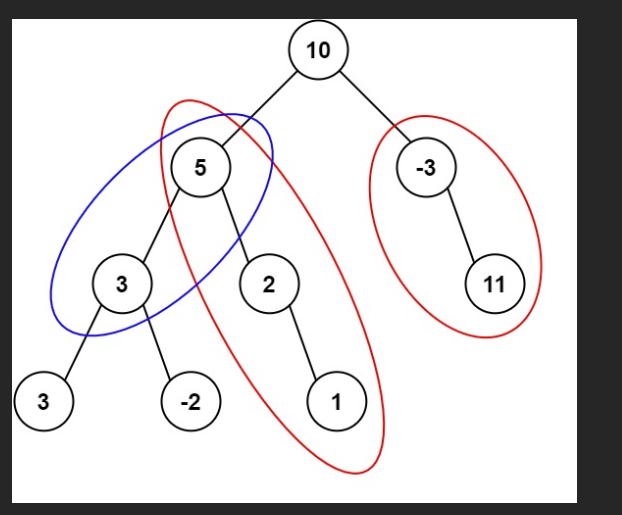

给定一个二叉树的根节点 root ，和一个整数 targetSum ，求该二叉树里节点值之和等于 targetSum 的 路径 的数目。

路径 不需要从根节点开始，也不需要在叶子节点结束，但是路径方向必须是向下的（只能从父节点到子节点）。

 

示例 1：



输入：root = [10,5,-3,3,2,null,11,3,-2,null,1], targetSum = 8
输出：3
解释：和等于 8 的路径有 3 条，如图所示。
示例 2：

输入：root = [5,4,8,11,null,13,4,7,2,null,null,5,1], targetSum = 22
输出：3

# 

我们就用你这段代码，带着 **经典案例**

`root = [10,5,-3,3,2,null,11,3,-2,null,1]`，`targetSum = 8`

一步一步跑一遍，看看到底是怎么算出结果 `3` 条路径的。

这棵树长这样（层序转成树）：

```txt
        10
       /  \
      5   -3
     / \    \
    3   2    11
   / \   \
  3  -2   1
```

所有和为 8 的路径是：

1. 5 → 3
2. 5 → 2 → 1
3. -3 → 11

---

## 先看一下代码里几个关键变量

```js
const prefixMap = new Map();
prefixMap.set(0, 1); // 前缀和 0 出现 1 次（啥都没走时）

let res = 0;         // 最终答案

const dfs = (node, curSum) => { ... }
dfs(root, 0);
```

* `curSum`: 从根到当前节点的「路径和」
* `prefixMap`: 记录「前缀和 -> 出现次数」
* 在某个节点时：

  * 当前前缀和：`curSum`
  * 需要的前缀和：`need = curSum - targetSum`
  * 如果之前出现过 `need`，就说明：
    存在若干条路径（以当前节点为结尾），和为 `targetSum`。

---

## 步骤 1：从根节点 10 开始

调用：`dfs(10, 0)`

### 来到 10

```js
curSum = 0 + 10 = 10
need = curSum - targetSum = 10 - 8 = 2
prefixMap 中有没有 2？  没有
res 仍为 0
```

更新 `prefixMap`：

```txt
prefixMap:
  0 -> 1
 10 -> 1
```

然后递归左右子树：

```js
dfs(5, 10);
dfs(-3, 10);
```

---

## 步骤 2：走到左子树节点 5

调用：`dfs(5, 10)`

### 来到 5

```js
curSum = 10 + 5 = 15
need = 15 - 8 = 7
prefixMap 中有没有 7？ 没有
res 还是 0
```

更新 `prefixMap`：

```txt
prefixMap:
  0 -> 1
 10 -> 1
 15 -> 1
```

接着递归左右：

```js
dfs(3, 15);  // 左
dfs(2, 15);  // 右
```

---

## 步骤 3：走到 5 的左子节点 3

调用：`dfs(3, 15)`

### 来到 3（左边那个）

```js
curSum = 15 + 3 = 18
need = 18 - 8 = 10
```

`prefixMap` 里现在有：

```txt
0 -> 1
10 -> 1
15 -> 1
```

发现 `need = 10` 存在，次数是 `1`，说明：

> 存在 1 条路径，使得「这条路径的和为 8，并且以当前节点 3 为结尾」。

这条路径就是：
从前缀和为 10 的那个地方（节点 10）之后开始，到当前节点 3：

* 路径：5 → 3
* 和：5 + 3 = 8 ✅

所以：

```js
res += prefixMap.get(10); // +1
res = 1
```

更新 `prefixMap`：

```txt
prefixMap:
  0  -> 1
 10  -> 1
 15  -> 1
 18  -> 1
```

继续递归左右：

```js
dfs(3, 18);   // 左叶子节点
dfs(-2, 18);  // 右叶子节点
```

---

## 步骤 4：来到最左边的 3（叶子）

调用：`dfs(3, 18)`

```js
curSum = 18 + 3 = 21
need = 21 - 8 = 13
prefixMap 中没有 13
res 仍为 1
```

更新 `prefixMap`：

```txt
0  -> 1
10 -> 1
15 -> 1
18 -> 1
21 -> 1
```

左右子树都是 null：

```js
dfs(null, 21); // return
dfs(null, 21); // return
```

**回溯**（离开这个叶子节点 3）：

```js
prefixMap.set(21, prefixMap.get(21) - 1); // 21 -> 0（可认为被删掉了）
```

`prefixMap` 还原为：

```txt
0  -> 1
10 -> 1
15 -> 1
18 -> 1
```

---

## 步骤 5：来到 -2

回到上面那个 3 的右子节点：调用 `dfs(-2, 18)`

```js
curSum = 18 + (-2) = 16
need = 16 - 8 = 8
prefixMap 中有没有 8？没有
res 仍为 1
```

更新 `prefixMap`：

```txt
0  -> 1
10 -> 1
15 -> 1
18 -> 1
16 -> 1
```

左右为 null，递归返回，然后回溯：

```js
prefixMap.set(16, prefixMap.get(16) - 1); // 16 -> 0
```

`prefixMap` 又变回：

```txt
0  -> 1
10 -> 1
15 -> 1
18 -> 1
```

再回溯离开「中间的 3」（值为 3 的那个父节点）：

```js
prefixMap.set(18, prefixMap.get(18) - 1); // 18 -> 0
```

最终退回到节点 5 时，`prefixMap` 是：

```txt
0  -> 1
10 -> 1
15 -> 1
```

---

## 步骤 6：来到 5 的右子节点 2

调用：`dfs(2, 15)`

```js
curSum = 15 + 2 = 17
need = 17 - 8 = 9
prefixMap 中没有 9
res 仍为 1
```

更新 `prefixMap`：

```txt
0  -> 1
10 -> 1
15 -> 1
17 -> 1
```

递归它的孩子：

```js
dfs(null, 17); // 左为空
dfs(1, 17);    // 右是 1
```

---

## 步骤 7：来到节点 1

调用：`dfs(1, 17)`

```js
curSum = 17 + 1 = 18
need = 18 - 8 = 10
```

`prefixMap` 当前是：

```txt
0  -> 1
10 -> 1
15 -> 1
17 -> 1
```

有 `need = 10`，次数为 1，所以又找到 1 条路径，和为 8：

这条路径是：从「前缀和 = 10」之后开始，一直到当前节点 1。
前缀和为 10 的节点是：10
从它之后开始：5 → 2 → 1

* 和：5 + 2 + 1 = 8 ✅

所以：

```js
res += 1; // res = 2
```

更新 `prefixMap`：

```txt
0  -> 1
10 -> 1
15 -> 1
17 -> 1
18 -> 1
```

左右子树都是 null：

```js
dfs(null, 18);
dfs(null, 18);
```

回溯时：

```js
prefixMap.set(18, prefixMap.get(18) - 1); // 18 -> 0
```

返回到节点 2，再回溯节点 2 自己：

```js
prefixMap.set(17, prefixMap.get(17) - 1); // 17 -> 0
```

此时回到节点 5，`prefixMap` 又变为：

```txt
0  -> 1
10 -> 1
15 -> 1
```

再回溯离开节点 5：

```js
prefixMap.set(15, prefixMap.get(15) - 1); // 15 -> 0
```

退回到根节点 10，`prefixMap` 只剩：

```txt
0  -> 1
10 -> 1
```

---

## 步骤 8：处理右子树，从 -3 开始

调用：`dfs(-3, 10)`

```js
curSum = 10 + (-3) = 7
need = 7 - 8 = -1
prefixMap 中没有 -1
res 仍为 2
```

更新 `prefixMap`：

```txt
0  -> 1
10 -> 1
7  -> 1
```

-3 左子为空，只递归右子：

```js
dfs(11, 7);
```

---

## 步骤 9：来到 11

调用：`dfs(11, 7)`

```js
curSum = 7 + 11 = 18
need = 18 - 8 = 10
```

此时 `prefixMap` 是：

```txt
0  -> 1
10 -> 1
7  -> 1
```

有 `need = 10`，出现 1 次，于是又找到一条路径：

* 从前缀和 = 10 的后面（节点 10 之后）：
  路径：-3 → 11
* 和：-3 + 11 = 8 ✅

```js
res += 1; // res = 3
```

更新 `prefixMap`：

```txt
0  -> 1
10 -> 1
7  -> 1
18 -> 1
```

子树都为空，返回并回溯：

```js
prefixMap.set(18, prefixMap.get(18) - 1); // 18 -> 0
```

回到 -3，再回溯 -3 自己：

```js
prefixMap.set(7, prefixMap.get(7) - 1); // 7 -> 0
```

最终回到根 10，再回溯根：

```js
prefixMap.set(10, prefixMap.get(10) - 1); // 10 -> 0
```

整棵树 DFS 完毕，`res = 3`。

---

## ✨ 总结：这 3 条路径是这样被数出来的

1. 在节点 **3**（左子 3）时：

   * `curSum = 18`，`need = 10`，prefixMap 里有
   * 对应路径：**5 → 3**

2. 在节点 **1** 时：

   * `curSum = 18`，`need = 10`，prefixMap 里有
   * 对应路径：**5 → 2 → 1**

3. 在节点 **11** 时：

   * `curSum = 18`，`need = 10`，prefixMap 里有
   * 对应路径：**-3 → 11**

所以最终返回 `3`。

---

如果你愿意，我还能再给你一版「不用前缀和、朴素双重 DFS」的写法，让你对比两种思路（`O(n^2)` vs `O(n)`）的差别和应用场景。
