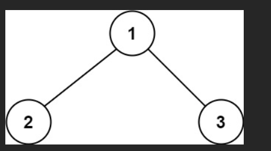

# 二叉树中的最大路径和

二叉树中的 路径 被定义为一条节点序列，序列中每对相邻节点之间都存在一条边。

同一个节点在一条路径序列中 至多出现一次 。该路径 至少包含一个 节点，且不一定经过根节点。

路径和 是路径中各节点值的总和。

给你一个二叉树的根节点 `root` ，返回其 最大路径和 。

## 示例 1：



输入：`root = [1,2,3]`

输出：`6`

解释：最优路径是 `2 -> 1 -> 3` ，路径和为 `2 + 1 + 3 = 6`

## 示例 2：


输入：`root = [-10,9,20,null,null,15,7]`

输出：`42`

解释：最优路径是 `15 -> 20 -> 7` ，路径和为 `15 + 20 + 7 = 42`

# 解

先把这颗树画出来，再带你一步一步跑完这段 `maxPathSum` 代码。

---

## 1️⃣ 先把数组建成二叉树

`root = [-10,9,20,null,null,15,7]` 对应的树结构是（LeetCode 标准层序）：

```
       -10
       /  \
      9    20
          /  \
         15   7
```

我们用的代码是：

```js
var maxPathSum = function (root) {
  let maxSum = -Infinity; // 全局最大路径和

  const dfs = (node) => {
    if (node === null) return 0;

    // 递归计算左右子树能“向上”提供的最大贡献，负数则直接舍弃（视为 0）
    const leftGain = Math.max(0, dfs(node.left));
    const rightGain = Math.max(0, dfs(node.right));

    // 以当前节点为“最高点/拐点”的路径和：左 + 根 + 右
    const priceNewPath = node.val + leftGain + rightGain;

    // 更新全局最大路径和
    maxSum = Math.max(maxSum, priceNewPath);

    // 返回当前节点对父亲能提供的“单边最大贡献”
    return node.val + Math.max(leftGain, rightGain);
  };

  dfs(root);
  return maxSum;
};
```

核心：

- `dfs(node)` 返回：从 `node` 出发、**往上只能走一边**（左 or 右）的最大贡献值
- `maxSum` 记录所有“以某个节点为拐点的完整路径（左+根+右）”的最大值

---

## 2️⃣ 从叶子往上算（后序遍历）

### 🔹 Step A：从叶子 15 开始

调用顺序其实是：`dfs(-10) -> dfs(9) -> dfs(null) ...`，我们只看关键节点。

先到 15：

```txt
node = 15
```

它是叶子节点：

- `dfs(15.left)` 返回 `0`
- `dfs(15.right)` 返回 `0`

```js
leftGain = Math.max(0, 0) = 0
rightGain = Math.max(0, 0) = 0

priceNewPath = 15 + 0 + 0 = 15
maxSum = max(-Infinity, 15) = 15

返回给父节点的单边贡献 = 15 + Math.max(0, 0) = 15
```

👉 结论：

- 以 15 为拐点的最佳路径：就是 `[15]`，和为 `15`
- 向上汇报的贡献：`15`

---

### 🔹 Step B：叶子 7

同理来到 `7`：

```txt
node = 7
```

- 左右孩子都是 null，`dfs` 都返回 0

```js
leftGain = 0
rightGain = 0

priceNewPath = 7 + 0 + 0 = 7
maxSum = max(15, 7) = 15  // 还是 15

返回贡献 = 7 + Math.max(0, 0) = 7
```

👉 结论：

- 以 7 为拐点的最佳路径：`[7]`，和 7
- 向上汇报贡献：`7`

---

### 🔹 Step C：回到 20 节点

现在到了 `20`：

```txt
node = 20
左子 dfs(20.left) = dfs(15) = 15
右子 dfs(20.right) = dfs(7)  = 7
```

注意：**这里拿到的是孩子“向上能贡献的单边最大值”**。

接下来在 20 这里计算：

```js
leftGain = Math.max(0, 15) = 15
rightGain = Math.max(0, 7) = 7

priceNewPath = 20 + 15 + 7 = 42   // 左 + 根 + 右
maxSum = max(15, 42) = 42
```

这一步非常关键：

- 以 20 为拐点，走路径：`15 → 20 → 7`，路径和 = `15 + 20 + 7 = 42`
- 目前为止，这是整个树中最大的路径和，所以 `maxSum` 更新为 `42`

然后算给父节点的单边贡献：

```js
return 20 + Math.max(leftGain, rightGain)
     = 20 + Math.max(15, 7)
     = 20 + 15
     = 35
```

👉 结论：

- 以 20 为“最高点”的最佳完整路径：`15 → 20 → 7`，和 42（更新到全局）
- 向上只能走一边时，会选择更大的那边（15 那边），贡献：`35`

---

### 🔹 Step D：叶子 9

然后回溯到根的左孩子 9：

```txt
node = 9
左右子都是 null
```

```js
leftGain = 0
rightGain = 0

priceNewPath = 9 + 0 + 0 = 9
maxSum = max(42, 9) = 42  // 不变

返回贡献 = 9 + Math.max(0, 0) = 9
```

👉 结论：

- 以 9 为单独路径：和 9
- 向上贡献：9

---

### 🔹 Step E：最后回到根节点 -10

现在来到根：

```txt
node = -10
left child  = 9   → dfs(9)  = 9
right child = 20  → dfs(20) = 35
```

这里拿到的 9 和 35，分别是左右子树“单边最大贡献”。

计算：

```js
leftGain = Math.max(0, 9) = 9
rightGain = Math.max(0, 35) = 35

priceNewPath = -10 + 9 + 35 = 34
maxSum = max(42, 34) = 42   // 仍然是 42
```

说明：

- 以 `-10` 为拐点的最佳路径：`9 → -10 → 20 → 15` 或 `9 → -10 → 20 → 7`，
  反正总和都不会超过 34（具体细算是当前左 + 根 + 右）

返回给上层（其实没有上层了，这一步只是形式上）：

```js
return -10 + Math.max(9, 35)
     = -10 + 35
     = 25
```

但这里返回值没人用了，关键是 `maxSum` 已经确定为 `42`。

---

## 3️⃣ 最终结果

整个 DFS 结束后：

```js
return maxSum; // 42
```

也就是这棵树的最大路径和是：

```txt
15 → 20 → 7
和：15 + 20 + 7 = 42
```

---

## 4️⃣ 再帮你总结一下这段代码的含义

对每个节点 `node`：

1. `dfs(node)` 返回：
   👉 “从 `node` 出发，**往上只能走一条边**（选左或右）时，能给父节点提供的最大路径和”

2. 在每个节点处，用：

   ```js
   priceNewPath = node.val + leftGain + rightGain;
   ```

   来尝试把当前节点当作 **路径最高点 / 拐点**，看看
   “从左子树经过我再到右子树”这条完整路径能得到多大的和。

3. 全局变量 `maxSum` 记录所有这些 `priceNewPath` 中的最大值，就是真正的答案。

---

如果你想，我也可以给你一个「全是负数」的例子，帮你理解为什么要写：

```js
Math.max(0, dfs(node.left));
Math.max(0, dfs(node.right));
```

以及在那种情况下，代码如何保证会选中“最大的那个单个负节点”。
