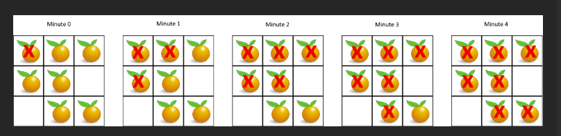

# 题

- 在给定的 m x n 网格 grid 中，每个单元格可以有以下三个值之一：

- 值 0 代表空单元格；
- 值 1 代表新鲜橘子；
- 值 2 代表腐烂的橘子。
- 每分钟，腐烂的橘子 周围 4 个方向上相邻 的新鲜橘子都会腐烂。

- 返回 直到单元格中没有新鲜橘子为止所必须经过的最小分钟数。如果不可能，返回 -1 。

## 示例 1：


输入：grid = `[[2,1,1],[1,1,0],[0,1,1]]`
输出：`4`

## 示例 2：

输入：grid = `[[2,1,1],[0,1,1],[1,0,1]]`
输出：`-1`
解释：左下角的橘子（第 2 行， 第 0 列）永远不会腐烂，因为腐烂只会发生在 4 个方向上。

## 示例 3：

输入：grid = `[[0,2]]`
输出：`0`
解释：因为 0 分钟时已经没有新鲜橘子了，所以答案就是 0 。

# 解

这题典型 **多源 BFS**：把所有腐烂橘子(2)同时入队，当作第 0 分钟的起点；每一层扩展一圈，把相邻的新鲜橘子(1)变成腐烂(2)，分钟数 +1。最后如果还有新鲜橘子没被感染，返回 -1，否则返回用到的分钟数。

```js
/**
 * @param {number[][]} grid
 * @return {number}
 */
var orangesRotting = function (grid) {
  const m = grid.length;
  const n = grid[0].length;

  const q = [];
  let fresh = 0;

  // 统计新鲜橘子数量 + 初始化队列(所有腐烂橘子作为多源起点)
  for (let i = 0; i < m; i++) {
    for (let j = 0; j < n; j++) {
      if (grid[i][j] === 2) q.push([i, j]);
      else if (grid[i][j] === 1) fresh++;
    }
  }

  // 没有新鲜橘子，0 分钟
  if (fresh === 0) return 0;

  const dirs = [
    [1, 0],
    [-1, 0],
    [0, 1],
    [0, -1],
  ];
  let minutes = 0;

  // BFS 按“分钟”分层
  while (q.length > 0) {
    const size = q.length;
    let rottedThisMinute = false;

    for (let k = 0; k < size; k++) {
      const [x, y] = q.shift();

      for (const [dx, dy] of dirs) {
        const nx = x + dx,
          ny = y + dy;
        if (nx < 0 || nx >= m || ny < 0 || ny >= n) continue;
        if (grid[nx][ny] !== 1) continue;

        // 新鲜 -> 腐烂
        grid[nx][ny] = 2;
        fresh--;
        q.push([nx, ny]);
        rottedThisMinute = true;
      }
    }

    // 这一层如果确实感染到了新橘子，才算过了 1 分钟
    if (rottedThisMinute) minutes++;
  }

  return fresh === 0 ? minutes : -1;
};
```

要点：

- **多源 BFS**确保分钟数最小。
- `fresh` 用来判断是否还有新鲜橘子，以及最终是否返回 -1。
- `rottedThisMinute` 避免队列最后一层没有继续感染时还多加 1 分钟。

下面我用你给的示例 `[[2,1,1],[1,1,0],[0,1,1]]`，按 **“多源 BFS 分层（每层=1 分钟）”** 一步一步走一遍，并对应到代码里的关键变量。

---

## 1）初始化（对应代码第一段）

网格（行列从 0 开始）：

```
(0)  [2,1,1]
(1)  [1,1,0]
(2)  [0,1,1]
      0 1 2
```

- 把所有 **腐烂橘子 2** 入队 `q`

  - 这里只有 `(0,0)` 是 2
    所以：`q = [(0,0)]`

- 统计 **新鲜橘子 1** 数量 `fresh`

  - 一共有 6 个 1
    所以：`fresh = 6`

- `minutes = 0`

---

## 2）第 1 分钟（BFS 第一层扩散）

此时队列长度 `size = 1`（这一层只处理 1 个点：`(0,0)`）

从 `(0,0)` 往四个方向看（上、下、左、右）：

- 上：`(-1,0)` 越界，跳过
- 下：`(1,0)` 是 1 → 变成 2，入队
- 左：`(0,-1)` 越界
- 右：`(0,1)` 是 1 → 变成 2，入队

这一分钟感染了新橘子，所以 `minutes++`

结果：

- 新入队：`(1,0)`, `(0,1)`
- `fresh = 6 - 2 = 4`
- `q = [(1,0), (0,1)]`
- `minutes = 1`

网格变成：

```
[2,2,1]
[2,1,0]
[0,1,1]
```

---

## 3）第 2 分钟（BFS 第二层扩散）

队列 `q` 现在有两个点，所以 `size = 2`
这一分钟会处理：`(1,0)`、`(0,1)`（注意：同一分钟里它们“同时扩散”）

### 处理 `(1,0)`：

四方向：

- 上 `(0,0)` 是 2，跳过
- 下 `(2,0)` 是 0，跳过
- 左 `(1,-1)` 越界
- 右 `(1,1)` 是 1 → 变 2 入队

### 处理 `(0,1)`：

四方向：

- 上 `(-1,1)` 越界
- 下 `(1,1)` 现在已经被上一轮处理变成 2 了（同一分钟内也算腐烂了），跳过
- 左 `(0,0)` 是 2
- 右 `(0,2)` 是 1 → 变 2 入队

这一分钟也感染到了新橘子 → `minutes++`

结果：

- 新入队：`(1,1)`, `(0,2)`
- `fresh = 4 - 2 = 2`
- `q = [(1,1), (0,2)]`
- `minutes = 2`

网格：

```
[2,2,2]
[2,2,0]
[0,1,1]
```

---

## 4）第 3 分钟（BFS 第三层扩散）

`size = 2`，处理 `(1,1)`、`(0,2)`

### 处理 `(1,1)`：

- 上 `(0,1)` 是 2
- 下 `(2,1)` 是 1 → 变 2 入队
- 左 `(1,0)` 是 2
- 右 `(1,2)` 是 0

### 处理 `(0,2)`：

- 上 `(-1,2)` 越界
- 下 `(1,2)` 是 0
- 左 `(0,1)` 是 2
- 右 `(0,3)` 越界

本分钟感染了 `(2,1)` → `minutes++`

结果：

- 新入队：`(2,1)`
- `fresh = 2 - 1 = 1`
- `q = [(2,1)]`
- `minutes = 3`

网格：

```
[2,2,2]
[2,2,0]
[0,2,1]
```

---

## 5）第 4 分钟（BFS 第四层扩散）

`size = 1`，处理 `(2,1)`

四方向：

- 上 `(1,1)` 是 2
- 下 `(3,1)` 越界
- 左 `(2,0)` 是 0
- 右 `(2,2)` 是 1 → 变 2 入队

感染到新橘子 → `minutes++`

结果：

- 新入队：`(2,2)`
- `fresh = 1 - 1 = 0`
- `q = [(2,2)]`
- `minutes = 4`

网格：

```
[2,2,2]
[2,2,0]
[0,2,2]
```

---

## 6）结束判断

虽然队列里还有 `(2,2)`，但它再扩散也不会感染到新鲜橘子了。循环继续一轮时 `rottedThisMinute` 会是 `false`，不会再 `minutes++`。

最终 `fresh === 0`，所以返回 `minutes = 4` ✅（与示例输出一致）

---

## 关键点总结（你要记住这 3 个）

1. **队列一开始放所有 2**：这就是“多源”，表示它们同一时间开始传播。
2. **按层处理**：每一层就是“1 分钟”，处理完这一层才算时间+1。
3. **fresh 计数**：感染一个 fresh--，最后 fresh>0 说明永远感染不到 → 返回 -1。

如果你愿意，我也可以把这段代码加上“打印每分钟网格变化”的调试版本，让你运行时直接看到每一步变化。
