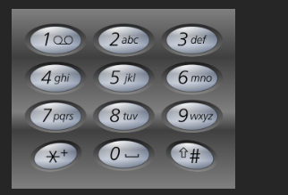

给定一个仅包含数字 2-9 的字符串，返回所有它能表示的字母组合。答案可以按 任意顺序 返回。

给出数字到字母的映射如下（与电话按键相同）。注意 1 不对应任何字母。




 

示例 1：

输入：digits = "23"
输出：`["ad","ae","af","bd","be","bf","cd","ce","cf"]`
示例 2：

输入：digits = "2"
输出：`["a","b","c"]`
# 

这个题也是典型的「回溯 + 组合」问题，和你前面做的 `permute / subsets` 很类似 👍

---

## 🧠 思路

1. 先建一个数字到字母的映射表，比如：

   ```js
   {
     '2': 'abc',
     '3': 'def',
     '4': 'ghi',
     '5': 'jkl',
     '6': 'mno',
     '7': 'pqrs',
     '8': 'tuv',
     '9': 'wxyz'
   }
   ```
2. 遍历 `digits` 字符串，用回溯来构造所有可能的字母组合：

   * 用一个字符串 `path` 表示当前已经拼出来的一部分
   * 当前在处理第 `index` 位数字 `digits[index]`
   * 对这个数字对应的所有字母逐个尝试，加入 `path`，递归到下一位
3. 当 `index === digits.length` 时，说明已经处理完所有数字，把当前 `path` 加入结果。

注意：

* 如果 `digits` 是空字符串，直接返回空数组 `[]`。

---

## ✅ JavaScript 实现

```js
/**
 * @param {string} digits
 * @return {string[]}
 */
var letterCombinations = function(digits) {
    const res = [];
    if (!digits || digits.length === 0) return res;

    const map = {
        '2': 'abc',
        '3': 'def',
        '4': 'ghi',
        '5': 'jkl',
        '6': 'mno',
        '7': 'pqrs',
        '8': 'tuv',
        '9': 'wxyz'
    };

    const path = [];

    const backtrack = (index) => {
        // 如果已经处理完所有数字，收集一个结果
        if (index === digits.length) {
            res.push(path.join(''));
            return;
        }

        const digit = digits[index];
        const letters = map[digit];

        for (const ch of letters) {
            path.push(ch);          // 选择当前字母
            backtrack(index + 1);   // 递归到下一位数字
            path.pop();             // 回溯，撤销选择
        }
    };

    backtrack(0);
    return res;
};
```

---

## 🔍 用示例 `digits = "23"` 简单看一下流程

* 数字 `'2'` → `a b c`
* 数字 `'3'` → `d e f`

回溯构造组合：

* 先选 `a`：

  * 再搭配 `d e f` → `ad, ae, af`
* 再选 `b`：

  * 搭配 `d e f` → `bd, be, bf`
* 再选 `c`：

  * 搭配 `d e f` → `cd, ce, cf`

最终结果：

```js
["ad","ae","af","bd","be","bf","cd","ce","cf"]
```

---

如果你愿意，我可以帮你把这个题和 `permute / subsets` 放在一起，总结一套路“回溯模板”，以后看到类似题就不用想太多，直接套。
