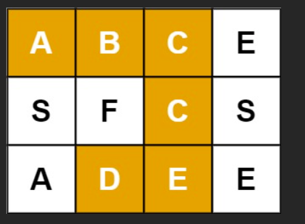
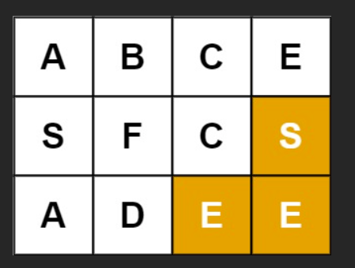
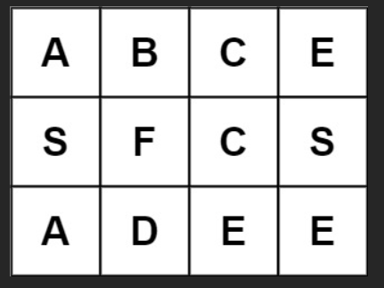

# 题
给定一个 m x n 二维字符网格 board 和一个字符串单词 word 。如果 word 存在于网格中，返回 true ；否则，返回 false 。

单词必须按照字母顺序，通过相邻的单元格内的字母构成，其中“相邻”单元格是那些水平相邻或垂直相邻的单元格。同一个单元格内的字母不允许被重复使用。

 

## 示例 1：



输入：board = `[['A','B','C','E'],['S','F','C','S'],['A','D','E','E']]`, `word = "ABCCED"`
输出：true
## 示例 2：



输入：board = `[['A','B','C','E'],['S','F','C','S'],['A','D','E','E']]`, `word = "SEE"`
输出：true
## 示例 3：



输入：board = `[['A','B','C','E'],['S','F','C','S'],['A','D','E','E']]`, `word = "ABCB"`
输出：false
# 解

这题是经典 **回溯 / DFS 搜索路径**（LeetCode 79 单词搜索）。

核心：从每个格子当起点，尝试匹配 `word[0]`，匹配上就往四个方向继续找 `word[1]...`，走过的格子要“标记已访问”，回退时再恢复。

---

## 思路拆解（对应代码会一一实现）

* 外层：遍历每个 `(i,j)`，把它当作起点
* DFS(i,j,k)：表示我现在在 `(i,j)`，要匹配 `word[k]`

  * 如果 `board[i][j] !== word[k]` → false
  * 如果 `k === word.length - 1` 且匹配成功 → true
  * 否则：

    1. 标记 `(i,j)` 已访问（避免重复使用）
    2. 向四方向递归找 `k+1`
    3. 回溯恢复 `(i,j)` 原字符
* 只要任意起点返回 true，整体 true；都不行则 false

---

## 可直接提交的 JS 代码

```js
/**
 * @param {character[][]} board
 * @param {string} word
 * @return {boolean}
 */
var exist = function(board, word) {
  const m = board.length;
  const n = board[0].length;

  function dfs(i, j, k) {
    // 越界
    if (i < 0 || i >= m || j < 0 || j >= n) return false;
    // 当前字符不匹配
    if (board[i][j] !== word[k]) return false;
    // 已经匹配到最后一个字符
    if (k === word.length - 1) return true;

    // 标记访问：临时把这个格子改成一个不可能匹配的字符
    const temp = board[i][j];
    board[i][j] = '#';

    // 四方向继续找下一个字符
    const found =
      dfs(i + 1, j, k + 1) ||
      dfs(i - 1, j, k + 1) ||
      dfs(i, j + 1, k + 1) ||
      dfs(i, j - 1, k + 1);

    // 回溯恢复
    board[i][j] = temp;

    return found;
  }

  // 每个格子都可以作为起点
  for (let i = 0; i < m; i++) {
    for (let j = 0; j < n; j++) {
      if (dfs(i, j, 0)) return true;
    }
  }

  return false;
};
```

---

## 用示例走一遍（简化版路径）

board:

```
A B C E
S F C S
A D E E
```

word = `"A B C C E D"`

成功路径之一是：

* (0,0) A ✅
* (0,1) B ✅
* (0,2) C ✅
* (1,2) C ✅
* (2,2) E ✅
* (2,1) D ✅ → 到末尾，返回 true

过程中每走一个格子就标记成 `#`，保证不会走回头重复使用同一个单元格；回溯时再恢复，给其它路径继续尝试。

---

如果你想更“可视化”，我也可以把这个示例按 **每一步 DFS 进入/回退** 的顺序（栈展开）完整写出来，让你看到它为什么会回溯、在哪里剪枝。


好，这里我们**只用你给的示例**，一步一步、**像“人走迷宫一样”**把这道题完整走一遍，让你真正理解 **DFS + 回溯** 在干什么。

---

# 示例回顾

```txt
board =
A B C E
S F C S
A D E E

word = "ABCCED"
```

目标：能不能 **不重复用格子**，上下左右走出
`A → B → C → C → E → D`

---

# 一、整体策略（先有全局视角）

1. 从 **每一个格子** 当起点
2. 如果当前格子 ≠ `word[0]`，直接跳过
3. 一旦匹配上，就：

   * 占用这个格子（不能再用）
   * 去四个方向找下一个字母
4. 走不通就 **回退（回溯）**
5. 只要有一条完整路径 → 返回 `true`

---

# 二、从第一个成功起点开始讲

## 起点 (0,0) = 'A'

```
[A] B  C  E
 S  F  C  S
 A  D  E  E
```

* `word[0] = 'A'` ✅
* 标记 (0,0) 已访问（逻辑上不能再走）

---

## 第 2 步：找 'B'

从 (0,0) 四方向：

* 上：越界 ❌
* 左：越界 ❌
* 下：(1,0) = 'S' ❌
* 右：(0,1) = 'B' ✅

走到 (0,1)

```
[#] [B] C  E
 S   F  C  S
 A   D  E  E
```

---

## 第 3 步：找第一个 'C'

从 (0,1) 四方向：

* 左：(0,0) 已访问 ❌
* 上：越界 ❌
* 下：(1,1) = 'F' ❌
* 右：(0,2) = 'C' ✅

走到 (0,2)

```
 #  # [C] E
 S  F  C  S
 A  D  E  E
```

---

## 第 4 步：找第二个 'C'

从 (0,2) 四方向：

* 左：(0,1) 已访问 ❌
* 上：越界 ❌
* 右：(0,3) = 'E' ❌
* 下：(1,2) = 'C' ✅

走到 (1,2)

```
 #  #  #  E
 S  F [C] S
 A  D  E  E
```

---

## 第 5 步：找 'E'

从 (1,2) 四方向：

* 左：(1,1) = 'F' ❌
* 上：(0,2) 已访问 ❌
* 右：(1,3) = 'S' ❌
* 下：(2,2) = 'E' ✅

走到 (2,2)

```
 #  #  #  E
 S  F  #  S
 A  D [E] E
```

---

## 第 6 步：找 'D'（最后一个字母）

从 (2,2) 四方向：

* 左：(2,1) = 'D' ✅
* `word` 已全部匹配完 🎉

```
 #  #  #  E
 S  F  #  S
 A [D] #  E
```

👉 **成功返回 true**

---

# 三、为什么一定要“回溯”？

假设在某一步 **走错方向**：

* 你先占用了一个格子
* 后面发现怎么走都匹配不上
* 就必须：

  1. **撤销占用**
  2. 换一条路试

这就是代码里的：

```js
const temp = board[i][j];
board[i][j] = '#';   // 占用

// 尝试四个方向

board[i][j] = temp; // 回溯（恢复）
```

👉 **不回溯，其他路径就没机会了**

---

# 四、对应 DFS 函数在“人话”中的含义

```js
dfs(i, j, k)
```

意思是：

> 我现在站在 `(i,j)`
> 我要匹配 `word[k]`
> 能不能从这里开始成功？

---

# 五、为什么不会重复使用同一个格子？

因为一旦用过：

```js
board[i][j] = '#'
```

* 后续 DFS 再遇到这个格子
* `board[i][j] !== word[k]`
* 自动失败 ❌

---

# 六、完整逻辑一句话总结（考试必背）

> **DFS 负责“走路”，回溯负责“后悔”，标记负责“不能回头”**

---

如果你愿意，我可以：

* 用 **递归调用栈图** 给你画出 DFS 是怎么一层层进、再一层层退的
* 或对比 **这题 vs 岛屿数量 DFS**
* 或讲 **为什么时间复杂度是 O(m · n · 4^L)**

你选一个，我继续带你练 👍
