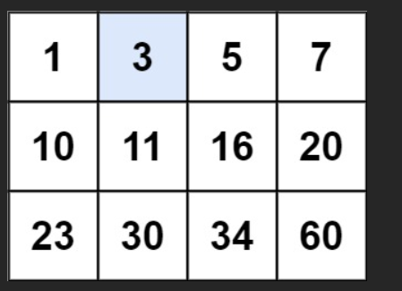
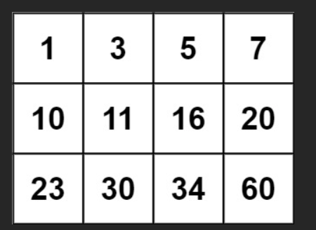

# 题

给你一个满足下述两条属性的 `m x n `整数矩阵：

每行中的整数从左到右按非严格递增顺序排列。

每行的第一个整数大于前一行的最后一个整数。

给你一个整数 `target` ，如果 `target` 在矩阵中，返回 `true` ；否则，返回 `false` 。

 

## 示例 1：



输入：`matrix = [[1,3,5,7],[10,11,16,20],[23,30,34,60]], target = 3`

输出：`true`

## 示例 2：



输入：`matrix = [[1,3,5,7],[10,11,16,20],[23,30,34,60]], target = 13`

输出：`false`

---

# 解

这是一个非常经典的题目：  
**LeetCode 74. Search a 2D Matrix（搜索二维矩阵）**

矩阵特点：
- 每行从左到右 **非严格递增**（允许相等）
- 每行的第一个元素 > 上一行的最后一个元素（整张矩阵可以看成一个「有序的一维数组」）

最优解法：**把二维矩阵当成一个「有序的一维数组」来做二分查找**（一次二分，时间 O(log(mn))）

### 推荐写法（一次二分查找）

```javascript
/**
 * @param {number[][]} matrix
 * @param {number} target
 * @return {boolean}
 */
var searchMatrix = function(matrix, target) {
    if (!matrix || matrix.length === 0 || matrix[0].length === 0) return false;
    
    const m = matrix.length;
    const n = matrix[0].length;
    let left = 0;
    let right = m * n - 1;   // 总元素个数 - 1
    
    while (left <= right) {
        const mid = left + ((right - left) >> 1);
        
        // 把一维下标 mid 映射回二维坐标
        const row = Math.floor(mid / n);
        const col = mid % n;
        const value = matrix[row][col];
        
        if (value === target) {
            return true;
        } else if (value < target) {
            left = mid + 1;
        } else {
            right = mid - 1;
        }
    }
    
    return false;
};
```

### 思路讲解（结合示例）

```js
matrix = [
  [ 1, 3, 5, 7],
  [10,11,16,20],
  [23,30,34,60]
], target = 3
```

把矩阵「拉平」成一个长度为 12 的一维有序数组：

```
索引典中典想象中的一维数组：
[1, 3, 5, 7, 10, 11, 16, 20, 23, 30, 34, 60]
 下标：0  1  2  3   4   5   6   7   8   9  10  11
```

我们直接在这个「虚拟一维数组」上做二分查找：

- `mid = 5` → 对应 matrix[1][1] = 11 > 3 → 去左边
- `mid = 2` → 对应 matrix[0][2] = 5 > 3 → 去左边
- `mid = 1` → 对应 matrix[0][1] = 3 == target → 返回 true

### 另一种常见写法：先二分行，再二分列（两次二分）

```javascript
var searchMatrix = function(matrix, target) {
    if (!matrix || matrix.length === 0 || matrix[0].length === 0) return false;
    
    const m = matrix.length, n = matrix[0].length;
    
    // Step 1: 二分找到可能的行
    let top = 0, bottom = m - 1;
    while (top < bottom) {
        const mid = top + Math.floor((bottom - top) / 2);
        if (matrix[mid][n-1] < target) {
            top = mid + 1;
        } else if (matrix[mid][0] > target) {
            bottom = mid - 1;
        } else {
            break; // 当前行可能包含 target
        }
    }
    const row = top; // 最终可能的行
    
    // Step 2: 在该行二分查找
    let left = 0, right = n - 1;
    while (left <= right) {
        const mid = left + Math.floor((right - left) / 2);
        if (matrix[row][mid] === target) return true;
        if (matrix[row][mid] < target) left = mid + 1;
        else right = mid - 1;
    }
    
    return false;
};
```

### 总结对比

| 写法               | 时间复杂度       | 空间复杂度 | 推荐度       |
|-------------------|------------------|------------|--------------|
| 一次二分（推荐）   | O(log(mn))       | O(1)       | 5 stars       |
| 两次二分（先找行再找列） | O(log m + log n) | O(1)       | 4 stars       |

**面试最推荐第一种写法**：代码最简洁、逻辑最优雅、常数最小，基本是这道题的标准答案。

两种写法都能 AC，但第一种更能体现「把二维当一维处理」的巧妙思维！